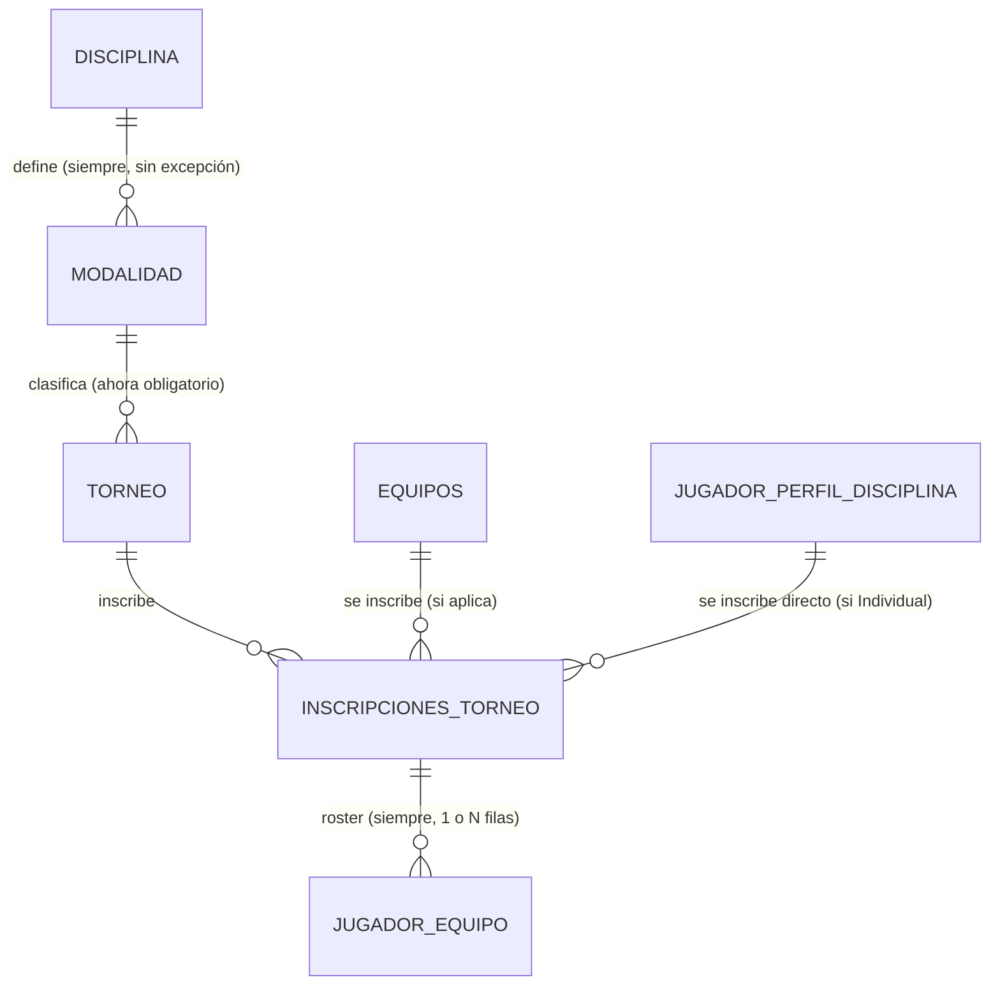

# Plan: Herencia en Ediciones + Catálogo Maestro de Disciplinas + Inscripción Dinámica

Generado con `/autoplan` (revisión CEO → Design → Eng). Codex no está
disponible en esta máquina (`codex` no está en PATH) — corrió en modo
`[subagent-only]`, una sola voz revisora (Claude), mismo estado que
`equipos-jugadores-plan.md` y `torneos-admin-plan.md`. Dado el tamaño real
de este documento (grounded en código leído, no en el requerimiento a
ciegas), se optó por hacer el análisis directo en vez de despachar un
subagente adicional puramente redundante — mismo criterio pragmático (P3)
que ya se documentó en esos dos planes.

Estado: **Documento de planificación únicamente — cero código ni cambios
de esquema aplicados.** El usuario pidió explícitamente solo el plan para
leerlo antes de implementar.

**Las 3 decisiones de arquitectura marcadas para confirmación (Decision
Audit Trail #1, #2, #3) ya fueron confirmadas por el usuario — las 3
opciones recomendadas (A1, B1, C1)**: eliminar `DISCIPLINA.Tipo` y
unificar bajo `Modalidad.Tamano_Equipo`; cambiar el esquema de
`INSCRIPCIONES_TORNEO` para que las disciplinas individuales no creen
ninguna fila en `EQUIPOS`; y reemplazar el CRUD de Disciplinas/Modalidades
por una vista de solo lectura con toggle de Estado. El plan queda listo
para pasar a implementación tal como está escrito, sin ramas alternativas
pendientes.

---

## Resumen del módulo

Tres piezas que se piden juntas porque comparten el mismo eje (Disciplina →
Modalidad → cómo se inscribe alguien), pero que tocan partes muy distintas
del sistema ya construido:

**A. Herencia en "Nueva Edición".** Hoy el formulario de nueva edición
vuelve a pedir Disciplina y Modalidad como si fuera un torneo nuevo — el
pedido es dejarlos de solo lectura, heredados del grupo, y pedir solo
Fecha de Inicio/Fin.

**B. Inscripción dinámica.** Hoy TODA inscripción pasa por un `EQUIPOS.ID`
obligatorio, incluso en disciplinas individuales (se autocrea un "equipo"
con el nombre del jugador, invisible para el admin pero real en la base).
El pedido es que las disciplinas individuales inscriban un `Jugador`
directo, sin ninguna fila de `EQUIPOS` de por medio; que las de pareja
autogeneren un nombre de equipo editable; y que las de conjunto sigan
como hoy (nombre libre).

**C. Catálogo maestro inmutable.** Hoy `DISCIPLINA`/`MODALIDAD` son un
CRUD libre con una sola disciplina cargada (Fútbol). El pedido es
precargar la taxonomía completa (28 disciplinas, 66 modalidades) y que
el admin ya no pueda crear/inventar disciplinas nuevas a mano.

**D. Mock data de estrés.** Un script que arme un torneo por cada
combinación disciplina+modalidad del catálogo, con 10 inscripciones cada
uno (Jugadores directos si es individual, Equipos con su plantilla si es
pareja/conjunto).

Estas cuatro piezas **no son del mismo tamaño de riesgo**. A es un fix de
alcance chico sobre una pantalla ya construida. B y C tocan una tabla con
triggers y tests ya en verde (`INSCRIPCIONES_TORNEO`, `DISCIPLINA`) y
implican decisiones de arquitectura reales que este documento marca
explícitamente para que el usuario las confirme antes de tocar código —
ver "Decisiones que requieren tu confirmación" al final.

---

## Fase 1 — CEO Review (Estrategia y Alcance)

### Premisas (verificadas leyendo el código, no asumidas)

| # | Premisa | Veredicto |
|---|---------|-----------|
| P1 | El formulario de "Nueva edición" (`TorneosAdmin.tsx`, función `camposTorneo(false)`) sigue mostrando y pidiendo `disciplina_id`/`modalidad_id` como campos editables, sin pre-rellenar con los valores del grupo. El backend (`TorneoService.create`) tampoco valida que la disciplina/modalidad de una edición nueva coincida con las de las ediciones anteriores del mismo `torneo_grupo_id`. | Confirmado leyendo ambos archivos. Es un gap real, no cosmético — hoy un admin PUEDE crear "Liga Relámpago Edición 3" como Tenis aunque las Ediciones 1 y 2 sean Fútbol, y nada lo impide. |
| P2 | `DisciplinasAdmin.tsx`/`ModalidadesAdmin.tsx` son páginas CRUD libres (`SimpleResourceAdminPage`, con botón "Crear" y edición de Nombre/Tipo) construidas explícitamente en `equipos-jugadores-plan.md`. Esto contradice directamente "las disciplinas no son creadas por el usuario". | Confirmado. Es una reversión de una pantalla ya construida y con tests — se marca como decisión que requiere tu confirmación (no se auto-decide silenciosamente). |
| P3 | `INSCRIPCIONES_TORNEO.Equipo_ID` es `NOT NULL` (`01_schema.sql`) — toda inscripción, incluso en disciplinas individuales, pasa por una fila real de `EQUIPOS`. Hoy eso ya se disimula parcialmente: `ModalAgregarEquipo.tsx` autocompleta el nombre del "equipo" con el del jugador cuando `Modalidad.Tamano_Equipo === 1` (D-Eng-4 de `torneos-admin-plan.md`), pero la fila de `EQUIPOS` **sigue existiendo** en la base. "Omitir el concepto de Equipo" que pide el usuario es un cambio de modelo de datos real, no una cuestión de nombres. | Confirmado. Ver Alternativa B abajo — es la decisión de mayor riesgo de este plan. |
| P4 | Hoy solo existe **una** fila en `DISCIPLINA` (`Fútbol`, seed inicial). El catálogo pedido son 28 disciplinas / 66 modalidades — no es una extensión incremental, es poblar el catálogo real por primera vez. | Confirmado en `05_seed.sql`. |
| P5 | `DISCIPLINA.Tipo` es hoy binario (`'Equipo'` \| `'Individual'`) y el trigger `fn_validar_torneo_modalidad` **prohíbe** `Modalidad_ID` cuando `Tipo='Equipo'`. La taxonomía pedida rompe ese supuesto: Voleibol necesita "Pista 6x6" (tamaño 6) y "Playa 2x2" (tamaño 2) — dos modalidades con tamaños de equipo distintos dentro de una disciplina que hoy el sistema clasificaría como "de Equipo, sin modalidad". Lo mismo con Baloncesto (Tradicional 5 vs 3x3) y Rugby (7 vs 15). | Confirmado. El esquema `Tipo` binario no alcanza para la taxonomía pedida — ver Alternativa A. |
| P6 | `PARTIDOS`/`EVENTOS_PARTIDO` modelan siempre "dos equipos juegan, hay goles" (`EQUIPOS_ID_LOCAL`/`VISITANTE`, `EVENTOS_ID` con catálogo Gol/Tarjeta/Cambio). No existe ningún soporte para resultados de disciplinas de marca/tiempo (Atletismo, Natación, Ciclismo), combate (MMA, Boxeo — resultado por combate, no por partido con goles), o mente (Ajedrez — resultado por partida). | Confirmado. Registrar resultados/estadísticas de esas disciplinas es un módulo aparte, no cubierto por este plan — ver "Fuera de este módulo". Este plan cubre inscripción y catálogo, no scoring. |

### Qué ya existe (leverage map)

| Sub-problema | Ya cubierto por | Qué falta |
|---|---|---|
| Agrupar ediciones de un mismo torneo, autonumerar | `TORNEO_GRUPO` + `TorneoGrupoRepository.siguiente_numero_edicion` (advisory lock, EC-21) | Nada — se reutiliza tal cual, esta pieza ya funciona |
| Ocultar/mostrar Modalidad según el tipo de disciplina en un formulario | `camposTorneo()` en `TorneosAdmin.tsx`, patrón de campos condicionales de `ResourceForm` | Extenderlo para que "Nueva edición" los muestre de solo lectura en vez de condicionales-editables |
| Autonombrar una entidad reutilizando datos ya tipeados en el mismo formulario | `ModalAgregarEquipo.tsx`, D-Eng-4 (`nombreEditadoAMano` + autocompletar mientras no se edite a mano) | Mismo patrón, aplicado a Pareja (tamaño 2) en vez de Individual (tamaño 1) — ver Alternativa D |
| Borrado lógico / desactivación sin romper históricos | Convención `Estado` en las ~12 tablas existentes | Aplicar el mismo criterio para "desactivar" una fila del catálogo sin poder borrarla ni editar su nombre |
| Registrar jugadores por lote con validación (cédula, duplicados, exclusividad) | `RegistroLoteAdminPage` + `POST /plantillas/lote/validar`\|`/confirmar` | Nada del motor — el flujo de inscripción directa de Jugador (disciplinas individuales) puede reusar el mismo servicio de resolución de `JUGADORES`/`JUGADOR_PERFIL_DISCIPLINA` por cédula |
| Trigger de exclusividad por torneo (`fn_validar_exclusividad_torneo`) | Ya opera sobre `JUGADOR_EQUIPO` vía `Inscripcion_Torneo_ID` | Nada, si el modelo elegido (Alternativa B) sigue generando una fila `JUGADOR_EQUIPO` también para inscripciones individuales directas — mismo mecanismo, sin reescribir el trigger |

### Alternativas de arquitectura consideradas

**A. Cómo modelar el tamaño de equipo por disciplina/modalidad**

| Alternativa | Completeness | Veredicto |
|---|---|---|
| **A1. Eliminar `DISCIPLINA.Tipo`; unificar todo bajo `Modalidad.Tamano_Equipo`** (recomendada) | 10/10 | Cada disciplina tiene 1+ modalidades siempre (incluso Fútbol: "Fútbol 11", "Fútbol 5"...). `Tamano_Equipo` es la única fuente de verdad: `=1` → Individual (sin Equipo), `=2` → Pareja (Equipo autonombrado), `>2` → Conjunto (Equipo, nombre libre). Elimina la columna `Tipo` y el trigger `fn_validar_torneo_modalidad` se simplifica a "todo torneo requiere Modalidad_ID, y esa modalidad debe pertenecer a la disciplina elegida" — una sola regla en vez de tres. **Es una reversión de una decisión ya implementada y testeada** (`Tipo` binario, `equipos-jugadores-plan.md` Fase 1) — se marca para tu confirmación. |
| A2. Mantener `DISCIPLINA.Tipo` binario, agregar un tercer valor `'Conjunto'` y permitir Modalidad en los tres | 6/10 | Menos invasivo (no borra la columna), pero dos fuentes de verdad divergentes con el tiempo: nada impide que alguien cargue una Modalidad con `Tamano_Equipo=1` bajo una Disciplina marcada `Tipo='Conjunto'`, y el sistema tendría que decidir a cuál de las dos hacerle caso. Rechazada por P5 (explícito > mantener dos campos que puedan contradecirse). |
| A3. No tocar el esquema; forzar la taxonomía pedida a caber en el `Tipo` binario actual (ej. Voleibol Playa 2x2 como disciplina "Individual" separada de Voleibol Pista) | 3/10 | Duplica disciplinas artificialmente ("Voleibol Pista" y "Voleibol Playa" como dos filas de `DISCIPLINA` sin relación) solo para esquivar el problema real. Rechazada — es la misma clase de parche que `torneos-admin-plan.md` ya rechazó para el nombre de ediciones (B3, parsear por convención). |

**B. Cómo modelar la inscripción directa de un Jugador (disciplinas individuales)**

| Alternativa | Completeness | Veredicto |
|---|---|---|
| **B1. `INSCRIPCIONES_TORNEO.Equipo_ID` pasa a NULLABLE; se agrega `Jugador_Perfil_ID` NULLABLE con `CHECK` de exactamente-uno-de-los-dos** (recomendada) | 10/10 | Modela literalmente lo pedido: una inscripción individual referencia un `Jugador_Perfil_ID`, no un `Equipo_ID` fantasma. `JUGADOR_EQUIPO` se sigue creando igual en ambos casos (con `Inscripcion_Torneo_ID` apuntando a esa fila) — el trigger de exclusividad no se toca. Es la opción que de verdad "omite" el Equipo, no solo lo esconde. Toca una tabla con triggers/tests existentes — se marca para tu confirmación. |
| B2. Mantener el esquema actual; solo esconder la UI de "Equipo" y seguir autocreando una fila `EQUIPOS` fantasma con el nombre del jugador (extensión de D-Eng-4, cero cambio de esquema) | 5/10 | Cero riesgo de migración, se puede implementar hoy mismo. Pero dejaría el pedido "sin ningún concepto de Equipo" resuelto solo en apariencia — cualquier reporte, export o consulta directa a la tabla `EQUIPOS` seguiría viendo un "equipo" de un jugador solo, exactamente el problema que el usuario describió. Rechazada como recomendación principal, pero es la alternativa de bajo riesgo si se prefiere no tocar `INSCRIPCIONES_TORNEO` todavía. |
| B3. Tabla nueva `INSCRIPCIONES_JUGADOR` paralela a `INSCRIPCIONES_TORNEO`, solo para individuales | 4/10 | Duplica el ancla del roster (`INSCRIPCIONES_TORNEO` ya cumple ese rol) — el trigger de exclusividad, los traspasos y las estadísticas tendrían que aprender a mirar DOS tablas en vez de una. Rechazada por P4 (DRY), mismo argumento que ya usó `equipos-jugadores-plan.md` D1 contra una tabla paralela. |

**C. Cómo hacer el catálogo "inmutable"**

| Alternativa | Completeness | Veredicto |
|---|---|---|
| **C1. Reemplazar el CRUD de `DisciplinasAdmin.tsx`/`ModalidadesAdmin.tsx` por una vista de solo lectura + toggle de `Estado` (Activo/Inactivo)** (recomendada) | 9/10 | El admin puede "apagar" una disciplina/modalidad mal cargada (deja de aparecer en el selector de "Torneo nuevo") sin poder renombrarla ni borrarla ni inventar una nueva — coherente con la convención `Estado` que ya usa todo el sistema. Una disciplina real faltante (ej. un deporte no listado en la taxonomía) requiere una migración SQL nueva, no un formulario — es la consecuencia esperada de "inmutable". Se marca para tu confirmación por ser una reversión de una pantalla ya construida. |
| C2. Dejar el CRUD tal cual, solo agregar el seed completo | 4/10 | No resuelve el pedido — el usuario pidió explícitamente que el admin NO pueda crear disciplinas, no solo que empiece con más datos cargados. |
| C3. Ocultar el CRUD detrás de un rol nuevo ("solo Superadmin") en vez de eliminarlo | 6/10 | Alternativa razonable si en el futuro hace falta ajustar el catálogo sin una migración SQL manual — pero agrega un concepto de permisos nuevo no pedido, y el sistema de roles actual (`Admin`/`Arbitro`/`Publico`, ver `roles-3-modulos-plan.md`) no tiene un nivel por encima de `Admin` hoy. Anotada como posible evolución futura en `TODOS.md`, no en el alcance de este plan. |

**D. Nombre autogenerado para Parejas**

`JUGADORES.Nombre` es hoy un único campo de texto libre (sin `Apellido`
separado). Partir el string por la última palabra para armar "Pérez /
Gómez" es frágil en apellidos compuestos, muy comunes en español ("María
José Pérez Gómez" → ¿"Gómez" o "Pérez Gómez"?). En vez de adivinar:

**Decisión (mecánica, P5 explícito > heurística de texto):** el nombre
sugerido de una Pareja se arma con el **nombre completo** de cada
jugador, unidos por " / " — ej. "Carlos Pérez / Ana Gómez" — nunca solo
el apellido. Sigue siendo editable a mano (mismo patrón `nombreEditadoAMano`
ya implementado), así que un admin que prefiera "Pérez / Gómez" puede
escribirlo él mismo con un clic. Evita construir un parser de apellidos
que se equivoca silenciosamente con nombres reales.

### Alcance

**Dentro de este módulo:**
- Herencia real de Disciplina/Modalidad en "Nueva edición": campos de
  solo lectura en el formulario, y el backend deja de aceptar
  `disciplina_id`/`modalidad_id` en el payload cuando viene
  `torneo_grupo_id` (los toma del grupo, ignora lo que mande el cliente —
  cierra el gap de P1 también contra un `curl` directo, no solo en la UI).
- Catálogo maestro de 28 disciplinas / 66 modalidades, precargado vía
  script de inicialización (SQL, ver Fase 3).
- Catálogo pasa a solo-lectura + toggle de `Estado` en el admin (Decisión C1).
- Inscripción dinámica: Individual → Jugador directo sin `EQUIPOS`
  (Decisión B1); Pareja → Equipo autonombrado editable; Conjunto → Equipo
  con nombre libre (sin cambios, ya funciona).
- Migración del único torneo existente (`Copa Ecotec 2026`) al esquema
  unificado (Decisión A1): se le asigna una Modalidad retroactiva.
- Script de mock data: un torneo por cada **Modalidad** del catálogo (66
  torneos, no 28 — ver nota de alcance abajo), con 10 inscripciones cada
  uno.

**Nota de alcance — "por disciplina" se interpreta como "por modalidad":**
el pedido dice "un torneo de prueba por cada disciplina", pero varias
disciplinas tienen modalidades con comportamiento de inscripción
completamente distinto entre sí (Tenis Singles = Jugador directo, Tenis
Dobles = Equipo de 2). Probar solo la disciplina y no cada modalidad
dejaría sin ejercitar la mitad de las combinaciones Individual/Pareja/
Conjunto que este plan introduce — que es exactamente lo que una "prueba
de estrés" debería cubrir. Ampliación dentro del radio de impacto directo
del pedido (P1 completeness + P2 boil-lakes, `<1 día` de trabajo real),
no una expansión de alcance ajena.

**Fuera de este módulo (→ `TODOS.md`):**
- Registro de resultados/estadísticas para disciplinas de marca y tiempo
  (Atletismo, Natación, Ciclismo), combate (MMA, Boxeo, Judo, Taekwondo,
  Karate) o mente (Ajedrez). `PARTIDOS`/`EVENTOS_PARTIDO` asumen dos
  equipos y goles — un tiempo de maratón o un resultado de combate no
  encajan ahí. Merece su propio diseño (¿"partido" = combate/carrera?
  ¿cómo se registra un tiempo o un ganador por sumisión?).
- Categorías de peso/cinturón reales de una federación específica para
  Combate. Este plan precarga 3 categorías genéricas por disciplina
  ("Peso Ligero/Medio/Pesado") como placeholder editable-por-migración,
  no la tabla oficial de cada federación (varía por región/edad/género y
  fabricar una tabla "oficial" falsa sería peor que no tenerla).
- Límite superior de inscripciones por torneo (cuántos Equipos/Jugadores
  caben en un bracket). No fue pedido.
- eSports: el catálogo cubre inscripción (equipos de 5, parejas, 1v1), no
  brackets de doble eliminación ni integración con APIs de las plataformas
  (Riot, Steam) — eso es un módulo de "sistema de brackets" aparte.

### Dream state

```
ACTUAL                          ESTE PLAN                        IDEAL 12 MESES
──────────────────────          ──────────────────────           ──────────────────────
"Nueva edición" repite el       Nueva edición: 2 campos           + Wizard de creación de
formulario completo,            (fechas), Disciplina/Modalidad     torneo con checklist de
Disciplina/Modalidad editable   heredadas de solo lectura.         requisitos por disciplina
otra vez.                                                          (ej. "Ajedrez necesita
                                                                    sistema de pareo Suizo").
1 sola disciplina cargada       28 disciplinas / 66 modalidades
(Fútbol), CRUD libre —          precargadas, catálogo de solo     + Motor de resultados por
cualquiera crea "Fulbo 5x5"     lectura (toggle Activo/Inactivo    disciplina (marca/tiempo,
mal escrito.                    únicamente).                       combate, mente) — hoy
                                                                    fuera de alcance.
Toda inscripción exige un       Individual = Jugador directo,
"Equipo" aunque sea un          sin Equipo. Pareja = Equipo con   + Bracket/fixture generator
jugador solo (equipo            nombre autogenerado editable.      genérico por Tamano_Equipo,
fantasma autonombrado).         Conjunto = sin cambios.            no solo round-robin de
                                                                    fútbol.
```

### Selección de modo

**SELECTIVE EXPANSION** — extiende el esquema y la UI ya construidos en
los dos planes previos, no reemplaza nada de cero. Tres de sus decisiones
(A1, B1, C1) son reversiones deliberadas de comportamiento ya
implementado y testeado — se marcan explícitamente, no se auto-deciden.

---

## Fase 2 — Design Review (UX de herencia + inscripción dinámica)

Aplica — hay un formulario que cambia de forma según el contexto (nueva
edición vs torneo nuevo) y un modal que ahora se ramifica en 3 caminos en
vez de 2.

### A. Formulario "Nueva edición" — antes / después

```
ANTES (hoy, TorneosAdmin.tsx camposTorneo(false)):
┌─────────────────────────────────────────┐
│ Nueva edición — Liga Relámpago (Ed. 3)   │
│ Disciplina: [▾ Fútbol            ]  ← editable, puede cambiarse por error
│ Fecha de inicio: [__________]            │
│ Fecha de fin:    [__________]            │
└─────────────────────────────────────────┘

DESPUÉS (este plan):
┌─────────────────────────────────────────┐
│ Nueva edición — Liga Relámpago (Ed. 3)   │
│ Disciplina: Fútbol            (heredado, texto plano, no <select>)
│ Modalidad:  Fútbol 11          (heredado — u oculto del todo si la
│                                  disciplina no usa modalidad de equipo
│                                  de tamaño 1, ver nota abajo)
│ Fecha de inicio: [__________]  ← único campo editable, junto con fin
│ Fecha de fin:    [__________]
│              [Cancelar]  [Crear edición]
└─────────────────────────────────────────┘
```

Los valores heredados se muestran como texto (no un `<select>` deshabilitado
— un `<select disabled>` sigue pareciendo un campo de formulario y un
admin puede preguntarse por qué no responde; texto plano dice "esto no se
edita acá" sin ambigüedad, mismo criterio que ya usa este proyecto para
campos derivados en vistas de solo lectura). El valor real sigue
viajando en el payload (`disciplina_id`/`modalidad_id` del grupo), pero el
backend los ignora si el cliente los manda distinto (P1, cierre de gap).

### B. Modal de inscripción — 3 caminos según `Modalidad.Tamano_Equipo`

```
Admin en la sub-pestaña "Equipos"/"Jugadores" del dashboard de un torneo,
clic en "+ Agregar" (el texto del botón también cambia — ver abajo):

Tamano_Equipo == 1 (Individual) → botón dice "+ Agregar Jugador"
┌─────────────────────────────────────────────┐
│ Agregar jugador a Tenis Singles — Copa Raíces │
│ Buscar jugador existente (por cédula/nombre): │
│  [🔍 buscar...______________]                 │
│  • Micky Fernández       [Inscribir]          │
│  ── o ──                                       │
│  No encuentro al jugador: [+ Crear jugador]    │
│  Cédula: [___] Nombre: [___] Correo: [___]     │
│                          [Validar e inscribir] │
└─────────────────────────────────────────────┘
  Sin campo de "nombre de equipo" en ningún lado — no existe esa entidad
  en este camino. Al confirmar: POST /inscripciones {torneo_id,
  jugador_perfil_id} (resuelve JUGADORES + JUGADOR_PERFIL_DISCIPLINA por
  cédula igual que ya hace el registro por lote), sin tocar EQUIPOS.

Tamano_Equipo == 2 (Pareja) → botón dice "+ Agregar Pareja"
┌─────────────────────────────────────────────┐
│ Crear pareja — Tenis Dobles — Copa Raíces     │
│ Jugador 1: Cédula [___] Nombre [___] Correo[__]│
│ Jugador 2: Cédula [___] Nombre [___] Correo[__]│
│ Nombre del equipo: [Carlos Pérez / Ana Gómez]  │  ← autogenerado
│                      (editable — Decisión D)   │     mientras no se
│                          [Validar y crear]     │     edite a mano
└─────────────────────────────────────────────┘
  Exactamente 2 filas, sin botón "+ agregar fila" (la modalidad fija el
  tamaño) — mismo criterio que ya aplica `!esIndividual` hoy para ocultar
  ese botón cuando no corresponde agregar filas libres.

Tamano_Equipo > 2 (Conjunto) → botón dice "+ Agregar Equipo" (sin cambios)
  Camino ya construido en torneos-admin-plan.md — buscar equipo existente
  o crear uno con nombre libre + plantilla de N filas. No se toca.
```

### Estados de interacción — camino Individual (nuevo)

| Estado | Comportamiento |
|---|---|
| Loading (buscando jugadores existentes) | Spinner inline en la lista, buscador no bloqueado — mismo patrón que la búsqueda de equipos existentes. |
| Empty (sin jugadores que matcheen) | "No hay jugadores con ese nombre/cédula. ¿Es nuevo?" con el formulario de creación ya visible debajo, no un paso separado. |
| Cédula ya inscrita en este mismo torneo | Error inline del trigger de exclusividad, mensaje "ya está inscrito en este torneo" — mismo mensaje que hoy usa el registro por lote para el caso equivalente. |
| Éxito | Toast "Micky Fernández inscrito" — sin mención de "equipo" en ningún lado del mensaje, para no reintroducir el concepto que se pidió omitir. |

### Litmus scorecard (resumen)

| Dimensión | Score | Nota |
|---|---|---|
| Jerarquía de información (el admin nunca ve un concepto de Equipo en disciplinas individuales) | 9/10 | El único lugar donde "Equipo" podría colarse es un mensaje de error genérico reusado sin revisar — se marca como ítem de QA en la tabla de tareas. |
| Estados especificados | 8/10 | Cubiertos arriba; el camino Pareja hereda 1:1 los estados ya definidos para Conjunto en `torneos-admin-plan.md` (no se repiten acá). |
| Especificidad (autonombre de Pareja explica de dónde sale el texto) | 8/10 | "Carlos Pérez / Ana Gómez" es trazable a los dos campos que el admin acaba de tipear, no magia. |
| Alineación con patrones existentes (`ResourceForm`, botón de acción con label dinámico) | Taste decision — el label del botón ("+ Agregar Jugador" vs "+ Agregar Pareja" vs "+ Agregar Equipo") cambia según la modalidad del torneo activo; es una variación chica sobre un patrón ya usado (`ModalAgregarEquipo` cambiando de modo internamente), no un componente nuevo. |

---

## Fase 3 — Eng Review (Arquitectura, Datos, Edge Cases, Tests)

### Arquitectura

```
Frontend (Vite)                       Backend (FastAPI)                DB (Postgres)
────────────────                       ──────────────────                ─────────────
TorneosAdminPage                ────▶  POST /torneos                    DISCIPLINA (Tipo eliminado)
  "nueva-edicion": Disciplina/          {torneo_grupo_id, fecha_inicio,        │
  Modalidad de SOLO LECTURA             fecha_fin}  ← ya NO manda            ▼
  (vienen del `grupo` en memoria,       disciplina_id/modalidad_id;      MODALIDAD
  no de un <select>)                    el service los toma del grupo    (Tamano_Equipo,
        │                               (cierra EC-26)                   único driver)
        ▼                                     │
CatalogoDisciplinasPage         ────▶  GET /disciplinas?con_modalidades  DISCIPLINA ──┐
  (reemplaza DisciplinasAdmin/                (nueva vista jerárquica,                │
  ModalidadesAdmin — solo lectura        no dos listas planas separadas)              ▼
  + PATCH estado)                 ────▶  PATCH /disciplinas/{id}         MODALIDAD (roster
                                          {estado} / /modalidades/{id}    de cada disciplina)
                                          {estado}  — nombre/tipo ya NO
                                          aceptan PATCH (Decisión C1)

ModalAgregarInscripcion         ────▶  GET /torneos/{id} (trae           TORNEO.Modalidad_ID
  (reemplaza/extiende                   modalidad_id → tamano_equipo     (ahora siempre
  ModalAgregarEquipo, rama por          resuelto en el cliente)           obligatorio)
  tamano_equipo)                              │
        │                                     ├─ tamano=1 ──▶ POST /inscripciones      INSCRIPCIONES_TORNEO
        │                                     │   {torneo_id,                          (Equipo_ID NULLABLE,
        │                                     │    jugador_cedula/nombre/correo}        Jugador_Perfil_ID
        │                                     │   (resuelve/crea JUGADORES +            NUEVO, CHECK
        │                                     │    JUGADOR_PERFIL_DISCIPLINA,           exactamente-uno)
        │                                     │    crea INSCRIPCIONES_TORNEO
        │                                     │    (Jugador_Perfil_ID set) +
        │                                     │    JUGADOR_EQUIPO (para que el
        │                                     │    trigger de exclusividad          JUGADOR_EQUIPO
        │                                     │    siga aplicando sin reescribirse) (sin cambios de
        │                                     │                                     estructura)
        │                                     └─ tamano>=2 ──▶ POST /equipos
        │                                         {nombre}  (autogenerado si         EQUIPOS
        │                                          tamano=2, ver Decisión D)          (sin cambios)
        │                                         POST /inscripciones
        │                                         {torneo_id, equipo_id}
        │                                         [reusa RegistroLoteAdminPage
        │                                          para las N filas de plantilla,
        │                                          sin cambios — ya funciona]
```

### Modelo de datos relacional



**`DISCIPLINA`** — se elimina `Tipo` (Decisión A1):
```sql
ALTER TABLE DISCIPLINA DROP COLUMN Tipo;
ALTER TABLE DISCIPLINA ADD CONSTRAINT unique_disciplina_nombre UNIQUE (Nombre);
-- UNIQUE nuevo: soporta el seed idempotente (ON CONFLICT DO NOTHING) y
-- evita que el catálogo "inmutable" termine con dos filas "Fútbol" por
-- una recarga accidental del script.
```

**`MODALIDAD`** — sin cambio de columnas, pero ahora es la única fuente
de `Tamano_Equipo` y toda disciplina tiene 1+ filas acá (antes las
disciplinas `Tipo='Equipo'` no tenían ninguna):
```sql
-- Ya tiene UNIQUE(Disciplina_ID, Nombre) desde equipos-jugadores-plan.md
-- — el seed del catálogo maestro se apoya en eso para ser idempotente.
```

**`TORNEO`** — `Modalidad_ID` pasa a NOT NULL:
```sql
-- Backfill primero (EC-30): Copa Ecotec 2026 (Fútbol, sin modalidad hoy)
-- necesita una Modalidad real antes del NOT NULL. Se le asigna
-- "Fútbol 11" por ser el formato estándar — decisión de backfill, no de
-- producto (el torneo real ya jugó con 11, es solo completar el dato).
UPDATE TORNEO SET Modalidad_ID = (
    SELECT ID FROM MODALIDAD WHERE Nombre = 'Fútbol 11'
      AND Disciplina_ID = (SELECT ID FROM DISCIPLINA WHERE Nombre = 'Fútbol')
) WHERE Modalidad_ID IS NULL;

ALTER TABLE TORNEO ALTER COLUMN Modalidad_ID SET NOT NULL;
```

**`INSCRIPCIONES_TORNEO`** — el cambio central (Decisión B1):
```sql
ALTER TABLE INSCRIPCIONES_TORNEO ALTER COLUMN Equipo_ID DROP NOT NULL;
ALTER TABLE INSCRIPCIONES_TORNEO ADD COLUMN Jugador_Perfil_ID INT
    REFERENCES JUGADOR_PERFIL_DISCIPLINA(ID);
ALTER TABLE INSCRIPCIONES_TORNEO ADD CONSTRAINT chk_inscripcion_exactamente_uno
    CHECK (
        (Equipo_ID IS NOT NULL AND Jugador_Perfil_ID IS NULL) OR
        (Equipo_ID IS NULL AND Jugador_Perfil_ID IS NOT NULL)
    );
-- El service layer decide cuál de los dos setear según
-- Modalidad.Tamano_Equipo del torneo (=1 → Jugador_Perfil_ID; >=2 →
-- Equipo_ID), nunca los dos a la vez ni ninguno.
```

**`JUGADOR_EQUIPO`** — sin cambio de columnas. Para una inscripción
individual (`Jugador_Perfil_ID` en `INSCRIPCIONES_TORNEO`), el service
crea igual una fila acá (`Jugador_Perfil_ID` = el mismo, `Inscripcion_Torneo_ID`
= la inscripción recién creada, `Dorsal` = NULL) — así el trigger de
exclusividad (`fn_validar_exclusividad_torneo`, que opera sobre
`JUGADOR_EQUIPO`) sigue funcionando **sin reescribirse** para el caso
individual. Es la razón por la que Alternativa B1 no necesita tocar
ningún trigger existente.

**`fn_validar_torneo_modalidad`** — se simplifica (ya no hay `Tipo` que
consultar):
```sql
CREATE OR REPLACE FUNCTION fn_validar_torneo_modalidad()
RETURNS TRIGGER AS $$
DECLARE
    v_modalidad_disciplina INT;
BEGIN
    IF NEW.Modalidad_ID IS NULL THEN
        RAISE EXCEPTION 'Todo torneo requiere una Modalidad.';
    END IF;
    SELECT Disciplina_ID INTO v_modalidad_disciplina FROM MODALIDAD WHERE ID = NEW.Modalidad_ID;
    IF v_modalidad_disciplina <> NEW.Disciplina_ID THEN
        RAISE EXCEPTION 'La modalidad indicada no pertenece a esta disciplina.';
    END IF;
    RETURN NEW;
END;
$$ LANGUAGE plpgsql;
```

### Decisiones de Eng (D-Eng-*, continúa la numeración de `torneos-admin-plan.md`)

- **D-Eng-5 — El backend ignora `disciplina_id`/`modalidad_id` del
  cliente cuando viene `torneo_grupo_id`.** Cierra P1/EC-26 también contra
  un request manual, no solo la UI — la fuente de verdad es siempre el
  grupo, nunca el payload.
- **D-Eng-6 — Resolución de Jugador en inscripción individual reusa el
  servicio de registro por lote.** `JugadorRegistroService` (o el que
  exponga esa lógica hoy) ya sabe resolver-o-crear `JUGADORES` +
  `JUGADOR_PERFIL_DISCIPLINA` por cédula — el endpoint nuevo de
  inscripción individual lo llama con una sola fila en vez de un lote,
  sin duplicar la lógica de EC-1/EC-2/EC-3/EC-4/EC-9 (P4 DRY).
- **D-Eng-7 — El catálogo (`GET /disciplinas`) se sirve completo
  (Activo + Inactivo) al admin, pero el selector de "Torneo nuevo" filtra
  a solo `Estado='Activo'`** (EC-31) — mismo patrón que ya usan otros
  catálogos activos/inactivos del sistema.
- **D-Eng-8 — El script de seed del catálogo va en un archivo nuevo**
  (`database/11_catalogo_disciplinas.sql`, siguiendo la numeración de
  `09_.../10_...`), separado de `05_seed.sql` — el catálogo maestro es
  infraestructura de referencia (se aplica una vez, en cualquier
  ambiente), no datos de demostración de un escenario puntual como
  `10_demo_torneos_admin.sql`.

### Edge cases (nuevos, continúan la numeración desde EC-25)

- **EC-26 — Payload manipulado a mano en "Nueva edición".** Un request
  directo a `POST /torneos` con `torneo_grupo_id` + una `disciplina_id`
  distinta a la del grupo. Cubierto por D-Eng-5: el backend descarta lo
  que mande el cliente y usa siempre los valores del grupo — no hace
  falta ni un `400`, el campo simplemente se ignora (ya que en la UI
  nueva ni siquiera se envía).
- **EC-27 — Doble inscripción del mismo jugador en un torneo individual.**
  Cubierto sin cambios: la fila `JUGADOR_EQUIPO` que se crea también para
  el camino individual (ver modelo de datos) hace que
  `fn_validar_exclusividad_torneo` lo rechace igual que hoy rechaza un
  segundo equipo — mismo mensaje ("ya está inscrito en este torneo").
- **EC-28 — Autonombre de Pareja se recalcula solo si no se editó a
  mano.** Igual a D-Eng-4 original: cambiar el Jugador 1 o el Jugador 2
  después de tipear un nombre de equipo custom NO debe pisar lo que el
  admin ya escribió — mismo flag `nombreEditadoAMano`, reusado tal cual.
- **EC-29 — Disciplina sin modalidades activas.** Si un admin desactivó
  (Estado) todas las modalidades de una disciplina, el formulario de
  "Torneo nuevo" debe bloquear la selección de esa disciplina con un
  mensaje explícito ("Sin modalidades activas — activá alguna en el
  catálogo primero"), no dejar el `<select>` de Modalidad vacío en
  silencio esperando que el admin lo note solo.
- **EC-30 — Backfill del torneo existente.** `Copa Ecotec 2026` no tiene
  Modalidad hoy — el backfill de arriba le asigna "Fútbol 11" antes de
  poner `Modalidad_ID NOT NULL`. Verificar contra `torneos_mvp` real
  (mismo criterio de `09_migracion_torneo_ediciones.sql`: correr contra
  una réplica primero, backup antes de aplicar).
- **EC-31 — Desactivar una Modalidad ya usada por torneos activos.**
  Permitido — no rompe históricos (mismo patrón que EC-25, renombrar un
  `TORNEO_GRUPO` con ediciones finalizadas). Solo deja de ofrecerse para
  torneos NUEVOS (D-Eng-7).
- **EC-32 — Limitación conocida del catálogo "solo lectura".** Un admin
  que necesite categorías de peso reales de una federación específica
  (no las 3 genéricas del seed) no tiene forma de ajustarlas desde la UI
  bajo la Decisión C1 — requiere una migración SQL manual. Se documenta
  como limitación esperada en `TODOS.md`, consecuencia directa de
  "inmutable", no un bug.

### Diagrama de pruebas

| Flujo/rama nueva | Tipo de test | Prioridad |
|---|---|---|
| "Nueva edición" no acepta `disciplina_id` distinta al grupo (EC-26) | Integración (API) | Alta |
| Formulario de "Nueva edición" muestra Disciplina/Modalidad de solo lectura, solo pide fechas | Unit/integración (componente) | Alta |
| Migración: `TORNEO.Modalidad_ID` backfillado y `NOT NULL` sin romper `Copa Ecotec 2026` (EC-30) | DB (migración, pytest contra Postgres real) | Alta — no reversible a mano fácilmente |
| `CHECK chk_inscripcion_exactamente_uno` rechaza INSERT con ambos o ninguno seteado | DB (constraint, INSERT directo) | Alta |
| Inscripción individual: crea `INSCRIPCIONES_TORNEO` (Jugador_Perfil_ID) + `JUGADOR_EQUIPO`, sin fila en `EQUIPOS` | Integración (API) | Alta |
| EC-27 — exclusividad rechaza doble inscripción individual en el mismo torneo | Integración | Alta |
| Autonombre de Pareja: "Carlos Pérez / Ana Gómez" antes de editar a mano; no se recalcula después (EC-28) | Unit (componente) | Media |
| EC-29 — disciplina sin modalidades activas bloquea el formulario | Unit (componente) | Media |
| `GET /disciplinas` filtra a `Activo` en el selector de Torneo nuevo, pero el catálogo admin ve todo (D-Eng-7) | Integración | Media |
| Seed del catálogo (`11_catalogo_disciplinas.sql`) es idempotente — correrlo dos veces no duplica filas | DB (script, corrida doble) | Alta — mismo criterio que `09_.../10_...` |
| `DisciplinasAdmin`/`ModalidadesAdmin` ya no exponen "Crear" ni edición de Nombre/Tipo, solo toggle de Estado | E2E/integración frontend | Alta |
| Script de mock data genera 66 torneos (uno por Modalidad) con 10 inscripciones cada uno, sin errores de validación | Script/integración, corrida completa contra una base descartable | Alta — es la prueba de estrés en sí misma |

---

## Catálogo Maestro — Taxonomía completa (28 disciplinas / 66 modalidades)

| Disciplina | Modalidades (Nombre → Tamano_Equipo) |
|---|---|
| Fútbol | Fútbol 11→11, Fútbol 7→7, Fútbol 5→5, Fútsal→5 |
| Fútbol Americano / Flag Football | 5v5→5, 7v7 sin contacto→7 |
| Baloncesto | Tradicional→5, 3x3→3 |
| Voleibol | Pista 6x6→6, Playa 2x2→2 |
| Hándbol | Pista→7, Playa→4 |
| Rugby | Rugby 7→7, Rugby 15→15 |
| Tenis | Singles→1, Dobles→2 |
| Ping Pong | Singles→1, Dobles→2 |
| Bádminton | Singles→1, Dobles→2 |
| Squash / Racquetball | Singles→1, Dobles→2 |
| Pickleball | Singles→1, Dobles→2 |
| Frontón / Pelota Vasca | Individual→1, Parejas→2 |
| Atletismo | 100m→1, 5K→1, 10K→1, Maratón→1 |
| Natación | Libre→1, Espalda→1, Pecho→1, Mariposa→1 |
| Ciclismo | Ruta→1, MTB→1, BMX→1, Velódromo→1 |
| Gimnasia | Artística→1, Rítmica→1, Trampolín→1 |
| CrossFit | WODs→1 |
| MMA | Peso Ligero→1, Peso Medio→1, Peso Pesado→1 |
| Boxeo | Peso Ligero→1, Peso Medio→1, Peso Pesado→1 |
| Judo | Peso Ligero→1, Peso Medio→1, Peso Pesado→1 |
| Taekwondo | Peso Ligero→1, Peso Medio→1, Peso Pesado→1 |
| Karate | Peso Ligero→1, Peso Medio→1, Peso Pesado→1 |
| League of Legends | 5v5→5 |
| CS:GO | 5v5→5 |
| Valorant | 5v5→5 |
| Rocket League | 3v3→3 |
| FIFA / EA FC | 1v1→1, 2v2→2 |
| Ajedrez | Clásico→1, Rápido→1, Blitz→1 |

**Notas de interpretación (mecánicas, P5 explícito):**
- "CS:GO/Valorant" del pedido original se separó en dos Disciplinas
  reales (son juegos distintos, un torneo es de uno u otro) — no una
  fila combinada que nadie podría elegir de forma coherente.
- "Fútbol Americano / Flag Football" se mantuvo como UNA disciplina (son
  nombres del mismo deporte, a diferencia del caso anterior).
- Las categorías de peso de Combate son genéricas (3 por disciplina), no
  las tablas oficiales de una federación — ver EC-32 y "Fuera de este
  módulo".

### Script de inicialización (borrador para Fase 1 de implementación)

```sql
-- ============================================================
-- 11_catalogo_disciplinas.sql
-- Catálogo maestro de disciplinas y modalidades — idempotente.
-- Asume aplicado: DROP COLUMN DISCIPLINA.Tipo, ADD UNIQUE(Nombre)
-- (ver "Modelo de datos relacional" arriba). Correr DESPUÉS del
-- backfill de TORNEO.Modalidad_ID (EC-30), antes de poner NOT NULL.
-- ============================================================

INSERT INTO DISCIPLINA (Nombre) VALUES
    ('Fútbol'), ('Fútbol Americano / Flag Football'),
    ('Baloncesto'), ('Voleibol'), ('Hándbol'), ('Rugby'),
    ('Tenis'), ('Ping Pong'), ('Bádminton'), ('Squash / Racquetball'),
    ('Pickleball'), ('Frontón / Pelota Vasca'),
    ('Atletismo'), ('Natación'), ('Ciclismo'), ('Gimnasia'), ('CrossFit'),
    ('MMA'), ('Boxeo'), ('Judo'), ('Taekwondo'), ('Karate'),
    ('League of Legends'), ('CS:GO'), ('Valorant'), ('Rocket League'),
    ('FIFA / EA FC'), ('Ajedrez')
ON CONFLICT (Nombre) DO NOTHING;

-- Helper conceptual: cada bloque abajo resuelve Disciplina_ID por nombre
-- y hace ON CONFLICT (Disciplina_ID, Nombre) DO NOTHING (constraint ya
-- existente desde equipos-jugadores-plan.md).

INSERT INTO MODALIDAD (Disciplina_ID, Nombre, Tamano_Equipo)
SELECT d.ID, m.nombre, m.tamano FROM DISCIPLINA d
JOIN (VALUES
    ('Fútbol 11', 11), ('Fútbol 7', 7), ('Fútbol 5', 5), ('Fútsal', 5)
) AS m(nombre, tamano) ON true
WHERE d.Nombre = 'Fútbol'
ON CONFLICT (Disciplina_ID, Nombre) DO NOTHING;

INSERT INTO MODALIDAD (Disciplina_ID, Nombre, Tamano_Equipo)
SELECT d.ID, m.nombre, m.tamano FROM DISCIPLINA d
JOIN (VALUES ('5v5', 5), ('7v7 sin contacto', 7)) AS m(nombre, tamano) ON true
WHERE d.Nombre = 'Fútbol Americano / Flag Football'
ON CONFLICT (Disciplina_ID, Nombre) DO NOTHING;

INSERT INTO MODALIDAD (Disciplina_ID, Nombre, Tamano_Equipo)
SELECT d.ID, m.nombre, m.tamano FROM DISCIPLINA d
JOIN (VALUES ('Tradicional', 5), ('3x3', 3)) AS m(nombre, tamano) ON true
WHERE d.Nombre = 'Baloncesto'
ON CONFLICT (Disciplina_ID, Nombre) DO NOTHING;

INSERT INTO MODALIDAD (Disciplina_ID, Nombre, Tamano_Equipo)
SELECT d.ID, m.nombre, m.tamano FROM DISCIPLINA d
JOIN (VALUES ('Pista 6x6', 6), ('Playa 2x2', 2)) AS m(nombre, tamano) ON true
WHERE d.Nombre = 'Voleibol'
ON CONFLICT (Disciplina_ID, Nombre) DO NOTHING;

INSERT INTO MODALIDAD (Disciplina_ID, Nombre, Tamano_Equipo)
SELECT d.ID, m.nombre, m.tamano FROM DISCIPLINA d
JOIN (VALUES ('Pista', 7), ('Playa', 4)) AS m(nombre, tamano) ON true
WHERE d.Nombre = 'Hándbol'
ON CONFLICT (Disciplina_ID, Nombre) DO NOTHING;

INSERT INTO MODALIDAD (Disciplina_ID, Nombre, Tamano_Equipo)
SELECT d.ID, m.nombre, m.tamano FROM DISCIPLINA d
JOIN (VALUES ('Rugby 7', 7), ('Rugby 15', 15)) AS m(nombre, tamano) ON true
WHERE d.Nombre = 'Rugby'
ON CONFLICT (Disciplina_ID, Nombre) DO NOTHING;

-- Raqueta y pala: mismo patrón Singles(1)/Dobles(2) para las 6 disciplinas.
INSERT INTO MODALIDAD (Disciplina_ID, Nombre, Tamano_Equipo)
SELECT d.ID, m.nombre, m.tamano FROM DISCIPLINA d
JOIN (VALUES ('Singles', 1), ('Dobles', 2)) AS m(nombre, tamano) ON true
WHERE d.Nombre IN ('Tenis', 'Ping Pong', 'Bádminton', 'Squash / Racquetball', 'Pickleball')
ON CONFLICT (Disciplina_ID, Nombre) DO NOTHING;

INSERT INTO MODALIDAD (Disciplina_ID, Nombre, Tamano_Equipo)
SELECT d.ID, m.nombre, m.tamano FROM DISCIPLINA d
JOIN (VALUES ('Individual', 1), ('Parejas', 2)) AS m(nombre, tamano) ON true
WHERE d.Nombre = 'Frontón / Pelota Vasca'
ON CONFLICT (Disciplina_ID, Nombre) DO NOTHING;

-- Marcas y tiempos: todas Tamano_Equipo=1 (individual, sin excepción).
INSERT INTO MODALIDAD (Disciplina_ID, Nombre, Tamano_Equipo)
SELECT d.ID, m.nombre, 1 FROM DISCIPLINA d
JOIN (VALUES ('100m'), ('5K'), ('10K'), ('Maratón')) AS m(nombre) ON true
WHERE d.Nombre = 'Atletismo'
ON CONFLICT (Disciplina_ID, Nombre) DO NOTHING;

INSERT INTO MODALIDAD (Disciplina_ID, Nombre, Tamano_Equipo)
SELECT d.ID, m.nombre, 1 FROM DISCIPLINA d
JOIN (VALUES ('Libre'), ('Espalda'), ('Pecho'), ('Mariposa')) AS m(nombre) ON true
WHERE d.Nombre = 'Natación'
ON CONFLICT (Disciplina_ID, Nombre) DO NOTHING;

INSERT INTO MODALIDAD (Disciplina_ID, Nombre, Tamano_Equipo)
SELECT d.ID, m.nombre, 1 FROM DISCIPLINA d
JOIN (VALUES ('Ruta'), ('MTB'), ('BMX'), ('Velódromo')) AS m(nombre) ON true
WHERE d.Nombre = 'Ciclismo'
ON CONFLICT (Disciplina_ID, Nombre) DO NOTHING;

INSERT INTO MODALIDAD (Disciplina_ID, Nombre, Tamano_Equipo)
SELECT d.ID, m.nombre, 1 FROM DISCIPLINA d
JOIN (VALUES ('Artística'), ('Rítmica'), ('Trampolín')) AS m(nombre) ON true
WHERE d.Nombre = 'Gimnasia'
ON CONFLICT (Disciplina_ID, Nombre) DO NOTHING;

INSERT INTO MODALIDAD (Disciplina_ID, Nombre, Tamano_Equipo)
SELECT d.ID, 'WODs', 1 FROM DISCIPLINA d WHERE d.Nombre = 'CrossFit'
ON CONFLICT (Disciplina_ID, Nombre) DO NOTHING;

-- Combate: 3 categorías genéricas de peso por disciplina (ver EC-32).
INSERT INTO MODALIDAD (Disciplina_ID, Nombre, Tamano_Equipo)
SELECT d.ID, m.nombre, 1 FROM DISCIPLINA d
JOIN (VALUES ('Peso Ligero'), ('Peso Medio'), ('Peso Pesado')) AS m(nombre) ON true
WHERE d.Nombre IN ('MMA', 'Boxeo', 'Judo', 'Taekwondo', 'Karate')
ON CONFLICT (Disciplina_ID, Nombre) DO NOTHING;

-- eSports y estrategia.
INSERT INTO MODALIDAD (Disciplina_ID, Nombre, Tamano_Equipo)
SELECT d.ID, '5v5', 5 FROM DISCIPLINA d
WHERE d.Nombre IN ('League of Legends', 'CS:GO', 'Valorant')
ON CONFLICT (Disciplina_ID, Nombre) DO NOTHING;

INSERT INTO MODALIDAD (Disciplina_ID, Nombre, Tamano_Equipo)
SELECT d.ID, '3v3', 3 FROM DISCIPLINA d WHERE d.Nombre = 'Rocket League'
ON CONFLICT (Disciplina_ID, Nombre) DO NOTHING;

INSERT INTO MODALIDAD (Disciplina_ID, Nombre, Tamano_Equipo)
SELECT d.ID, m.nombre, m.tamano FROM DISCIPLINA d
JOIN (VALUES ('1v1', 1), ('2v2', 2)) AS m(nombre, tamano) ON true
WHERE d.Nombre = 'FIFA / EA FC'
ON CONFLICT (Disciplina_ID, Nombre) DO NOTHING;

INSERT INTO MODALIDAD (Disciplina_ID, Nombre, Tamano_Equipo)
SELECT d.ID, m.nombre, 1 FROM DISCIPLINA d
JOIN (VALUES ('Clásico'), ('Rápido'), ('Blitz')) AS m(nombre) ON true
WHERE d.Nombre = 'Ajedrez'
ON CONFLICT (Disciplina_ID, Nombre) DO NOTHING;
```

---

## Mock Data de Estrés — diseño del script

**Objetivo:** un torneo por cada una de las 66 Modalidades del catálogo,
con 10 inscripciones cada uno (Jugadores directos si `Tamano_Equipo=1`,
Equipos con su plantilla completa si `Tamano_Equipo>=2`).

**Por qué Python contra el service layer, no INSERT crudo en SQL** (a
diferencia de `10_demo_torneos_admin.sql`, que sí es SQL puro): el
propósito explícito es "prueba de estrés" de la lógica de ramificación
Individual/Pareja/Conjunto — si el script inserta filas directo en la
base, bypaseando `TorneoService`/el endpoint de inscripción, no está
probando nada del código nuevo, solo está poblando datos. Un INSERT
crudo no ejercita el `CHECK chk_inscripcion_exactamente_uno` desde el
mismo camino que usaría un admin real, ni el trigger de exclusividad vía
el service, ni la resolución de `JUGADORES` por cédula. Se diseña como
un script Python (`backend/scripts/mock_estres_catalogo.py`) que llama a
los servicios/endpoints reales — más lento que SQL puro, pero es
literalmente el punto del ejercicio.

**Pseudocódigo:**
```
para cada Modalidad m en catálogo (66 filas, JOIN con su Disciplina):
    grupo = crear TORNEO_GRUPO(nombre=f"Prueba de Estrés — {m.disciplina.nombre} {m.nombre}")
    torneo = crear TORNEO(
        torneo_grupo_id=grupo.id, disciplina_id=m.disciplina_id,
        modalidad_id=m.id, fecha_inicio=hoy, fecha_fin=hoy+30d,
    )

    si m.tamano_equipo == 1:
        para i en 1..10:
            cedula = f"MOCK-{m.id:03d}-{i:02d}"   # determinístico, no random —
                                                     # una corrida repetida no
                                                     # genera cédulas nuevas cada vez
            POST /inscripciones {
                torneo_id: torneo.id,
                jugador: {cedula, nombre: f"Jugador Genérico {i}",
                          correo_electronico: f"mock{m.id}.{i}@stress.test"}
            }
    si no (tamano_equipo >= 2):
        para e en 1..10:
            jugadores = [
                {cedula: f"MOCK-{m.id:03d}-{e:02d}-{j:02d}",
                 nombre: f"Jugador {e}.{j}", correo_electronico: f"mock{m.id}.{e}.{j}@stress.test"}
                para j en 1..m.tamano_equipo
            ]
            nombre_equipo = (
                " / ".join(j.nombre para j en jugadores[:2])   # Decisión D, si tamano==2
                si m.tamano_equipo == 2
                si no f"Equipo Genérico {e} — {m.disciplina.nombre}"  # Conjunto, nombre libre
            )
            equipo = POST /equipos {nombre: nombre_equipo}
            inscripcion = POST /inscripciones {torneo_id: torneo.id, equipo_id: equipo.id}
            para j, dorsal en zip(jugadores, 1..): 
                POST /plantillas/lote/confirmar (o el endpoint equivalente de alta directa)
                    {inscripcion_torneo_id: inscripcion.id, jugador: j, dorsal}

reportar al final: cuántos torneos, inscripciones y jugadores/equipos se
crearon, y cualquier fila que haya fallado validación (no debería fallar
ninguna si el catálogo y el modelo de datos son correctos — un fallo acá
es señal de un bug real en el modelo, no un dato mal cargado).
```

**Idempotencia:** las cédulas son determinísticas (`MOCK-{modalidad_id}-...`),
así que correr el script dos veces no crea jugadores duplicados — la
segunda corrida los reconoce por cédula (mismo camino que EC-3 del plan
de Equipos/Jugadores) y falla solo si intenta re-inscribirlos en el mismo
torneo (exclusividad) — el script debe detectar ese caso puntual y
saltarlo sin abortar el resto, no tratarlo como error fatal.

**Limpieza:** el script no borra nada al terminar (a diferencia de los
flujos E2E de los planes anteriores, que sí limpiaban) — es data de
prueba de estrés pensada para quedar cargada y poder navegarla en la UI
después, marcada con el prefijo `MOCK-` en cédula y `Prueba de Estrés —`
en el nombre del grupo para poder filtrarla/borrarla en bloque si hace
falta.

---

## Decision Audit Trail

| # | Fase | Decisión | Clasificación | Principio | Racional |
|---|---|---|---|---|---|
| 1 | CEO | Eliminar `DISCIPLINA.Tipo`, unificar bajo `Modalidad.Tamano_Equipo` (A1) | **Requiere tu confirmación** — revierte una decisión ya implementada y testeada | P1 (completeness) + P5 (explícito) | La taxonomía pedida necesita modalidades de distinto tamaño dentro de disciplinas "de equipo" (Voleibol, Baloncesto, Rugby) — el `Tipo` binario no alcanza |
| 2 | CEO | `INSCRIPCIONES_TORNEO.Equipo_ID` nullable + `Jugador_Perfil_ID` nuevo, CHECK exactamente-uno (B1) | **Requiere tu confirmación** — toca una tabla con triggers/tests existentes | P1 (completeness) | Es la única opción que "omite" el Equipo de verdad, no solo en apariencia (B2 seguiría creando una fila `EQUIPOS` fantasma) |
| 3 | CEO | Catálogo pasa a solo lectura + toggle de Estado, sin crear/renombrar (C1) | **Requiere tu confirmación** — remueve una pantalla CRUD ya construida | P1 (completeness, cumple el pedido literal) | C2 (dejar el CRUD) no resuelve "las disciplinas no son creadas por el usuario" |
| 4 | CEO | Autonombre de Pareja usa nombre completo de ambos jugadores, no solo apellido | Mecánica | P5 (explícito) | Parsear apellidos de un campo de texto libre es frágil con apellidos compuestos en español |
| 5 | CEO | Categorías de peso de Combate: 3 genéricas por disciplina, no tablas oficiales de federación | Mecánica | P2 (boil-lakes, límite) + honestidad sobre precisión | Una tabla "oficial" fabricada sin fuente real sería peor que no tenerla — el admin la ajusta vía migración si necesita la real |
| 6 | CEO | Resultados/estadísticas de disciplinas de marca, combate y mente → fuera de alcance | Mecánica | P2 (límite) | `PARTIDOS`/`EVENTOS_PARTIDO` no modelan eso en absoluto — es un módulo de diseño propio, no una extensión chica |
| 7 | CEO | Mock data: un torneo por Modalidad (66), no por Disciplina (28) | Mecánica, dentro del radio del pedido | P1 (completeness) + P2 (boil-lakes) | Probar solo por disciplina dejaría sin ejercitar la mitad de las combinaciones Individual/Pareja/Conjunto que este plan introduce |
| 8 | Eng | Inscripción individual también genera una fila `JUGADOR_EQUIPO` (no solo `INSCRIPCIONES_TORNEO`) | Mecánica | P4 (DRY) | Reusa el trigger de exclusividad existente sin reescribirlo para un caso nuevo |
| 9 | Eng | Backend ignora `disciplina_id`/`modalidad_id` del cliente en "nueva edición", los toma siempre del grupo | Mecánica | P1 (completeness) | Cierra el gap también contra un request manual, no solo la UI |
| 10 | Eng | Script de mock data llama al service layer/API real, no INSERT SQL crudo | Mecánica | P1 (completeness, es literalmente el propósito de "prueba de estrés") | Un INSERT directo no ejercitaría el `CHECK` nuevo ni el trigger de exclusividad vía el camino real |

---

## Tareas de implementación (borrador, sin priorizar por sprint — nada implementado todavía)

- [ ] **DB** — `ALTER TABLE DISCIPLINA DROP COLUMN Tipo` + `UNIQUE(Nombre)`; `TORNEO.Modalidad_ID` backfill + `NOT NULL`; `INSCRIPCIONES_TORNEO.Equipo_ID` nullable + `Jugador_Perfil_ID` + `CHECK` exactamente-uno; simplificar `fn_validar_torneo_modalidad`; `database/11_catalogo_disciplinas.sql` (28 disciplinas / 66 modalidades, idempotente); migración de `Copa Ecotec 2026` verificada contra réplica antes de aplicar a `torneos_mvp`, con backup previo.
- [ ] **Backend** — `POST /torneos` ignora `disciplina_id`/`modalidad_id` del cliente cuando viene `torneo_grupo_id` (D-Eng-5); endpoint de inscripción individual (`POST /inscripciones` con rama por `Tamano_Equipo`, reusa `JugadorRegistroService` — D-Eng-6); `PATCH /disciplinas/{id}`/`/modalidades/{id}` limitado a `{estado}` (quitar aceptación de `nombre`/`tipo`); filtro `Estado='Activo'` en el selector de disciplinas para "Torneo nuevo" (D-Eng-7); endpoint `GET /disciplinas?con_modalidades` jerárquico para `CatalogoDisciplinasPage`.
- [ ] **Frontend** — `TorneosAdmin.tsx`: modo "nueva-edicion" muestra Disciplina/Modalidad como texto (no `<select>`), solo pide fechas; `DisciplinasAdmin.tsx`/`ModalidadesAdmin.tsx` reemplazadas por `CatalogoDisciplinasPage` (jerárquico, solo toggle de Estado); `ModalAgregarEquipo.tsx` extendido/reemplazado por `ModalAgregarInscripcion.tsx` con 3 ramas por `Tamano_Equipo` (1/2/>2), label del botón dinámico ("+ Agregar Jugador"/"Pareja"/"Equipo"); autonombre de Pareja (nombre completo de ambos jugadores, editable).
- [ ] **Script de mock data** — `backend/scripts/mock_estres_catalogo.py`: un torneo por Modalidad (66), 10 inscripciones cada uno vía el service layer real, cédulas determinísticas (`MOCK-...`), reporte final de qué se creó y qué falló.
- [ ] **Tests** — la tabla "Diagrama de pruebas" arriba, priorizando el `CHECK` nuevo de `INSCRIPCIONES_TORNEO`, la migración de backfill (EC-30, no reversible a mano), y la corrida completa del script de mock data contra una base descartable.

---

## Decisiones confirmadas por el usuario

Tres decisiones de este plan revertían o removían comportamiento **ya
implementado y testeado** en los dos módulos anteriores, así que se
presentaron para confirmación explícita en vez de auto-decidirse. Las 3
fueron confirmadas con la opción recomendada:

1. **Modelo Disciplina** → Unificar (A1): se elimina `DISCIPLINA.Tipo`, todo
   pasa a depender de `Modalidad.Tamano_Equipo`.
2. **Inscripción individual** → Cambio de esquema (B1): `INSCRIPCIONES_TORNEO`
   gana `Jugador_Perfil_ID` nullable; las disciplinas individuales no
   crean ninguna fila en `EQUIPOS`.
3. **Catálogo inmutable** → Solo lectura + toggle Estado (C1): se retira el
   CRUD de Disciplinas/Modalidades, queda solo activar/desactivar filas.

No quedan ramas alternativas abiertas — el plan tal como está escrito
arriba (Modelo de datos relacional, script de seed, mock data) ya refleja
estas 3 decisiones.

---

## GSTACK REVIEW REPORT

- **Modo**: SELECTIVE EXPANSION (extiende el esquema y la UI de los dos
  planes previos; no reemplaza nada de cero).
- **Fases corridas**: CEO ✅, Design ✅ (scope UI detectado: formulario de
  edición, modal de inscripción con 3 ramas, catálogo jerárquico), Eng ✅,
  DX — omitida (sin superficie de API/CLI para terceros, módulo interno).
- **Voces**: `[subagent-only]` en las 3 fases — Codex no disponible en
  esta máquina (binario no encontrado en PATH), mismo estado que los dos
  planes anteriores de este repo.
- **Gates**: premisas presentadas arriba (Fase 1) para lectura antes de
  cualquier implementación. A diferencia de los dos planes previos, este
  SÍ tiene 3 decisiones marcadas explícitamente para confirmación humana
  (Decision Audit Trail #1, #2, #3) — no se auto-decidieron porque
  revierten comportamiento ya implementado y testeado, no por ambigüedad
  del pedido.
- **Decisiones registradas**: 10 (ver Decision Audit Trail). Las 3 que
  requerían confirmación explícita (#1, #2, #3) ya fueron confirmadas por
  el usuario — las 3 opciones recomendadas (A1, B1, C1). 0 decisiones
  abiertas.
- **Entregables cubiertos** (pedidos explícitamente por el usuario):
  - Herencia automática en "Nueva Edición" (solo lectura + inputs
    mínimos) → sección "Fase 2, parte A" + D-Eng-5/EC-26.
  - Inscripción dinámica Equipos vs Jugadores (individual/pareja/conjunto,
    autonombre de pareja) → "Fase 2, parte B" + "Modelo de datos
    relacional" (Decisión B1) + Decisión D.
  - Catálogo maestro inmutable con la taxonomía completa pedida → sección
    "Catálogo Maestro — Taxonomía completa" + script de inicialización
    SQL completo (28 disciplinas / 66 modalidades).
  - Script de generación de mock data de estrés (un torneo por
    disciplina/modalidad, 10 inscripciones cada uno) → sección "Mock Data
    de Estrés — diseño del script" (pseudocódigo completo, listo para
    implementarse).
- **No implementado en este momento**: cero código ni cambios de esquema
  reales — solo este documento, como se pidió explícitamente.
- **Siguiente paso sugerido**: las 3 decisiones ya están confirmadas —
  directo a implementación con este documento como referencia, o
  `/plan-eng-review` interactivo si se quiere una segunda pasada humana
  sobre el cambio de `INSCRIPCIONES_TORNEO` antes de tocar código (es el
  ítem de mayor riesgo de este plan).

**STATUS: DONE** (este era el review del documento — no hay implementación que reportar todavía)
