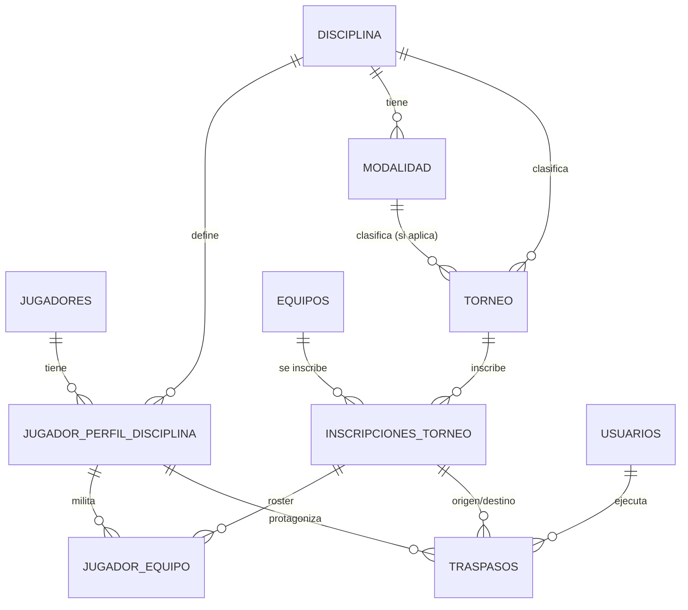

# Plan: Módulo de Gestión de Equipos y Jugadores

Generado con `/autoplan` (revisión CEO → Design → Eng). Codex no está
disponible en esta máquina (`codex` no está en PATH) — las 3 fases corrieron
en modo `[subagent-only]`, una sola voz revisora (Claude), no dos. Está
marcado así en cada tabla de consenso en vez de fingir dual-voice.

Estado: **Fase 1 (DB) implementada** — 2026-08-26. `01_schema.sql` a
`06_triggers.sql` quedaron actualizados a su forma final (catálogo
DISCIPLINA/MODALIDAD, JUGADOR_PERFIL_DISCIPLINA, TRASPASOS, reestructura
de JUGADOR_EQUIPO/TORNEO/JUGADORES, triggers y vistas nuevas), y
`database/08_migracion_equipos_jugadores.sql` migró `torneos_mvp` (con
backup previo). Ver el checklist de "Tareas de implementación" abajo para
el detalle por ítem.

**Fase 2, Etapa A implementada** — 2026-08-26 (misma sesión). El backend
y el frontend estaban rotos a propósito tras la Fase 1 (apuntaban al
esquema viejo) — esta etapa los deja funcionando de nuevo contra el
esquema nuevo, más el catálogo mínimo (Disciplina/Modalidad/Perfil de
jugador) que hace falta para que "Plantillas" pueda crear un vínculo.
69 tests backend + 70 tests frontend en verde, typecheck limpio, y un
flujo end-to-end real contra `torneos_mvp` (disciplina individual → sin
modalidad rechazado 400 → con modalidad OK → equipo → inscripción →
jugador → perfil → plantilla), con los datos de prueba limpiados después.
Detalle en `C:\Users\Gabo\.claude\plans\shiny-bubbling-robin.md` (el plan
de esta etapa).

**Fase 2, Etapas B/C/D implementadas — Fase 2 completa** — 2026-08-27
(misma sesión que la Etapa A). Registro por lote con pantalla dividida
(`POST /plantillas/lote/validar` + `/confirmar`, cubre EC-1/2/3/4/6/9/13/18,
con revalidación real en `/confirmar` para EC-7), Traspasos
(`POST /traspasos`, `POST /traspasos/{id}/anular` — anular es una
anotación visual, EC-20, nunca toca `JUGADOR_EQUIPO`), y Perfil de
Jugador (`GET /jugadores/{id}/perfil`, stats + trayectoria compuestas
sobre las vistas de Fase 1). Frontend: pantalla dividida
(`RegistroLoteAdmin.tsx`), pestaña Traspasos (`TraspasosAdmin.tsx`),
vista de Perfil (`PerfilJugadorAdmin.tsx`, alcanzable desde un link "Ver
perfil" en Jugadores). 90 tests backend + 80 tests frontend en verde,
typecheck limpio, y un flujo end-to-end real contra `torneos_mvp`
(registrar lote de 2 jugadores nuevos → traspasar uno → anular ese
traspaso → ver su Perfil de Jugador, confirmando trayectoria y equipo
activo coherentes), datos de prueba limpiados después. Detalle de diseño
(URLs planas en vez del sketch anidado del plan, decisiones de
transacción en Traspasos, etc.) en
`C:\Users\Gabo\.claude\plans\shiny-bubbling-robin.md`.

**Fase 3, P3 implementada — pasada de tests contra la tabla "Diagrama de
pruebas"** — 2026-08-27 (misma sesión). Se auditó cada fila de esa tabla
contra los tests ya existentes de la Fase 2: la mayoría de EC's de
registro por lote (EC-1/2/3/4/6/7/9/13/18) y de Traspasos ya tenían test
propio (`test_registro_lote.py`, `test_traspasos.py`, `test_perfil_jugador.py`).
Quedaban 3 filas descubiertas — las que la tabla marca explícitamente como
"DB (pytest contra Postgres real)", es decir, un INSERT/UPDATE directo que
bypasea el service layer para confirmar que la base misma impone la regla,
no solo el chequeo de aplicación que la antecede:
- Trigger de exclusividad (`fn_validar_exclusividad_torneo`) rechazando un
  INSERT directo (no vía `/plantillas/lote/*`).
- `unique_dorsal_por_roster_vigente` rechazando un INSERT directo con
  dorsal repetido, aislado de cualquier conflicto de exclusividad.
- **EC-10** (agencia libre no debe pisar multi-torneo) — el que el plan
  marca como el de mayor costo de bug silencioso, y el único de los tres
  que no tenía ningún test, ni de app ni de DB. Se agregó en ambas
  direcciones: un perfil con membresía paralela en otro torneo de la misma
  disciplina queda `Activo` tras finalizar el primero; un perfil sin
  paralela queda `Libre`.

Los 4 tests nuevos viven en `test_db_triggers_equipos_jugadores.py`. 94
tests backend (90 + 4) + 80 tests frontend en verde, typecheck de frontend
limpio (no hay typecheck configurado para el backend — solo pytest, ya era
así antes de esta fase).

**Fuera de esta implementación, sin empezar**:
`database/esquema_relacional_torneos.html` (diagrama) desactualizado, y
todo lo que el plan original marcó "fuera de alcance" (EC-17,
desactivación de persona; límite de plantilla en disciplinas de equipo;
notificaciones por correo; importación CSV).

---

## Resumen del módulo

Registro de jugadores por lote con validación de conflictos de cédula,
perfiles de jugador aislados por disciplina, exclusividad de equipo por
torneo, traspasos formales con trazabilidad inmutable, y estadísticas
consolidadas cross-torneo por disciplina.

---

## Fase 1 — CEO Review (Estrategia y Alcance)

### Premisas

| # | Premisa | Veredicto |
|---|---------|-----------|
| P1 | El esquema actual (`JUGADORES`, `EQUIPOS`, `JUGADOR_EQUIPO`, `INSCRIPCIONES_TORNEO`) se **extiende**, no se reemplaza. | Aceptada — hay convención de triggers y vistas ya establecida que este plan reutiliza. |
| P2 | `TORNEO.Disciplina` hoy es texto libre (`VARCHAR(50)`), sin catálogo. No modela modalidades. | Confirmado leyendo `database/01_schema.sql`. Se normaliza a `DISCIPLINA`/`MODALIDAD`. |
| P3 | **Gap crítico**: `JUGADOR_EQUIPO` no sabe en qué torneo milita el jugador — solo referencia `EQUIPO_ID`, y un equipo puede estar inscrito en varios torneos (`INSCRIPCIONES_TORNEO` es N:M). Hoy es literalmente imposible expresar "exclusivo por torneo". | Confirmado — es el hallazgo central de esta revisión. Resuelto con D1 (ver abajo). |
| P4 | Un "torneo" en este esquema es una sola disciplina y (con este plan) una sola modalidad. "Tenis Individual" y "Tenis Dobles" del mismo evento son **dos filas de `TORNEO` distintas**, no una con sub-brackets. | Aceptada como default razonable — consecuencia: un jugador SÍ puede jugar el cuadro individual y el de dobles del "mismo" evento a la vez, porque para el modelo son torneos diferentes. Coincide con la regla #3 de multi-torneo. Si esto no es lo que se espera en producto, es una conversación de negocio, no un bug de este plan. |
| P5 | La UI de pantalla dividida es una vista nueva sobre el flujo existente de "agregar jugadores a un equipo"; no reemplaza formularios de jugador individual. | Aceptada. |

### D1 — Decisión ya tomada con el usuario

Se preguntó cómo escalar `JUGADOR_EQUIPO` para exclusividad por torneo.
**Elegido: Opción C — roster por torneo**, pero refinado tras leer el
código: no hace falta una tabla nueva de "equipo-en-torneo" — `INSCRIPCIONES_TORNEO`
**ya es exactamente eso** (`Torneo_ID` + `Equipo_ID`, único por par). Crear
una tabla paralela hubiera violado DRY. Ver modelo de datos abajo.

### Qué ya existe (leverage map)

| Sub-problema | Ya cubierto por | Qué falta |
|---|---|---|
| Roster de un equipo en un torneo específico | `INSCRIPCIONES_TORNEO` | Nada — se reutiliza tal cual como ancla del roster |
| Historial de goles/tarjetas por equipo-en-el-momento | `EVENTOS_PARTIDO.EQUIPO_ID` (ya congela el equipo al momento del evento, según su propio comentario en el schema) | Nada — un traspaso no altera goles históricos, ya funciona |
| `fecha_modificacion` automática | `fn_actualizar_fecha_modificacion()` + trigger por tabla | Replicar el trigger en las tablas nuevas |
| Validación cruzada vía trigger (patrón ya usado) | `fn_validar_jugador_partido()` en `06_triggers.sql` | Mismo patrón para exclusividad por torneo y agencia libre |
| Vistas de agregación en vez de tablas de resumen duplicadas | `vw_goleadores`, `vw_tabla_posiciones` | Misma técnica para estadísticas cross-torneo por disciplina |
| Borrado lógico vía `Estado` | Convención en las 9 tablas actuales | Mantenerla en las tablas nuevas |

### Alternativas de arquitectura consideradas

| Alternativa | Completeness | Veredicto |
|---|---|---|
| **A. Extender el esquema relacional actual** (elegida) | 10/10 | Reutiliza `INSCRIPCIONES_TORNEO`, mantiene consistencia con el resto del sistema, sin capa nueva de infraestructura. |
| B. Motor de reglas separado (ej. tabla de "restricciones" genérica evaluada en la app) | 4/10 | Más flexible en teoría, pero el proyecto no tiene ese patrón en ningún otro módulo — sería la única regla de negocio no respaldada por constraint/trigger de DB. Rechazada (P5: explícito > clever). |
| C. Cédula como PK global de "persona" fuera de `JUGADORES`, con `JUGADORES` como alias por disciplina | 6/10 | Correcto en teoría pero duplica lo que `JUGADORES` + `JUGADOR_PERFIL_DISCIPLINA` ya resuelven con una tabla menos. Rechazada por sobre-ingeniería (P3: pragmático). |

### Alcance

**Dentro de este módulo:**
- Registro por lote con pantalla de validación dividida (válidos/inválidos).
- Perfiles de jugador por disciplina, exclusividad por torneo, agencia libre.
- Traspasos con trazabilidad inmutable.
- Estadísticas consolidadas por disciplina, cross-torneo.
- Vista de perfil del jugador (stats globales, equipos activos, trayectoria).

**Fuera de este módulo (→ `TODOS.md`):**
- Desactivación/GDPR de una persona (`JUGADORES.Estado → Inactivo`) con cascada a perfiles y rosters activos. Comportamiento no trivial (¿se fuerza cierre de membresías? ¿se anonimiza?) — merece su propia revisión.
- Límite de tamaño de plantilla para disciplinas de equipo (Fútbol). Este plan sí limita el tamaño de pareja/individual vía `Modalidad.Tamano_Equipo`, pero no pone techo a un roster de fútbol.
- Notificación por correo al jugador cuando es traspasado o pasa a libre (el campo `Correo_Electronico` se captura pero enviar el correo es un módulo de notificaciones aparte).
- Importación masiva desde CSV/Excel — el requerimiento habla de "lote" pero no especifica el mecanismo de entrada; se asume formulario multi-fila en la UI, no upload de archivo. Si se necesita CSV, es una extensión menor sobre el mismo endpoint de validación.

### Dream state

```
ACTUAL                         ESTE PLAN                       IDEAL 12 MESES
──────────────────────         ──────────────────────          ──────────────────────
Jugador = 1 fila global.        Jugador = identidad + N          + Transferencias entre
Sin cédula, sin email.          perfiles por disciplina.           disciplinas distintas
                                                                    del mismo club en un
Un equipo puede estar en        Roster = INSCRIPCIONES_TORNEO       solo flujo (ej. mover
2 torneos sin distinguir        + JUGADOR_EQUIPO exclusivo          jugadores de la
membresías.                     por torneo (trigger).               cantera al primer
                                                                    equipo).
Sin traspasos formales,         TRASPASOS inmutable, agencia
sin agencia libre.              libre automática al finalizar     + Notificaciones al
                                 torneo.                            jugador (email real).
Stats por torneo suelto,
no consolidadas.                Stats consolidadas por           + Analítica de
                                 disciplina vía vistas.             rendimiento cross-
                                                                    disciplina.
```

---

## Fase 2 — Design Review (UX de validación)

Aplica — la pantalla dividida es UI nueva con estados de interacción no
triviales.

### Flujo de pantallas

```
[Formulario de equipo]
        │  admin agrega N filas (Cédula, Nombre, Dorsal, Correo)
        ▼
[Validar lote] ── POST /equipos/{id}/torneos/{torneo_id}/jugadores/validar
        │
        │  loading: spinner sobre el botón "Validar", filas deshabilitadas
        ▼
┌─────────────────────────────────────────────┐
│ PANTALLA DIVIDIDA                            │
│ ┌───────────────────────────────────────┐   │
│ │ ✅ VÁLIDOS (n)                         │   │
│ │  Cédula | Nombre | Dorsal | Correo     │   │
│ │  ─────────────────────────────────     │   │
│ │  (vacío → "Ningún jugador nuevo listo   │   │
│ │  para registrar")                       │   │
│ └───────────────────────────────────────┘   │
│ ┌───────────────────────────────────────┐   │
│ │ ⚠️ INVÁLIDOS (m)                       │   │
│ │  Cédula | Nombre | Motivo               │   │
│ │  ─────────────────────────────────      │   │
│ │  Motivos posibles (texto distinto      │   │
│ │  cada uno, no un genérico "conflicto"):│   │
│ │  • "Ya juega en [Equipo X] este         │   │
│ │     torneo — usa Traspasos en           │   │
│ │     Plantillas para moverlo"            │   │
│ │  • "Cédula duplicada en este mismo      │   │
│ │     lote (fila 3 y fila 7)"             │   │
│ │  • "Nombre no coincide con el           │   │
│ │     registrado para esta cédula         │   │
│ │     (¿es la misma persona?)"            │   │
│ │  • "Jugador suspendido en esta          │   │
│ │     disciplina"                         │   │
│ └───────────────────────────────────────┘   │
│         [Cancelar Registro]  [Confirmar]     │
└─────────────────────────────────────────────┘
        │ Confirmar                    │ Cancelar
        ▼                              ▼
POST /confirmar (solo IDs de       Vuelve al formulario con las
la sección Válidos)                filas tal cual estaban
        │
        │  Revalida en el servidor (no confía en el snapshot del cliente:
        │  otro admin pudo haber registrado esa cédula entre el "validar"
        │  y el "confirmar" — condición de carrera, ver Eng #EC-7).
        ▼
┌── éxito total ──────────────┐   ┌── éxito parcial (race) ──────────┐
│ Todos insertados. Toast      │   │ k de n insertados. Los que ya no │
│ "n jugadores registrados".   │   │ son válidos vuelven a la sección │
│ Redirige a la plantilla.     │   │ Inválidos con el nuevo motivo,   │
│                               │   │ el resto queda confirmado.       │
└───────────────────────────────┘   └───────────────────────────────────┘
```

### Estados de interacción cubiertos

| Estado | Comportamiento |
|---|---|
| Loading (validando) | Botón deshabilitado + spinner, filas no editables. |
| Empty (sección Válidos vacía) | Mensaje explícito, botón "Confirmar Registro" deshabilitado (no tiene sentido confirmar 0 filas). |
| Empty (sección Inválidos vacía) | Sección inferior colapsada u oculta — no mostrar un panel vacío con encabezado de advertencia sin contenido. |
| Error (fallo de red al validar) | Mensaje de error inline + botón "Reintentar", el formulario original no se pierde. |
| Éxito total | Toast de confirmación, navegación a la plantilla. |
| Éxito parcial (race en confirmar) | Ver arriba — nunca un error 500 genérico; se re-renderiza la pantalla dividida con el estado actualizado. |
| Cancelar | Vuelve al formulario de ingreso preservando lo tipeado (no se pierde el trabajo del admin). |

### Litmus scorecard (resumen)

| Dimensión | Score |
|---|---|
| Jerarquía de información (válidos arriba, inválidos abajo, motivo visible) | 9/10 |
| Estados especificados (no dejados a interpretación del implementador) | 9/10 — cubiertos arriba |
| Especificidad (motivos de invalidez son mensajes concretos, no un genérico "conflicto") | 8/10 |
| Alineación con patrones existentes del frontend (Vite/React, según `frontend/`) | No evaluado a fondo — este plan no leyó componentes de frontend existentes en detalle; **taste decision**: reutilizar el sistema de diseño actual del frontend es responsabilidad de la fase de implementación, no de este documento. |

---

## Fase 3 — Eng Review (Arquitectura, Datos, Edge Cases, Tests)

### Arquitectura

```
Frontend (Vite)                Backend (FastAPI)                    DB (Postgres)
────────────────                ──────────────────                   ─────────────
PantallaDividida.tsx    ──────▶ POST /equipos/{id}/torneos/          JUGADOR_EQUIPO
  (válidos/inválidos)            {torneo_id}/jugadores/validar         (trigger de
        │                              │                                exclusividad)
        │                        service: JugadorRegistroService            │
        ▼                              │  - resuelve JUGADORES por cédula   │
  POST .../confirmar    ──────▶        │    (crea si no existe)             │
        │                              │  - resuelve/crea                   │
        │                              │    JUGADOR_PERFIL_DISCIPLINA       │
        │                              │  - valida exclusividad             │
        │                              │    (re-check en confirmar)         │
        ▼                              ▼                                    ▼
  Toast / partial-result        repositories/jugadores.py           INSCRIPCIONES_TORNEO
                                 repositories/traspasos.py           (ancla del roster)
                                                                             │
Pestaña Plantillas ─────────▶  POST /traspasos                     TRASPASOS (append-only)
  (Traspasos)                        │
                                      ▼
                               trigger: cierra JUGADOR_EQUIPO origen,
                               abre JUGADOR_EQUIPO destino, todo en
                               una sola transacción

Cron/trigger de cierre de torneo (TORNEO.Estado → 'Finalizado')
        │
        ▼
  Cierra todas las JUGADOR_EQUIPO activas de ese torneo (Agencia Libre).
  NO toca perfiles con membresía activa en OTRO torneo de la misma
  disciplina (ver EC-10).
```

### Modelo de datos relacional



#### Tablas nuevas

**`DISCIPLINA`**
| Columna | Tipo | Notas |
|---|---|---|
| ID | SERIAL PK | |
| Nombre | VARCHAR(50) UNIQUE NOT NULL | "Fútbol", "Tenis", "Pádel" |
| Tipo | VARCHAR(20) NOT NULL CHECK IN ('Equipo','Individual') | Equipo = sin modalidad (Fútbol). Individual = requiere Modalidad en el torneo. |
| Estado | VARCHAR(20) DEFAULT 'Activo' | |

**`MODALIDAD`**
| Columna | Tipo | Notas |
|---|---|---|
| ID | SERIAL PK | |
| Disciplina_ID | INT FK → DISCIPLINA | |
| Nombre | VARCHAR(30) NOT NULL | "Individual", "Dobles" |
| Tamano_Equipo | INT NOT NULL CHECK (> 0) | 1 para individual, 2 para dobles/pádel |
| Estado | VARCHAR(20) DEFAULT 'Activo' | |
| | UNIQUE(Disciplina_ID, Nombre) | |

**`JUGADOR_PERFIL_DISCIPLINA`**
| Columna | Tipo | Notas |
|---|---|---|
| ID | SERIAL PK | |
| Jugador_ID | INT FK → JUGADORES ON DELETE CASCADE | |
| Disciplina_ID | INT FK → DISCIPLINA | |
| Suspendido | BOOLEAN NOT NULL DEFAULT FALSE | Sanción explícita — **no** "Libre/Activo": eso se deriva (ver EC-11), guardarlo aparte hubiera duplicado estado que ya vive en `JUGADOR_EQUIPO`. |
| Fecha_Registro | TIMESTAMP DEFAULT now() | |
| Fecha_Modificacion | TIMESTAMP DEFAULT now() | |
| | UNIQUE(Jugador_ID, Disciplina_ID) | Un perfil por persona por disciplina |

**`TRASPASOS`** (append-only, trayectoria inmutable)
| Columna | Tipo | Notas |
|---|---|---|
| ID | SERIAL PK | |
| Jugador_Perfil_ID | INT FK → JUGADOR_PERFIL_DISCIPLINA | |
| Inscripcion_Origen_ID | INT FK → INSCRIPCIONES_TORNEO NULL | NULL = fichaje desde libre, no un traspaso equipo-a-equipo |
| Inscripcion_Destino_ID | INT FK → INSCRIPCIONES_TORNEO NOT NULL | |
| Dorsal_Nuevo | INT NULL | |
| Realizado_Por | INT FK → USUARIOS | Auditoría — quién lo hizo |
| Motivo | VARCHAR(200) NULL | |
| Fecha_Traspaso | TIMESTAMP DEFAULT now() | |
| Estado | VARCHAR(20) DEFAULT 'Completado' CHECK IN ('Completado','Anulado') | Anular es un flag, **nunca** un DELETE — ver EC-20 |

#### Tablas modificadas

**`JUGADORES`** — agregar:
```sql
ALTER TABLE JUGADORES
  ADD COLUMN Cedula VARCHAR(20) NOT NULL,
  ADD COLUMN Correo_Electronico VARCHAR(150) NOT NULL,
  ADD CONSTRAINT unique_jugador_cedula UNIQUE (Cedula);
-- Correo_Electronico NO es UNIQUE a propósito (EC-12): dos cédulas
-- distintas pueden compartir un correo familiar. La identidad es la
-- cédula, el correo es solo contacto.
```
Migración de datos existentes: las filas actuales de `JUGADORES` no
tienen cédula real — requiere backfill manual o placeholder antes de
poner `NOT NULL` (bloqueante de implementación, no de este plan).

**`TORNEO`** — reemplazar `Disciplina` texto libre por catálogo:
```sql
ALTER TABLE TORNEO ADD COLUMN Disciplina_ID INT REFERENCES DISCIPLINA(ID);
ALTER TABLE TORNEO ADD COLUMN Modalidad_ID INT REFERENCES MODALIDAD(ID);
-- backfill: mapear TORNEO.Disciplina (texto) a DISCIPLINA.Nombre
-- luego: ALTER TABLE TORNEO ALTER COLUMN Disciplina_ID SET NOT NULL;
--        ALTER TABLE TORNEO DROP COLUMN Disciplina;
-- Trigger: Modalidad_ID es NOT NULL si DISCIPLINA.Tipo='Individual',
-- y debe ser NULL si Tipo='Equipo' (un CHECK simple no puede cruzar
-- tablas — se valida en fn_validar_torneo_modalidad(), mismo patrón
-- que fn_validar_jugador_partido()).
```

**`INSCRIPCIONES_TORNEO`** — sin cambios estructurales. Pasa a ser,
formalmente, el ancla del roster ("equipo-en-este-torneo"), que es
literalmente lo que ya modela.

**`JUGADOR_EQUIPO`** — se convierte en "membresía de un perfil de
disciplina en un roster de torneo":
```sql
ALTER TABLE JUGADOR_EQUIPO
  ADD COLUMN Jugador_Perfil_ID INT REFERENCES JUGADOR_PERFIL_DISCIPLINA(ID),
  ADD COLUMN Inscripcion_Torneo_ID INT REFERENCES INSCRIPCIONES_TORNEO(ID);
-- backfill desde JUGADOR_ID + EQUIPO_ID existentes, luego:
--   ALTER COLUMN ... SET NOT NULL
--   DROP COLUMN JUGADOR_ID, DROP COLUMN EQUIPO_ID
-- Dorsal, Fecha_Inicio, Fecha_Fin, Estado, Fecha_Registro/Modificacion: sin cambio.
-- Estado gana un 4to valor: 'Traspasado' (distinto de 'Inactivo' genérico,
-- para que la trayectoria diga *por qué* terminó esa membresía sin tener
-- que ir a buscarlo en TRASPASOS).
ALTER TABLE JUGADOR_EQUIPO DROP CONSTRAINT chk_jugador_equipo_estado;
ALTER TABLE JUGADOR_EQUIPO ADD CONSTRAINT chk_jugador_equipo_estado
  CHECK (Estado IN ('Activo','Inactivo','Suspendido','Traspasado'));
ALTER TABLE JUGADOR_EQUIPO DROP CONSTRAINT unique_jugador_equipo;
ALTER TABLE JUGADOR_EQUIPO ADD CONSTRAINT unique_jugador_equipo
  UNIQUE (Jugador_Perfil_ID, Inscripcion_Torneo_ID, Fecha_Inicio);
ALTER TABLE JUGADOR_EQUIPO ADD CONSTRAINT unique_dorsal_por_roster
  UNIQUE (Inscripcion_Torneo_ID, Dorsal); -- ver EC-13: gap preexistente que este plan cierra
```

**Trigger de exclusividad por torneo** (mismo patrón que
`fn_validar_jugador_partido`, no un UNIQUE plano porque `Torneo_ID` no
vive directamente en `JUGADOR_EQUIPO` — se deriva por join, evitando
denormalizar):
```sql
CREATE OR REPLACE FUNCTION fn_validar_exclusividad_torneo()
RETURNS TRIGGER AS $$
DECLARE
    v_conflicto INT;
BEGIN
    IF NEW.Estado = 'Activo' THEN
        SELECT COUNT(*) INTO v_conflicto
        FROM JUGADOR_EQUIPO je
        JOIN INSCRIPCIONES_TORNEO it_new ON it_new.ID = NEW.Inscripcion_Torneo_ID
        JOIN INSCRIPCIONES_TORNEO it_je  ON it_je.ID = je.Inscripcion_Torneo_ID
        WHERE je.Jugador_Perfil_ID = NEW.Jugador_Perfil_ID
          AND je.Estado = 'Activo'
          AND je.ID <> COALESCE(NEW.ID, -1)
          AND it_je.Torneo_ID = it_new.Torneo_ID;
        IF v_conflicto > 0 THEN
            RAISE EXCEPTION 'jugador_ya_activo_en_este_torneo';
        END IF;
    END IF;
    RETURN NEW;
END;
$$ LANGUAGE plpgsql;

CREATE TRIGGER trg_jugador_equipo_exclusividad
BEFORE INSERT OR UPDATE ON JUGADOR_EQUIPO
FOR EACH ROW EXECUTE FUNCTION fn_validar_exclusividad_torneo();
```
El backend atrapa esta excepción específica (`jugador_ya_activo_en_este_torneo`)
y la traduce al mensaje de UI de la sección Inválidos — la DB es la
fuente de verdad, no un chequeo de aplicación que se puede saltar desde
un script de seed o un admin directo a SQL.

**Agencia libre automática:**
```sql
-- Al pasar un TORNEO a 'Finalizado': cerrar todas las membresías activas
-- de ese torneo. NO tocar JUGADOR_PERFIL_DISCIPLINA (no tiene columna de
-- estado activo/libre que "cerrar" — eso ya es derivado, ver vista abajo).
CREATE OR REPLACE FUNCTION fn_cerrar_torneo_libera_jugadores()
RETURNS TRIGGER AS $$
BEGIN
    IF NEW.Estado = 'Finalizado' AND OLD.Estado <> 'Finalizado' THEN
        UPDATE JUGADOR_EQUIPO je
        SET Estado = 'Inactivo', Fecha_Fin = CURRENT_DATE
        FROM INSCRIPCIONES_TORNEO it
        WHERE je.Inscripcion_Torneo_ID = it.ID
          AND it.Torneo_ID = NEW.ID
          AND je.Estado = 'Activo';
    END IF;
    RETURN NEW;
END;
$$ LANGUAGE plpgsql;

CREATE TRIGGER trg_torneo_finalizado_libera
AFTER UPDATE ON TORNEO
FOR EACH ROW EXECUTE FUNCTION fn_cerrar_torneo_libera_jugadores();
```

**Vista de estado del perfil (Libre/Activo derivado, no almacenado):**
```sql
CREATE OR REPLACE VIEW vw_estado_perfil_disciplina AS
SELECT
    jpd.ID AS Jugador_Perfil_ID,
    jpd.Jugador_ID,
    jpd.Disciplina_ID,
    CASE
        WHEN jpd.Suspendido THEN 'Suspendido'
        WHEN EXISTS (
            SELECT 1 FROM JUGADOR_EQUIPO je
            WHERE je.Jugador_Perfil_ID = jpd.ID AND je.Estado = 'Activo'
        ) THEN 'Activo'
        ELSE 'Libre'
    END AS Estado
FROM JUGADOR_PERFIL_DISCIPLINA jpd;
```

**Vista de estadísticas consolidadas por disciplina (cross-torneo):**
```sql
CREATE OR REPLACE VIEW vw_goleadores_por_disciplina AS
SELECT
    jpd.ID AS Jugador_Perfil_ID,
    j.Nombre AS Jugador,
    d.Nombre AS Disciplina,
    COUNT(ga.Evento_Partido_ID) AS Goles_Totales
FROM JUGADOR_PERFIL_DISCIPLINA jpd
JOIN JUGADORES j ON j.ID = jpd.Jugador_ID
JOIN DISCIPLINA d ON d.ID = jpd.Disciplina_ID
LEFT JOIN vw_goles_acreditados ga ON ga.JUGADOR_ID = jpd.Jugador_ID AND ga.Tipo_Gol = 'Gol'
LEFT JOIN TORNEO t ON t.ID = ga.TORNEO_ID AND t.Disciplina_ID = jpd.Disciplina_ID
GROUP BY jpd.ID, j.Nombre, d.Nombre;
-- Nota: vw_goles_acreditados hoy referencia JUGADOR_ID (persona), no
-- Jugador_Perfil_ID — con perfiles multi-disciplina hace falta filtrar
-- por la disciplina del torneo del evento (el JOIN con TORNEO arriba),
-- para que un gol de fútbol no se cuente en el perfil de tenis de la
-- misma persona.
```
Se eligió **vista** sobre tabla de resumen duplicada (P4 DRY + convención
existente `vw_goleadores`/`vw_tabla_posiciones`). Si el volumen de datos
lo justifica más adelante, migrar a vista materializada con refresh
periódico es un cambio aislado — no bloquea este plan.

### Máquina de estados

**`JUGADOR_PERFIL_DISCIPLINA` (derivado, vía `vw_estado_perfil_disciplina`):**
```
        ┌─────────┐   se crea el perfil,      ┌─────────┐
        │  n/a    │──sin membresía activa────▶│  LIBRE  │
        └─────────┘                            └────┬────┘
                                                       │ se registra en un equipo
                                                       │ (batch válido o traspaso
                                                       │  desde libre)
                                                       ▼
                                                  ┌─────────┐
                          torneo finaliza y       │ ACTIVO  │
                          no queda membresía  ◀───┤         │◀── traspaso (cierra
                          activa en NINGÚN         └────┬────┘    origen, abre destino,
                          torneo de esta                │          perfil sigue ACTIVO)
                          disciplina (EC-10)             │
                          │                              │ admin marca sanción
                          ▼                              ▼
                     ┌─────────┐                   ┌─────────────┐
                     │  LIBRE  │                    │ SUSPENDIDO  │
                     └─────────┘                    └─────────────┘
```

**`JUGADOR_EQUIPO` (membresía, fila real):**
```
[no existe] ──registro válido / traspaso──▶ Activo ──┬─▶ Traspasado (traspaso a otro equipo)
                                                       ├─▶ Inactivo   (torneo finalizado)
                                                       └─▶ Suspendido (sanción a nivel roster)
```

### Edge cases

**Identidad y datos**
- **EC-1 — Cédula duplicada dentro del mismo lote.** Dos filas del
  formulario comparten cédula. Se detecta antes de tocar la DB, va a
  Inválidos con "duplicado en este mismo lote (fila X y fila Y)".
- **EC-2 — Mismo cédula, nombre distinto al ya registrado.** ¿Typo o
  suplantación? No sobreescribir el nombre silenciosamente — va a
  Inválidos con "el nombre no coincide con el registrado para esta
  cédula", el admin decide manualmente.
- **EC-3 — Jugador ya existe como Libre y se re-registra.** Válido —
  reutiliza la fila `JUGADORES` existente (match por cédula), no crea
  una persona duplicada.
- **EC-4 — Primera vez del jugador en OTRA disciplina** (ya tiene perfil
  de Fútbol, se registra en Tenis). Válido — reutiliza `JUGADORES`,
  crea un `JUGADOR_PERFIL_DISCIPLINA` nuevo para Tenis.
- **EC-12 — Correo repetido entre dos cédulas distintas.** Permitido a
  propósito (familia compartiendo correo) — la identidad es la cédula,
  no el correo.

**Concurrencia y exclusividad**
- **EC-5 — Conflicto cruzado disciplina/modalidad.** Un jugador activo
  en Fútbol Torneo 1 se registra en Tenis Torneo 2 simultáneamente: no
  es conflicto — perfiles aislados por disciplina, cubierto porque la
  exclusividad se evalúa por `Torneo_ID`, y cada torneo tiene una sola
  disciplina.
- **EC-6 — Roster sobre la capacidad de la modalidad.** Registrar un
  tercer jugador en un "equipo" de Tenis Dobles (`Tamano_Equipo=2`).
  Bloquear en el service layer antes de insertar (no es un caso de
  cédula duplicada, es capacidad — mensaje distinto: "esta modalidad
  admite máximo 2 jugadores por equipo").
- **EC-7 — Race entre validar y confirmar.** Otro admin registra la
  misma cédula en otro equipo entre el render de la pantalla dividida y
  el click en "Confirmar". El endpoint de confirmar **revalida en el
  servidor**, no confía en el snapshot del cliente — resultado parcial,
  ver flujo de UI arriba.
- **EC-9 — Jugador suspendido intenta ser registrado.** Bloquear en
  validación aunque esté "Libre" desde el punto de vista de roster —
  `Suspendido` es independiente de tener o no membresía activa.
- **EC-13 — Dorsal repetido dentro del mismo equipo/torneo.** Gap que ya
  existía en el esquema actual (no hay `UNIQUE` sobre dorsal), este plan
  lo cierra con `unique_dorsal_por_roster`. Es un error de **validación
  de formulario** (corregible con solo cambiar el número), no pertenece
  a la sección Inválidos de cédula — se bloquea antes de llegar a la
  pantalla dividida.
- **EC-18 — Duplicado exacto de EC-1 pero contra la DB, no el lote**:
  cubierto por el trigger de exclusividad, mensaje "ya juega en
  [Equipo X] este torneo — usa Traspasos".

**Ciclo de vida (agencia libre / traspasos)**
- **EC-10 — Agencia libre no debe pisar multi-torneo.** Al finalizar el
  Torneo 1 de Fútbol, un jugador con membresía activa en el Torneo 3 de
  Fútbol (multi-torneo permitido) **no** debe quedar "libre" a nivel de
  perfil — porque el estado es derivado de "¿tiene alguna membresía
  activa en cualquier torneo de esta disciplina?", no de "¿tiene
  membresía activa en el torneo que acaba de cerrar?". La vista
  `vw_estado_perfil_disciplina` ya lo resuelve correctamente por
  construcción (no hay columna que "olvidar" actualizar) — es la razón
  por la que se eligió derivar el estado en vez de guardarlo.
- **EC-11 — Por qué el perfil no tiene columna Activo/Libre.** Si se
  guardara como columna, cada agencia-libre y cada traspaso tendría que
  recordar actualizarla en la disciplina correcta — una sola migración
  futura que toque `JUGADOR_EQUIPO` sin tocar ese campo lo deja
  desincronizado. Derivarlo vía vista elimina la clase de bug.
- **EC-20 — Corrección de un traspaso mal hecho.** No se permite editar
  ni borrar la fila de `TRASPASOS` (rompería "inmutable"). Corregir un
  error es un **traspaso nuevo** en sentido inverso; el original se
  marca `Estado='Anulado'` solo como anotación visual, sigue existiendo
  en la trayectoria.
- **EC-15/16 — Historial de goles tras un traspaso.** Ya funciona sin
  cambios: `EVENTOS_PARTIDO.EQUIPO_ID` congela el equipo al momento del
  evento (comentario explícito en `01_schema.sql`), independiente de
  dónde juegue el jugador ahora.

**Fuera de alcance, documentado**
- **EC-17 — Desactivación de una persona con perfiles/rosters activos.**
  No definido en este plan — depende de una decisión de producto sobre
  qué pasa con las membresías activas. → `TODOS.md`.

### Diagrama de pruebas

| Flujo/rama nueva | Tipo de test | Cubierto por |
|---|---|---|
| Registro de lote 100% válido | Integración (API) | Nuevo — pendiente de implementación |
| Registro de lote con EC-1 (dup. en lote) | Unit (service) | Nuevo |
| Registro de lote con EC-2 (nombre no coincide) | Unit (service) | Nuevo |
| Registro de lote con EC-3/EC-4 (jugador existente / nueva disciplina) | Integración | Nuevo |
| Registro con EC-9 (suspendido) | Unit (service) | Nuevo |
| Trigger de exclusividad — insert directo violando regla | DB (pytest contra Postgres real, ya hay convención en `backend/tests/`) | Nuevo |
| EC-6 capacidad de modalidad (dobles) | Unit (service) | Nuevo |
| EC-7 race condition en confirmar | Integración con mock de carrera (dos requests concurrentes) | Nuevo — el más caro de escribir bien, priorizar |
| Traspaso — cierra origen y abre destino atómicamente | Integración + DB | Nuevo |
| Traspaso — trayectoria inmutable tras "anular" | Unit | Nuevo |
| Agencia libre al finalizar torneo (EC-10, multi-torneo) | DB (trigger) | Nuevo — crítico, es el bug más fácil de introducir sin querer |
| `vw_goleadores_por_disciplina` — no mezcla disciplinas de la misma persona | DB (vista) | Nuevo |
| `unique_dorsal_por_roster` (EC-13) | DB (constraint) | Nuevo |

---

## Decision Audit Trail

| # | Fase | Decisión | Clasificación | Principio | Racional |
|---|---|---|---|---|---|
| 1 | CEO | Extender esquema actual, no reemplazar | Mecánica | P4 (DRY) | Ya hay convención de triggers/vistas consistente que reutilizar |
| 2 | CEO | Reutilizar `INSCRIPCIONES_TORNEO` como ancla de roster en vez de tabla nueva | Mecánica | P4 (DRY) | Ya modela "equipo-en-torneo" exactamente |
| 3 | CEO | D1: roster escopado por torneo (opción C, refinada) | **User challenge resuelto con el usuario** | P1 (completeness) | Confirmado explícitamente por el usuario en D1 |
| 4 | CEO | Torneos individuales con modalidad = filas de TORNEO separadas por modalidad | Taste | P5 (explícito) | Evita sub-brackets dentro de un torneo, que el esquema actual no modela en ningún lado |
| 5 | Design | Dorsal repetido es validación de formulario, no va a la sección Inválidos de cédula | Taste | P5 (explícito) | Son dos clases de error distintas con distinta corrección |
| 6 | Design | Confirmar revalida en servidor, nunca confía en snapshot del cliente | Mecánica | P1 (completeness) | Condición de carrera real con múltiples admins concurrentes |
| 7 | Eng | Estado del perfil (Libre/Activo) derivado vía vista, no columna almacenada | Taste | P5 (explícito) + P4 (DRY) | Elimina una clase entera de bug de sincronización (EC-10/EC-11) |
| 8 | Eng | Exclusividad por trigger (no UNIQUE plano, no chequeo solo en app) | Mecánica | P5 (explícito) | Sigue el patrón ya usado en `fn_validar_jugador_partido`; UNIQUE no puede expresar la regla sin denormalizar |
| 9 | Eng | Estadísticas consolidadas vía vista, no tabla de resumen duplicada | Mecánica | P4 (DRY) | Sigue convención existente (`vw_goleadores`) |
| 10 | Eng | Correo NO es único globalmente | Taste | — | Evita falsos rechazos por correos familiares compartidos |
| 11 | CEO | Desactivación de persona con membresías activas → fuera de alcance | Mecánica | P2 (boil lakes, límite) | Depende de decisión de producto no especificada en el requerimiento |

---

## Tareas de implementación (borrador, sin priorizar por sprint)

- [x] **P1 — DB: migración de catálogo** — crear `DISCIPLINA`, `MODALIDAD`; backfill de `TORNEO.Disciplina` texto → `Disciplina_ID`; drop de columna vieja. Hecho en `01_schema.sql`/`02_constraints.sql` (forma final) y `08_migracion_equipos_jugadores.sql` (base ya provisionada).
- [x] **P1 — DB: perfiles de jugador** — crear `JUGADOR_PERFIL_DISCIPLINA`; agregar `Cedula`/`Correo_Electronico` a `JUGADORES` con backfill de datos existentes. El backfill de una base ya provisionada usa placeholders (`PENDIENTE-<id>`) — cédula real sigue pendiente de captura manual, ver aviso en `08_migracion_equipos_jugadores.sql`.
- [x] **P1 — DB: reestructurar `JUGADOR_EQUIPO`** — nuevas FKs (`Jugador_Perfil_ID`, `Inscripcion_Torneo_ID`), backfill, drop de columnas viejas, nuevo `UNIQUE` de dorsal. El dorsal se implementó como índice único PARCIAL (vigencia), no el `UNIQUE` plano que sugería EC-13 — ver comentario en `03_indexes.sql` (un `UNIQUE` sin condición de vigencia dejaba el dorsal bloqueado para siempre).
- [x] **P1 — DB: trigger de exclusividad por torneo** (`fn_validar_exclusividad_torneo`). Probado funcionalmente contra base descartable.
- [x] **P1 — DB: trigger de agencia libre** (`fn_cerrar_torneo_libera_jugadores`), con test específico para EC-10. Probado: finalizar un torneo no toca membresías activas de otro torneo de la misma disciplina.
- [x] **P1 — DB: tabla `TRASPASOS`** + índices por `Jugador_Perfil_ID`.
- [x] **P1 — DB: vistas** `vw_estado_perfil_disciplina`, `vw_goleadores_por_disciplina`. `vw_goleadores_por_disciplina` tenía un bug de conteo en el plan original (el `LEFT JOIN` contra `TORNEO` no excluía goles de otra disciplina) — corregido, ver comentario en `04_views.sql`.
- [x] **P1 — DB: coherencia del resto del esquema** (no listado explícitamente en el plan original, pero necesario): `fn_validar_jugador_partido`, `vw_jugadores_activos_por_equipo` y el bloque de verificación final de `06_triggers.sql` dependían directo de `JUGADOR_EQUIPO.JUGADOR_ID`/`EQUIPO_ID` — se reescribieron para resolver la pertenencia vía perfil + roster de torneo. Sin esto la base quedaba con funciones/vistas rotas, no solo el backend.
- [x] **P2 — Backend: endpoint de validación de lote** (`POST .../jugadores/validar`) — implementa EC-1 a EC-9. Implementado como `POST /plantillas/lote/validar` (URL plana, no anidada — ver nota de diseño en el plan de la Etapa B) en `app/services/registro_lote.py` + `app/api/routes/registro_lote.py`.
- [x] **P2 — Backend: endpoint de confirmación** con revalidación server-side (EC-7). `POST /plantillas/lote/confirmar` — reusa el mismo `_validar_lote()` que `/validar`, así revalida de verdad contra la base en vez de confiar en el snapshot del cliente. Probado con un test de carrera explícito (`test_ec7_race_entre_validar_y_confirmar`).
- [x] **P2 — Backend: endpoints de Traspasos** (crear, anular-como-reversa). `POST /traspasos` (cierra origen + abre destino en una sola transacción) y `POST /traspasos/{id}/anular` (EC-20: anotación visual, nunca toca `JUGADOR_EQUIPO` — corregir de verdad es un traspaso nuevo en sentido inverso, no lo que hace este endpoint).
- [x] **P2 — Backend: endpoint de perfil de jugador** (stats globales + equipos activos + trayectoria). `GET /jugadores/{id}/perfil` — compone `vw_estado_perfil_disciplina` + `vw_goleadores_por_disciplina` (Fase 1) con equipos activos y trayectoria de `TRASPASOS`, por disciplina.
- [x] **P2 — Frontend: componente Pantalla Dividida** con los estados de interacción de la Fase 2. `RegistroLoteAdmin.tsx` — loading, vacíos, error+reintentar, éxito total, éxito parcial (vuelve a mostrar los rechazados con un botón para reintentar solo esas filas), cancelar sin perder lo tipeado.
- [x] **P2 — Frontend: pestaña Plantillas → flujo de Traspasos**. Pestaña propia "Traspasos" (`TraspasosAdmin.tsx`) en vez de un flujo embebido en Plantillas — más consistente con el resto de las pestañas de `TorneoAdminLayout.tsx` (una por recurso).
- [x] **P2 — Frontend: vista de Perfil del Jugador**. `PerfilJugadorAdmin.tsx`, alcanzable con un link "Ver perfil" nuevo en `JugadoresAdmin.tsx` (requirió extender `ResourceTable`/`SimpleResourceAdminPage` con un slot de acciones extra por fila, ver el plan de la Etapa D).
- [x] **P3 — Tests** — la tabla "Diagrama de pruebas" arriba, priorizando EC-7 y EC-10 por ser los de mayor costo de bug silencioso. EC-7 ya tenía test dedicado desde la Fase 2 (`test_ec7_race_entre_validar_y_confirmar`); EC-10 no tenía ninguno — se agregó en `test_db_triggers_equipos_jugadores.py`, junto con los otros dos huecos "DB directo" de la tabla (trigger de exclusividad y `unique_dorsal_por_roster_vigente` vía INSERT crudo, sin pasar por el service layer). 94 tests backend + 80 tests frontend en verde.

---

## GSTACK REVIEW REPORT

- **Modo**: SELECTIVE EXPANSION (extensión de esquema existente).
- **Fases corridas**: CEO ✅, Design ✅ (scope UI detectado: pantalla, botones, validación), Eng ✅, DX — omitida (no hay superficie de API/CLI para terceros, es un módulo interno).
- **Voces**: `[subagent-only]` en las 3 fases — Codex no disponible en esta máquina (binario no encontrado en PATH). Una sola voz revisora, no dual-voice real.
- **Gates**: 1 de 2 — premisa/decisión de arquitectura (D1) confirmada con el usuario. El gate final de aprobación no aplica: el usuario pidió explícitamente solo el documento, no una implementación para aprobar/rechazar.
- **Decisiones registradas**: 11 (ver Decision Audit Trail). 0 taste decisions sin resolver, 1 user challenge (D1, resuelto).
- **Entregables cubiertos** (pedidos explícitamente por el usuario):
  - Edge cases → sección "Edge cases" (14 casos concretos, con resolución).
  - Modelo de datos relacional → sección "Modelo de datos relacional" (tablas, relaciones, triggers, vistas).
  - Flujo de estados → sección "Máquina de estados" (perfil derivado + membresía).
- **No implementado**: cero código ni cambios de esquema reales — solo este documento, como se pidió.
- **Siguiente paso sugerido**: `/plan-eng-review` interactivo si se quiere una segunda pasada humana antes de implementar, o directo a implementación con este documento como referencia.

**STATUS: DONE**
