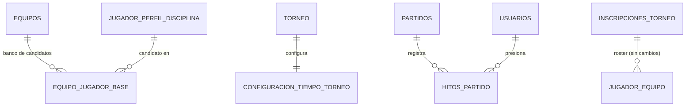

# Plan: Gestión Avanzada de Equipos + Control de Mesa (Live Match)

Generado con `/autoplan` (revisión CEO → Design → Eng). Codex no está
disponible en esta máquina (`codex` no está en PATH) — corrió en modo
`[subagent-only]`, una sola voz revisora (Claude), consistente con el
precedente ya sentado en `docs/plans/equipos-jugadores-plan.md` para este
mismo repo.

**Solo documento — sin implementación.** El usuario pidió explícitamente el
MD de diseño, no código. El gate final de aprobación de `/autoplan` (Fase 4)
no aplica por el mismo motivo que en el plan de Equipos y Jugadores.

**Las 4 decisiones que requerían criterio humano ya fueron confirmadas con
el usuario (2026-08-31), todas por la opción recomendada** — ver el
Decision Audit Trail al final para el detalle de cada una. Sin decisiones
pendientes: este documento queda listo para pasar directo a
implementación.

---

## Resumen del módulo

Dos piezas que comparten torneo/equipo/jugador como dominio pero resuelven
problemas distintos:

1. **Plantilla Base de Equipo** — un club puede tener jugadores registrados
   *antes* de inscribirse a ningún torneo, con alerta (no bloqueo) si un
   jugador ya está en otro club, y al inscribirse a un torneo esa plantilla
   se copia al roster real con exclusión automática + alerta crítica si hay
   conflicto de torneo.
2. **Motor de Tiempos + Control de Mesa en vivo** — cronómetro configurable
   por torneo (períodos vs. corrido), hitos de partido auditables, y un
   dashboard operativo para iniciar/reprogramar partidos.

---

## Fase 1 — CEO Review (Estrategia y Alcance)

### Premisas

| # | Premisa | Veredicto |
|---|---------|-----------|
| P1 | El módulo de Equipos/Jugadores/Torneos (`docs/plans/equipos-jugadores-plan.md`, `equipos-disciplina-navegacion-plan.md`) está implementado y en producción — este plan lo **extiende**, no lo reemplaza. | Confirmado leyendo el esquema actual (`database/01_schema.sql`, `06_triggers.sql`). |
| P2 | **Gap crítico**: hoy `JUGADOR_EQUIPO` exige `Inscripcion_Torneo_ID NOT NULL` — un jugador solo puede "pertenecer" a un equipo a través de una inscripción a un torneo concreto. No existe ningún concepto de "jugador del club" fuera de un torneo. | Confirmado. Es el hallazgo central de este plan — ver D1. |
| P3 | `TODOS.md` (sección "Deferido desde equipos-disciplina-navegacion-plan.md") ya había evaluado y **rechazado explícitamente** una tabla de roster permanente (`EQUIPO_MIEMBRO`, Alternativa A2), con el razonamiento: *"dos fuentes de verdad de quién es del equipo que `fn_validar_jugador_partido` y `fn_validar_exclusividad_torneo` hoy no saben conciliar"*. | Confirmado — este plan **reabre esa decisión a propósito** (D1), porque el Requerimiento 1 del usuario (redirección post-creación a una vista donde "registrar jugadores" ya funcione, sin torneo de por medio) es literalmente el caso de uso que esa alternativa cubría. Ver D1 para por qué esta vez sí se justifica y cómo se evita el problema de "dos fuentes de verdad" que motivó el rechazo original. |
| P4 | `PATCH /partidos/{id}` ya acepta `fecha_partido` y `estado`, y ya lo puede llamar el rol `Arbitro` (no solo `TorneoAdmin`) — confirmado en `backend/app/api/routes/partidos.py:57`. | Confirmado — el Requerimiento 4 (editar fecha/hora, botón "Empezar Partido") **no necesita backend nuevo**, es reconexión de UI sobre un endpoint que ya existe. |
| P5 | El catálogo `EVENTOS` (Gol/Autogol/Tarjeta Amarilla/Tarjeta Roja/Cambio) y `EVENTOS_PARTIDO.MINUTO` son específicos de fútbol — no existe ningún modelo de resultado para disciplinas de marca/tiempo, combate o corrido (Tenis/Pádel). `TODOS.md` ya lo marca como fuera de alcance ("merece su propio diseño"). | Aceptada como límite explícito — este plan **no** construye un motor de resultados para Tenis/Pádel. El cronómetro de tipo "Corrido" sí se construye (es lo que pide el Requerimiento 5), pero declarar el resultado del partido se resuelve con el mínimo necesario para cerrar el cronómetro (un campo "ganador"), no con un sistema de sets/games. |
| P6 | `INSCRIPCIONES_TORNEO` es el ancla de "equipo-en-este-torneo" y `JUGADOR_EQUIPO` de "jugador-en-ese-roster" — ambos patrones (roster por torneo, exclusividad vía trigger, estado derivado vía vista) se reutilizan tal cual para todo lo nuevo de este plan. | Aceptada — mismo criterio DRY que ya estableció el plan de Equipos y Jugadores. |
| P7 | El módulo Control de Mesa (`frontend/src/pages/ControlDeMesa.tsx`) ya existe y ya carga eventos de gol/tarjeta con polling — este plan lo **extiende** con el dashboard pre-partido y el cronómetro, no lo reescribe. | Confirmado leyendo `ControlDeMesa.tsx` — `MesaPanel` se reutiliza tal cual, el cronómetro se agrega como sección nueva dentro del mismo panel. |
| P8 | No hay superficie de API/CLI para terceros — es un módulo interno de un sistema de torneos ya autenticado. | Confirmado — Fase DX se omite, mismo criterio que el plan anterior. |

### D1 — Decisión de arquitectura central (confirmada con el usuario)

**La pregunta:** ¿de dónde salen los jugadores que aparecen en la nueva
vista "Detalle del Equipo" cuando el equipo todavía no está inscrito a
ningún torneo?

**Por qué no alcanza con lo que ya existe:** `JUGADOR_EQUIPO` no tiene
manera de expresar "este jugador es de este club" sin un
`Inscripcion_Torneo_ID`. Reinterpretar el Requerimiento 1 como "llevar al
admin al torneo más reciente y ahí cargar la plantilla" (Alternativa B
abajo) es más barato pero no es lo que el usuario pidió: pidió que la
interfaz de carga de jugadores quede **inmediatamente habilitada** al crear
el equipo, sin depender de que exista un torneo.

**Alternativas:**

| Alternativa | Completeness | Veredicto |
|---|---|---|
| **A. Reabrir `EQUIPO_MIEMBRO` completo** (la que `TODOS.md` había rechazado: equipo como entidad rica, con roster estable, escudo, sede, staff) | 10/10 en papel | Rechazada — sigue siendo más de lo que este requerimiento pide, y reintroduce el problema real que motivó el rechazo: si el roster "permanente" tiene su propia noción de vigencia, hay que conciliarla con la vigencia de `JUGADOR_EQUIPO` por torneo (¿qué manda si difieren?). |
| **B. Sin tabla nueva — redirigir a "elegir torneo para inscribir"** | 5/10 | Rechazada como default: no cumple el Requerimiento 1 tal cual está escrito (habilitar carga de jugadores YA, no un torneo). Válida solo si el usuario decide en la confirmación de D1 que prefiere no reabrir el modelo de datos — ver Alcance. |
| **C. `EQUIPO_JUGADOR_BASE` — "plantilla base", explícitamente NO autoritativa** (elegida) | 9/10 | Una tabla delgada: qué jugador (perfil) es candidato de este equipo, con un dorsal *sugerido*, nada más. **No participa de ninguna regla de elegibilidad** — la exclusividad real, la vigencia real, todo lo que `fn_validar_jugador_partido`/`fn_validar_exclusividad_torneo` protegen sigue viviendo exclusivamente en `JUGADOR_EQUIPO` (torneo-scoped), sin tocar. La plantilla base es un banco de candidatos que se **copia** a `JUGADOR_EQUIPO` recién cuando el equipo se inscribe a un torneo — en ese momento, y solo en ese momento, pasa por las mismas validaciones de siempre. Esto es precisamente lo que evita "dos fuentes de verdad": la fuente de verdad de elegibilidad sigue siendo una sola (`JUGADOR_EQUIPO`), la base es solo un atajo de captura de datos. |

**Decisión: C — confirmada con el usuario (2026-08-31).** Costo aceptado
conscientemente: es la única alternativa que agrega una tabla nueva, pero
de bajo nivel de compromiso (fácil de vaciar/ignorar si en la práctica no
se usa — ningún trigger de integridad depende de ella).

### Qué ya existe (leverage map)

| Sub-problema | Ya cubierto por | Qué falta |
|---|---|---|
| Crear equipo | `POST /equipos`, `EquiposAdmin.tsx` | Redirección post-creación (hoy se queda en el formulario/lista) |
| Buscar jugador existente por nombre/cédula | `GET /jugadores` (sin `?q=` todavía — lista completa, filtro en memoria en algunas pantallas) | Parámetro de búsqueda server-side (`?q=`) — el listado ya pasa el techo de 200 filas en otras grillas (ver `TODOS.md`, "Paginación real con cursor"), un buscador de texto libre sin filtrar en el servidor repite ese mismo bug |
| Registrar jugadores por lote a un roster de torneo | `POST /plantillas/lote/validar` + `/confirmar` (`RegistroLoteAdmin.tsx`) — ya cubre EC-1 a EC-9 del plan anterior | Nada nuevo para el flujo torneo-scoped; se reutiliza tal cual desde la Plantilla Base al inscribir |
| Validar dorsal duplicado en un roster | `unique_dorsal_por_roster` (índice único parcial, `03_indexes.sql`) | Nada — ya funciona |
| Bloquear conflicto de exclusividad por torneo | `fn_validar_exclusividad_torneo` (`06_triggers.sql`) — **bloquea todo el INSERT** | Cambiar el comportamiento en el camino de "inscribir equipo con plantilla base": no debe bloquear la inscripción del equipo, solo excluir al jugador conflictivo — ver Fase 3 |
| Reprogramar un partido (fecha/hora) | `PATCH /partidos/{id}` ya acepta `fecha_partido`, permitido a `TorneoAdmin` y `Arbitro` | Nada en backend — solo UI en el dashboard de Control de Mesa |
| Iniciar un partido (estado → "En curso") | `PATCH /partidos/{id}` ya acepta `estado` | Nada en backend estrictamente, pero conviene atarlo a un Hito de tiempo (ver Fase 3) para que "cuándo arrancó de verdad" quede registrado, no solo el estado |
| Cargar goles/tarjetas/cambios en vivo | `MesaPanel` en `ControlDeMesa.tsx`, `POST /eventos-partido` | Nada — se reutiliza sin cambios |
| Corregir el minuto de un evento ya cargado | — | **No existe.** No hay `PATCH /eventos-partido/{id}`. Es el gap que responde directamente a "¿cómo editás minutos si el árbitro se equivoca?" para goles/tarjetas — ver Fase 3 |
| Configurar duración/estructura del partido por torneo | — | No existe ninguna noción de tiempo de juego en el esquema — nuevo por completo |
| Hitos de tiempo (inicio/fin de período, pausas) | — | No existe — nuevo por completo |

### Alcance

**Dentro de este módulo:**
- Plantilla Base de equipo (D1-C) + redirección post-creación + acción rápida "Registrar Jugadores" en el listado.
- Búsqueda de jugadores existentes por nombre/cédula (server-side) reutilizada en 3 pantallas: Plantilla Base, registro por lote en torneo, y (opcional, ver Alcance de Design) el buscador del propio Control de Mesa.
- Alerta de multimilitancia (global, no bloqueante) al agregar a la Plantilla Base.
- Copia de Plantilla Base → roster de torneo al inscribir, con exclusión automática + alerta crítica en conflicto de torneo (extensión del comportamiento de `fn_validar_exclusividad_torneo`, no su reemplazo).
- Dashboard de Control de Mesa: listar partidos programados/en curso, editar fecha/hora, botón "Empezar Partido" con redirección a Partido en Vivo.
- `CONFIGURACION_TIEMPO_TORNEO`: tipo de cronómetro (Períodos/Corrido) configurable al crear/editar un torneo, con valores propios de duración de período.
- `HITOS_PARTIDO`: registro de inicio/fin de período, pausa/reanudación, fin de partido — para ambos tipos de cronómetro.
- Componente de Cronómetro en Partido en Vivo (Control de Mesa): cuenta ambos modos, pausa, corrección de minuto.
- `PATCH /eventos-partido/{id}`: corrección de minuto en un evento de gol/tarjeta/cambio ya cargado (gap que ya existía, no pedido explícitamente pero es la respuesta directa al Entregable 3).

**Fuera de este módulo (→ `TODOS.md`):**
- Motor de resultados para disciplinas de marca/tiempo, combate o corrido con score real (sets de Tenis, games, etc.) — ya estaba fuera de alcance desde `ediciones-catalogo-disciplinas-plan.md`, este plan no lo reabre. "Declarar ganador" en un partido Corrido es un campo, no un marcador.
- Tiempo extra / prórroga / penales como estructura de cronómetro propia — el requerimiento no lo pidió; un torneo que los usa hoy los resuelve como ya lo hace (`Ganador_Desempate_ID` para Eliminación, sin cronómetro dedicado).
- Alternativa A de D1 (equipo como entidad rica con roster permanente autoritativo) — sigue en `TODOS.md` tal cual estaba.
- Notificación al jugador cuando queda excluido por conflicto de torneo (mismo motivo que el plan anterior: notificaciones es un módulo aparte).
- Paginación con cursor real de `/jugadores` — este plan solo agrega el parámetro `?q=` de búsqueda que el Requerimiento 2 necesita, no resuelve el techo de 200 filas de fondo (ya está en `TODOS.md` para Equipos, ahora aplica también a Jugadores).

### Dream state

```
ACTUAL                          ESTE PLAN                        IDEAL 12 MESES
──────────────────────          ──────────────────────           ──────────────────────
Un jugador "existe" para        Plantilla Base por equipo:         + El mismo cronómetro
un equipo solo dentro de        banco de candidatos, se              alimenta un motor de
un torneo puntual.               copia al roster real al              resultados genérico
                                  inscribir.                          (marca/tiempo, combate,
Sin cronómetro: MINUTO es                                            corrido con score real).
un número que tipea el          Cronómetro configurable por
árbitro a mano.                  torneo (Períodos/Corrido),        + Reconexión automática:
                                  Hitos auditables, pausa/            si el árbitro pierde
Conflicto de torneo               reanudación, corrección.           conectividad a mitad de
bloquea TODO el registro                                            partido (ya en TODOS.md
del equipo, sin alternativa.     Conflicto de torneo excluye         desde el design doc de
                                  solo al jugador en conflicto,       frontend), el cronómetro
                                  el resto del equipo entra           sigue corriendo del lado
                                  igual, con alerta accionable.       del servidor, no del
                                                                      celular del árbitro.
```

---

## Fase 2 — Design Review (UX)

Aplica — hay 3 flujos de UI nuevos con estados de interacción no triviales
(Detalle del Equipo, alerta de multimilitancia, Cronómetro).

### Flujo 1 — Equipos: creación → Detalle del Equipo

```
[Listado de Equipos] ── "+ Nuevo equipo" ──▶ [Formulario: nombre, disciplina, modalidad]
        │                                              │ Crear
        │                                              ▼
        │                                   POST /equipos ── éxito ──▶ [Detalle del Equipo /torneo-admin/equipos/:id]
        │                                                                     │
        │  fila con "Registrar Jugadores" ───────────────────────────────────┤
        │  (acción rápida, sin pasar por editar)                             │
        ▼                                                                     ▼
  [Listado de Equipos]                                          ┌─────────────────────────────┐
                                                                  │ DETALLE DEL EQUIPO           │
                                                                  │ Nombre · Disciplina · Estado │
                                                                  │                               │
                                                                  │ Plantilla Base (n jugadores)  │
                                                                  │  [+ Buscar/Agregar jugador]   │
                                                                  │  tabla: Cédula|Nombre|Dorsal  │
                                                                  │         sugerido|Quitar       │
                                                                  │                               │
                                                                  │ "Este equipo aún no está      │
                                                                  │  inscrito a ningún torneo.    │
                                                                  │  [Inscribir a un torneo →]"   │
                                                                  │  (visible solo si 0 inscrip.) │
                                                                  └─────────────────────────────┘
```

`irAInscribir` (hoy en `EquiposAdmin.tsx:91`) deja de navegar directo al
listado de torneos — pasa a navegar al Detalle del Equipo, que es el que
ahora ofrece "Inscribir a un torneo" como acción secundaria dentro de la
misma vista. La columna "Plantilla" del listado global cambia su fuente: en
vez de contar `JUGADOR_EQUIPO` (torneo-scoped), cuenta la Plantilla Base
(`EQUIPO_JUGADOR_BASE` activa) — es la que responde "¿este equipo tiene
jugadores cargados?" antes de que exista ningún torneo, que es la pregunta
que esa columna necesita responder ahora.

### Flujo 2 — Agregar jugador a la Plantilla Base (con alerta de multimilitancia)

```
[+ Buscar/Agregar jugador] (dentro de Detalle del Equipo)
        │
        ▼
┌───────────────────────────────────────┐
│ Buscar por nombre o cédula             │
│ [___________________]  (debounce 300ms)│
├───────────────────────────────────────┤
│ Resultados (GET /jugadores?q=...)      │
│  • Juan Pérez — 12345678               │
│  • Juana Pérez — 87654321               │
│  ○ "Ningún jugador coincide.            │
│     [+ Crear jugador nuevo]" ───────────┼──▶ (formulario de alta rápida,
└───────────────────────────────────────┘      cédula/nombre/correo — mismo
        │ elegir uno                            patrón que registro por lote)
        ▼
GET /equipos/{id}/plantilla-base/verificar?jugador_id=X   (chequeo de multimilitancia)
        │
        ├── sin conflicto ──────────────────────────▶ agrega directo, sin modal
        │
        └── ya está en otro(s) equipo(s) ────────────▶ ┌─────────────────────────────────┐
                                                          │ ⚠️ Juan Pérez ya está inscrito en│
                                                          │ Deportivo Norte, Los Halcones.   │
                                                          │                                   │
                                                          │ Si alguno de esos equipos entra a│
                                                          │ un torneo donde este equipo       │
                                                          │ también participe, el jugador     │
                                                          │ quedará desvinculado de este      │
                                                          │ equipo para ese torneo            │
                                                          │ automáticamente.                  │
                                                          │                                   │
                                                          │      [Cancelar]  [Agregar igual]   │
                                                          └─────────────────────────────────┘
```

El texto del warning es literal al que pidió el usuario — no se resume ni
se genera dinámicamente de forma distinta a como se pidió, precisamente
porque es una advertencia legal/operativa que el admin necesita leer
completa, no una versión acortada.

### Flujo 3 — Inscribir equipo a un torneo con conflicto (Requerimiento 3)

```
[Torneo → pestaña Equipos] "+ Agregar Equipo" ──▶ elige equipo con Plantilla Base cargada
        │
        ▼
POST /inscripciones (equipo, torneo)  ── éxito, sin bloqueo ──▶ fila nueva en "Equipos inscritos"
        │
        ▼
Copia automática: Plantilla Base → JUGADOR_EQUIPO (uno por uno, con savepoint — ver Fase 3)
        │
        ├── todos entran sin conflicto ──▶ Toast: "Equipo inscrito. n jugadores agregados a la plantilla."
        │
        └── k de n en conflicto ─────────▶ ┌───────────────────────────────────────────────┐
                                             │ Equipo inscrito. n-k jugadores agregados.       │
                                             │                                                  │
                                             │ ⚠️ Alerta crítica:                              │
                                             │ Carlos Ruiz ya pertenece a otro equipo en este  │
                                             │ torneo. Para que pueda jugar en este club, andá │
                                             │ a la pestaña "Traspasos" y hacé la transferencia│
                                             │ formal.                                          │
                                             │ (repite una vez por jugador excluido)            │
                                             │                                     [Entendido]  │
                                             └───────────────────────────────────────────────┘
```

No es un toast que desaparece solo: es un modal de confirmación explícita
(`[Entendido]`) porque el admin puede necesitar anotar cuántos y quiénes
quedaron afuera antes de seguir — un toast de 3 segundos pierde esa
información si hay más de un jugador en conflicto.

### Flujo 4 — Control de Mesa: dashboard pre-partido

```
[/control-de-mesa]
┌──────────────────────────────────────────────────────────┐
│ Tiburones FC vs Águilas Doradas — Liga Relámpago            │
│ [📅 30/08/2026 16:00 ▾ editar]      [Empezar Partido ▶]     │
├──────────────────────────────────────────────────────────┤
│ Halcones vs Cóndor — Liga Relámpago            [En curso]   │
│                                       [Ir al partido en vivo]│
└──────────────────────────────────────────────────────────┘
```

Editar fecha/hora es un campo inline (no navega a otra pantalla — el
requerimiento dice "desde esta misma vista"): clic en la fecha abre un
`datetime-local` inline, `PATCH /partidos/{id}` al confirmar, refetch
inmediato. "Empezar Partido" solo aparece si `estado === "Programado"`;
una vez en curso, el botón cambia a "Ir al partido en vivo" (mismo lugar,
mismo peso visual, para no reflowar la fila).

### Flujo 5 — Cronómetro (diseño del componente)

Dos variantes del mismo componente, elegidas por
`CONFIGURACION_TIEMPO_TORNEO.tipo_cronometro` del torneo del partido — la
mesa nunca pregunta "¿qué tipo de cronómetro querés?", ya lo sabe.

**Variante Períodos (Fútbol, Baloncesto):**

```
┌─────────────────────────────┐
│         1er Tiempo            │
│          ▶ 23:47              │   ← MM:SS, corre en vivo (client-side,
│                                │      recalculado desde Timestamp_Real
│  [⏸ Pausar]  [Fin 1er Tiempo] │      del último Hito, no un setInterval
└─────────────────────────────┘      que se desincroniza al perder foco)

Antes de arrancar:            Al presionar "Fin 1er Tiempo":
┌───────────────────┐          reemplaza los botones por:
│   [▶ Iniciar        │        ┌───────────────────────┐
│    1er Tiempo]      │        │  Entretiempo            │
└───────────────────┘          │  [▶ Iniciar 2do Tiempo] │
                                └───────────────────────┘
                                        │
                                        ▼
                                (repite el patrón para cada período
                                 configurado — Cantidad_Periodos de
                                 CONFIGURACION_TIEMPO_TORNEO)
                                        │
                              último período: "Fin 1er Tiempo" pasa a
                              decir "Fin del Partido" — mismo botón,
                              label calculado, no un botón aparte
```

**Variante Corrido (Tenis, Pádel):**

```
┌─────────────────────────────┐
│      Tiempo de partido        │
│         ▶ 41:12                │
│                                 │
│  [⏸ Pausar]  [Finalizar partido]│
└─────────────────────────────┘
        │ Finalizar partido
        ▼
┌───────────────────────────────┐
│ ¿Quién ganó?                    │
│  ( ) Tiburones FC                │
│  ( ) Águilas Doradas             │
│         [Confirmar]              │
└───────────────────────────────┘
```

**Pausa** (ambas variantes): el botón `⏸ Pausar` congela el número
mostrado y cambia a `▶ Reanudar` en rojo/ámbar — la pausa es visualmente
inconfundible del estado corriendo, porque un árbitro mirando de reojo el
celular necesita distinguir "está corriendo" de "está parado" sin leer
texto.

**Corrección de minuto (el requerimiento explícito: "¿cómo manejarías...
editar minutos si el árbitro se equivoca?"):** dos casos distintos, dos
mecanismos distintos — no se resuelven con el mismo control:

1. *"Presioné Fin del 1er Tiempo tarde/temprano"* → el Hito ya registrado
   es editable: un ícono de lápiz junto al hito en un panel colapsable
   "Historial de hitos" (no en el cronómetro principal, para no invitar a
   tocarlo por accidente) abre un campo numérico de minuto, `PATCH
   /partidos/{id}/hitos/{hito_id}`. Solo Admin/Árbitro asignado. Queda
   auditado por el mecanismo de `AUDITORIA` que ya cubre cualquier UPDATE
   del sistema (`backend/app/core/auditoria.py`) — no hace falta un log
   nuevo.
2. *"Cargué un gol en el minuto 23 pero fue en el 32"* → ya es un problema
   distinto (evento de gol, no hito de tiempo): editar desde la timeline de
   eventos existente en `MesaPanel` (`ControlDeMesa.tsx:241-255`), un
   ícono de lápiz por fila que abre el mismo input de minuto que ya existe
   en `CargaEvento`, `PATCH /eventos-partido/{id}` (nuevo, ver Fase 3).

### Estados de interacción cubiertos

| Estado | Comportamiento |
|---|---|
| Plantilla Base vacía | "Sin jugadores todavía. Buscá o creá el primero." — nunca una tabla vacía sin CTA. |
| Búsqueda de jugador sin resultados | "Ningún jugador coincide con '{texto}'." + botón "Crear jugador nuevo" con el texto tipeado precargado como nombre si parece nombre, o como cédula si es todo dígitos. |
| Búsqueda con conflicto de multimilitancia | Modal bloqueante (Flujo 2), nunca un warning inline que se pueda ignorar sin leer. |
| Inscripción de equipo con conflictos parciales | Modal de confirmación explícita (Flujo 3), no un toast. |
| Inscripción de equipo sin plantilla base (0 jugadores) | Éxito silencioso, mismo criterio que EC-22 del plan anterior — 0 es válido. |
| Dashboard de Control de Mesa sin partidos | "No hay partidos programados ni en curso ahora mismo." (ya existe, sin cambios) |
| Edición de fecha con error de red | El campo vuelve al valor anterior + mensaje inline, no pierde el resto de la fila. |
| Cronómetro — pérdida de conectividad a mitad de partido | Fuera de alcance de este plan (ya está en `TODOS.md` desde el design doc original) — el cronómetro se recalcula desde el último Hito guardado en el servidor al reconectar, así que no se pierde el estado, pero no hay UI dedicada a avisar "estás offline". |
| Hito fuera de secuencia (ej. "Fin 2do Tiempo" sin haber presionado "Inicio 2do Tiempo") | Botón deshabilitado — la mesa no ofrece un hito que no es válido en el estado actual, no es un error post-submit. |

### Litmus scorecard (resumen)

| Dimensión | Score |
|---|---|
| Jerarquía de información (cronómetro grande y central, hitos secundarios en panel colapsable) | 9/10 |
| Estados especificados (tabla arriba) | 9/10 |
| Especificidad (mensajes de alerta son el texto literal pedido, no genéricos) | 9/10 |
| Alineación con patrones existentes (reutiliza `ResourceTable`, `ModalGestionarPlantilla` como referencia de modal, `tap-grid`/`tap-button` de `ControlDeMesa.tsx` para el flujo táctil) | 8/10 |
| Responsive / uso desde celular en cancha | No evaluado a fondo — el design doc original (`docs/designs/frontend-inicial-dashboard-mesa-en-vivo.md`) ya estableció "2-3 toques, sin tipear" como criterio de éxito para Control de Mesa; el Cronómetro hereda ese criterio (botones grandes, sin inputs salvo la corrección explícita de minuto). Verificación real en dispositivo queda para `/design-review` o `/qa` cuando se implemente. |

---

## Fase 3 — Eng Review (Arquitectura, Datos, Edge Cases, Tests)

### Arquitectura

```
Frontend (Vite)                     Backend (FastAPI)                        DB (Postgres)
────────────────                     ──────────────────                       ─────────────
DetalleEquipo.tsx           ───────▶ GET/POST /equipos/{id}/plantilla-base    EQUIPO_JUGADOR_BASE
  (Plantilla Base + buscador)         service: PlantillaBaseService                  │
        │                                  - búsqueda GET /jugadores?q=              │
        │                                  - GET .../verificar (multimilitancia,     │
        │                                    solo lectura, sin trigger)              │
        ▼                                                                            │
EquiposAdmin.tsx (listado)  ───────▶ GET /equipos (plantilla_total recalculado        │
  quick action "Registrar               desde EQUIPO_JUGADOR_BASE, no JUGADOR_EQUIPO)│
  Jugadores")                                                                         │
                                                                                       ▼
EquiposDelTorneo.tsx        ───────▶ POST /inscripciones                    INSCRIPCIONES_TORNEO
  "+ Agregar Equipo"                        │                                        │
                                             ▼                                        │
                                   InscripcionEquipoService.copiar_plantilla_base()   │
                                     - por cada fila de EQUIPO_JUGADOR_BASE:          │
                                       INSERT en JUGADOR_EQUIPO con SAVEPOINT         ▼
                                       propio; captura la excepción del          JUGADOR_EQUIPO
                                       trigger de exclusividad SIN abortar        (trigger de
                                       el resto                                    exclusividad,
                                             │                                     sin cambios)
                                             ▼
                                   { insertados: [...], conflictos: [...] }

ControlDeMesa.tsx (dashboard)  ────▶ PATCH /partidos/{id}                    PARTIDOS
  editar fecha, Empezar Partido            (sin cambios — ya existe)

MesaPanel (Cronómetro nuevo)    ───▶ POST /partidos/{id}/hitos               HITOS_PARTIDO
                                       service: HitoPartidoService                    │
                                       - valida secuencia (trigger)                   │
                                       - Inicio_Partido → PARTIDOS.Estado='En curso'   │
                                         (trigger, mismo patrón que agencia libre)     │
                                       - Fin_Partido → PARTIDOS.Estado='Finalizado'    │
                                     PATCH /partidos/{id}/hitos/{id}                   │
                                       - corrige Minuto_Reloj/Timestamp_Real           ▼
                                                                                  PARTIDOS
TorneosAdmin.tsx (crear/editar) ───▶ POST/PATCH /torneos                    CONFIGURACION_TIEMPO_TORNEO
  sección "Configuración de              body incluye config_tiempo{}            (1:1 con TORNEO,
  tiempos"                               TorneoService setea default              creada junto con
                                          por disciplina si no se especifica)      el torneo)

MesaPanel (eventos existentes)  ───▶ PATCH /eventos-partido/{id}             EVENTOS_PARTIDO
  corregir minuto de un gol/tarjeta        (nuevo — gap preexistente)         (sin cambios de esquema)
```

### Modelo de datos relacional



#### Tablas nuevas

**`EQUIPO_JUGADOR_BASE`** (Plantilla Base — D1)
| Columna | Tipo | Notas |
|---|---|---|
| ID | SERIAL PK | |
| Equipo_ID | INT NOT NULL REFERENCES EQUIPOS(ID) | |
| Jugador_Perfil_ID | INT NOT NULL REFERENCES JUGADOR_PERFIL_DISCIPLINA(ID) | No `Jugador_ID` directo — el perfil ya resuelve la disciplina, consistente con cómo `JUGADOR_EQUIPO` referencia perfiles, no jugadores. |
| Dorsal_Sugerido | INT NULL | **No es autoritativo.** Se usa como valor por defecto al copiar a `JUGADOR_EQUIPO` (el admin puede cambiarlo ahí si ya está tomado — la validación real de unicidad sigue siendo `unique_dorsal_por_roster`, que vive en la tabla torneo-scoped). |
| Fecha_Registro / Fecha_Modificacion | TIMESTAMP | Mismo patrón que el resto del esquema. |
| Estado | VARCHAR(20) DEFAULT 'Activo' CHECK IN ('Activo','Inactivo') | Baja lógica ("Quitar" en la UI), nunca DELETE — mismo criterio que las demás 9+ tablas. |
| | UNIQUE(Equipo_ID, Jugador_Perfil_ID) | Un perfil no puede estar dos veces en la misma plantilla base. |

**`CONFIGURACION_TIEMPO_TORNEO`**
| Columna | Tipo | Notas |
|---|---|---|
| ID | SERIAL PK | |
| Torneo_ID | INT NOT NULL UNIQUE REFERENCES TORNEO(ID) | 1:1 con `TORNEO` — se decidió tabla propia en vez de agregar columnas a `TORNEO` (que ya tiene 6 columnas nullable condicionadas a `Formato`) para no seguir haciendo crecer esa tabla con un eje de configuración que no tiene nada que ver con el formato de competición. Ver Alternativas abajo. |
| Tipo_Cronometro | VARCHAR(20) NOT NULL CHECK IN ('Periodos','Corrido') | Explícito por torneo, no derivado de la disciplina — el propio requerimiento dice que el mismo deporte (Fútbol) puede jugarse 2x45' o 2x20' según el nivel, así que ligarlo rígido a la disciplina sería incorrecto; lo que SÍ se deriva de la disciplina es el valor por defecto que preselecciona el formulario. |
| Cantidad_Periodos | INT NULL | Requerido si `Tipo_Cronometro='Periodos'` (ej. 2 para fútbol, 4 para baloncesto). |
| Duracion_Periodo_Minutos | INT NULL | Requerido si `Tipo_Cronometro='Periodos'` (ej. 45, 20, 30, 10). |
| Duracion_Descanso_Minutos | INT NULL | Opcional incluso en `'Periodos'` — es informativo (se muestra en el dashboard), el cronómetro no lo cuenta activamente: el entretiempo no tiene su propio hito de "fin", el árbitro simplemente presiona "Iniciar 2do Tiempo" cuando decide. |
| Fecha_Registro / Fecha_Modificacion | TIMESTAMP | |
| | `CHECK ((Tipo_Cronometro='Periodos' AND Cantidad_Periodos IS NOT NULL AND Duracion_Periodo_Minutos IS NOT NULL) OR (Tipo_Cronometro='Corrido' AND Cantidad_Periodos IS NULL AND Duracion_Periodo_Minutos IS NULL))` | Un solo `CHECK` de tabla alcanza — a diferencia de `fn_validar_torneo_modalidad`, acá todas las columnas viven en la misma fila, no hace falta cruzar tablas con un trigger. |

**`HITOS_PARTIDO`** (Match Events)
| Columna | Tipo | Notas |
|---|---|---|
| ID | SERIAL PK | |
| Partido_ID | INT NOT NULL REFERENCES PARTIDOS(ID) | |
| Tipo_Hito | VARCHAR(20) NOT NULL CHECK IN ('Inicio_Partido','Inicio_Periodo','Fin_Periodo','Pausa','Reanudacion','Fin_Partido') | Vocabulario único para ambos tipos de cronómetro — un partido Corrido solo usa `Inicio_Partido`/`Pausa`/`Reanudacion`/`Fin_Partido`, nunca `*_Periodo`. |
| Numero_Periodo | INT NULL | Solo para `Inicio_Periodo`/`Fin_Periodo` (1, 2, 3...). NULL en cualquier otro tipo — validado por trigger, ver abajo. |
| Timestamp_Real | TIMESTAMP NOT NULL DEFAULT CURRENT_TIMESTAMP | Momento real de reloj en que se presionó el botón — es la fuente de verdad para calcular duración transcurrida (`vw_duracion_partido`, abajo). |
| Minuto_Reloj | INT NULL | El minuto de partido que mostraba el cronómetro en ese instante (lo que ve/corrige el árbitro). Redundante respecto a `Timestamp_Real` a propósito: el minuto "de juego" y el reloj de pared no siempre coinciden exactamente (tiempo agregado, pausas) y es el número que un árbitro reconoce y quiere poder corregir sin tener que razonar sobre timestamps. |
| Registrado_Por | INT NOT NULL REFERENCES USUARIOS(ID) | Auditoría — mismo patrón que `TRASPASOS.Realizado_Por`. |
| Fecha_Registro | TIMESTAMP DEFAULT CURRENT_TIMESTAMP | |

No lleva `Fecha_Modificacion` ni trigger de auto-update: a diferencia de
`TRASPASOS` (inmutable por diseño, corregir = fila nueva), acá SÍ se
permite `UPDATE` directo sobre `Minuto_Reloj`/`Timestamp_Real` (es
exactamente el mecanismo de corrección del Flujo 5) — y ese `UPDATE` ya
queda capturado por el listener genérico de `AUDITORIA`
(`backend/app/core/auditoria.py`), que registra alta/modificación/baja de
cualquier tabla sin necesitar su propio trigger de fecha. Se decidió no
duplicar ese mecanismo con un `Fecha_Modificacion` + trigger dedicado
— sería la misma información dos veces.

#### Tablas modificadas

**`PARTIDOS`** — agregar:
```sql
ALTER TABLE PARTIDOS ADD COLUMN Ganador_Corrido_ID INT REFERENCES EQUIPOS(ID);
```
Deliberadamente **distinta** de `Ganador_Desempate_ID` (ya existente): esa
columna significa "quién ganó un empate a nivel de goles dentro de un
bracket de Eliminación" y su trigger (`fn_validar_partido_eliminacion_desempate`)
está atado a `FASE.Tipo='Eliminacion'`. `Ganador_Corrido_ID` significa algo
distinto — "quién ganó un partido que no tiene marcador de goles en
absoluto" — y se valida contra `CONFIGURACION_TIEMPO_TORNEO.Tipo_Cronometro`,
no contra la fase. Reusar la misma columna para dos significados distintos
hubiera sido más corto pero incorrecto: un desarrollador futuro leyendo
"empató, hay que resolver el Ganador_Desempate" no debería toparse con un
partido de Tenis que nunca tuvo empate posible.

### Triggers nuevos

**Validación de secuencia y coherencia de un Hito** (mismo patrón que
`fn_validar_jugador_partido`):
```sql
CREATE OR REPLACE FUNCTION fn_validar_hito_partido()
RETURNS TRIGGER AS $$
DECLARE
    v_torneo_id INT;
    v_tipo_cronometro VARCHAR(20);
    v_cantidad_periodos INT;
    v_ya_existe INT;
BEGIN
    SELECT p.Torneo_ID, c.Tipo_Cronometro, c.Cantidad_Periodos
      INTO v_torneo_id, v_tipo_cronometro, v_cantidad_periodos
      FROM PARTIDOS p
      JOIN CONFIGURACION_TIEMPO_TORNEO c ON c.Torneo_ID = p.Torneo_ID
     WHERE p.ID = NEW.Partido_ID;

    IF v_tipo_cronometro = 'Corrido' AND NEW.Tipo_Hito IN ('Inicio_Periodo','Fin_Periodo') THEN
        RAISE EXCEPTION 'Este torneo usa cronometro corrido, no admite hitos de periodo.';
    END IF;

    IF NEW.Tipo_Hito IN ('Inicio_Periodo','Fin_Periodo') THEN
        IF NEW.Numero_Periodo IS NULL OR NEW.Numero_Periodo < 1 OR NEW.Numero_Periodo > v_cantidad_periodos THEN
            RAISE EXCEPTION 'Numero de periodo invalido para este torneo.';
        END IF;
    ELSIF NEW.Numero_Periodo IS NOT NULL THEN
        RAISE EXCEPTION 'Numero_Periodo solo aplica a hitos de periodo.';
    END IF;

    -- Un mismo hito (mismo tipo + mismo periodo) no se repite en el mismo partido.
    -- 'Pausa'/'Reanudacion' son la excepcion explicita: pueden pasar varias veces.
    IF NEW.Tipo_Hito NOT IN ('Pausa','Reanudacion') THEN
        SELECT COUNT(*) INTO v_ya_existe
          FROM HITOS_PARTIDO
         WHERE Partido_ID = NEW.Partido_ID
           AND Tipo_Hito = NEW.Tipo_Hito
           AND Numero_Periodo IS NOT DISTINCT FROM NEW.Numero_Periodo
           AND ID <> COALESCE(NEW.ID, -1);
        IF v_ya_existe > 0 THEN
            RAISE EXCEPTION 'hito_ya_registrado';
        END IF;
    END IF;

    RETURN NEW;
END;
$$ LANGUAGE plpgsql;

CREATE TRIGGER trg_hito_partido_validar
BEFORE INSERT OR UPDATE ON HITOS_PARTIDO
FOR EACH ROW EXECUTE FUNCTION fn_validar_hito_partido();
```
La validación de "no podés presionar Fin 2do Tiempo sin haber presionado
Inicio 2do Tiempo" (secuencia estricta, no solo no-duplicados) queda del
lado de la aplicación (`HitoPartidoService`), no del trigger: requiere
consultar qué hitos previos existen y es exactamente el mismo tipo de
regla que ya decide qué botones mostrar en la UI (Flujo 5) — server-side
como defensa en profundidad, pero la fuente de la regla de secuencia es
una sola función de servicio, reusada por el endpoint y (indirectamente)
por lo que la UI deshabilita, no duplicada en SQL y en Python.

**Sincronización de `PARTIDOS.Estado` con los hitos de inicio/fin**
(mismo patrón que `fn_cerrar_torneo_libera_jugadores` — un hito de dominio
dispara un efecto colateral en otra tabla):
```sql
CREATE OR REPLACE FUNCTION fn_hito_sincroniza_estado_partido()
RETURNS TRIGGER AS $$
BEGIN
    IF NEW.Tipo_Hito = 'Inicio_Partido' THEN
        UPDATE PARTIDOS SET Estado = 'En curso' WHERE ID = NEW.Partido_ID AND Estado = 'Programado';
    ELSIF NEW.Tipo_Hito = 'Fin_Partido' THEN
        UPDATE PARTIDOS SET Estado = 'Finalizado' WHERE ID = NEW.Partido_ID AND Estado = 'En curso';
    END IF;
    RETURN NEW;
END;
$$ LANGUAGE plpgsql;

CREATE TRIGGER trg_hito_sincroniza_estado
AFTER INSERT ON HITOS_PARTIDO
FOR EACH ROW EXECUTE FUNCTION fn_hito_sincroniza_estado_partido();
```
El botón "Empezar Partido" del dashboard (Flujo 4) puede seguir llamando
`PATCH /partidos/{id}` directo (comportamiento actual, sin cambios) O el
nuevo `POST /partidos/{id}/hitos` con `Inicio_Partido` — ambos caminos
convergen al mismo estado. Se recomienda que el botón del dashboard
dispare el Hito (no el PATCH directo), porque así el partido siempre
tiene un `Inicio_Partido` auditable con hora real — necesario para que
`vw_duracion_partido` funcione en TODOS los partidos, no solo los que
arrancan desde la vista de Cronómetro.

**Validación de ganador en partido Corrido al finalizar:**
```sql
CREATE OR REPLACE FUNCTION fn_validar_ganador_corrido()
RETURNS TRIGGER AS $$
DECLARE
    v_tipo_cronometro VARCHAR(20);
BEGIN
    IF NEW.Estado = 'Finalizado' AND OLD.Estado <> 'Finalizado' THEN
        SELECT Tipo_Cronometro INTO v_tipo_cronometro
          FROM CONFIGURACION_TIEMPO_TORNEO WHERE Torneo_ID = NEW.Torneo_ID;
        IF v_tipo_cronometro = 'Corrido' AND NEW.Ganador_Corrido_ID IS NULL THEN
            RAISE EXCEPTION 'partido_corrido_sin_ganador';
        END IF;
    END IF;
    RETURN NEW;
END;
$$ LANGUAGE plpgsql;

CREATE TRIGGER trg_partido_validar_ganador_corrido
BEFORE UPDATE ON PARTIDOS
FOR EACH ROW EXECUTE FUNCTION fn_validar_ganador_corrido();
```
Mismo patrón exacto que `fn_validar_partido_eliminacion_desempate`, con la
disciplina de origen distinta (`Tipo_Cronometro` en vez de `FASE.Tipo`) —
confirma que no hay colisión entre ambos triggers: un partido Corrido no
tiene `Fase.Tipo='Eliminacion'` en los torneos de ejemplo (Tenis/Pádel
suelen no tener bracket), pero si algún torneo combinara ambos, los dos
triggers exigen sus propias condiciones de forma independiente sin
pisarse (cada uno mira una columna de configuración distinta).

### Vista nueva

**Duración real de un partido Corrido** (para guardar/exponer "la duración
exacta del encuentro", pedida en el Requerimiento 5):
```sql
CREATE OR REPLACE VIEW vw_duracion_partido AS
WITH pausas AS (
    SELECT
        Partido_ID,
        SUM(
            EXTRACT(EPOCH FROM (reanuda.Timestamp_Real - pausa.Timestamp_Real))
        ) AS Segundos_Pausado
    FROM HITOS_PARTIDO pausa
    JOIN HITOS_PARTIDO reanuda
      ON reanuda.Partido_ID = pausa.Partido_ID
     AND reanuda.Tipo_Hito = 'Reanudacion'
     AND reanuda.Timestamp_Real = (
         SELECT MIN(r2.Timestamp_Real) FROM HITOS_PARTIDO r2
          WHERE r2.Partido_ID = pausa.Partido_ID AND r2.Tipo_Hito = 'Reanudacion'
            AND r2.Timestamp_Real > pausa.Timestamp_Real
     )
    WHERE pausa.Tipo_Hito = 'Pausa'
    GROUP BY Partido_ID
)
SELECT
    ini.Partido_ID,
    ini.Timestamp_Real AS Inicio,
    fin.Timestamp_Real AS Fin,
    EXTRACT(EPOCH FROM (fin.Timestamp_Real - ini.Timestamp_Real)) - COALESCE(p.Segundos_Pausado, 0) AS Duracion_Segundos
FROM HITOS_PARTIDO ini
JOIN HITOS_PARTIDO fin ON fin.Partido_ID = ini.Partido_ID AND fin.Tipo_Hito = 'Fin_Partido'
LEFT JOIN pausas p ON p.Partido_ID = ini.Partido_ID
WHERE ini.Tipo_Hito = 'Inicio_Partido';
```
Mismo criterio DRY que `vw_estado_perfil_disciplina`/`vw_goleadores_por_disciplina`
del plan anterior: la duración se **deriva**, nunca se guarda como columna
que alguien tendría que recordar actualizar. Funciona igual para partidos
de Períodos (da la duración total incluyendo entretiempo, si a futuro hace
falta ese dato) aunque el requerimiento solo la pide para Corrido.

### Máquina de estados

**Cronómetro — Períodos:**
```
Sin_Iniciar ──Inicio 1er Tiempo──▶ Periodo(1) ──Fin 1er Tiempo──▶ Entre_Periodos
                                       │↕Pausa/Reanuda                  │
                                       │                    Inicio 2do Tiempo
                                       │                                ▼
                                                                   Periodo(2) ──...──▶ Fin del Partido ──▶ Finalizado
```

**Cronómetro — Corrido:**
```
Sin_Iniciar ──Iniciar Partido──▶ En_Curso ⇄(Pausa/Reanuda)⇄ En_Curso ──Finalizar (elige ganador)──▶ Finalizado
```

**Plantilla Base de un jugador (no derivado — a diferencia de
`vw_estado_perfil_disciplina`, esto es simplemente pertenece/no
pertenece a la fila de `EQUIPO_JUGADOR_BASE`, no tiene estados
intermedios):**
```
[no está en la plantilla base] ──agregar (con o sin warning)──▶ [está] ──quitar──▶ Estado='Inactivo' (soft delete)
```

**Conflicto de torneo al copiar Plantilla Base (por jugador, dentro de una
sola inscripción):**
```
Candidato en EQUIPO_JUGADOR_BASE
        │ INSERT en JUGADOR_EQUIPO (dentro de SAVEPOINT propio)
        ▼
  ¿Trigger fn_validar_exclusividad_torneo dispara?
        │
        ├── No ──▶ COMMIT del savepoint ──▶ jugador queda en el roster del torneo
        │
        └── Sí ──▶ ROLLBACK TO SAVEPOINT (solo este jugador, el resto sigue) ──▶
                    se agrega a la lista "conflictos" de la respuesta, con el
                    nombre del equipo donde SÍ está activo (para armar el
                    mensaje de alerta) ──▶ el jugador NO entra a este roster,
                    sigue disponible para traspaso formal
```

### Algoritmo de Multimilitancia — detallado (Entregable 2 del pedido)

**Nivel 1 — Global, al agregar a la Plantilla Base (no bloqueante):**
```
función verificar_multimilitancia(jugador_perfil_id, equipo_id_actual):
    otros = SELECT DISTINCT e.id, e.nombre
              FROM EQUIPO_JUGADOR_BASE ejb
              JOIN EQUIPOS e ON e.id = ejb.equipo_id
             WHERE ejb.jugador_perfil_id = jugador_perfil_id
               AND ejb.estado = 'Activo'
               AND ejb.equipo_id <> equipo_id_actual

    si otros está vacío:
        retornar { conflicto: false }
    si no:
        retornar {
            conflicto: true,
            equipos: [nombre for equipo in otros],
            mensaje: "Este jugador está inscrito en los equipos {lista}. Si este
                      nuevo equipo ingresa a un torneo donde uno de esos equipos
                      ya está participando, el jugador será desvinculado
                      automáticamente de este equipo para ese torneo."
        }

    # Nunca bloquea — el llamador (POST a la Plantilla Base) siempre procede,
    # el resultado de esta función solo decide si la UI muestra el modal
    # de advertencia antes de confirmar.
```
Es una consulta de solo lectura — no hay trigger de DB para esto porque
`EQUIPO_JUGADOR_BASE` no participa de ninguna regla de integridad (D1): es
información para el humano, no una restricción del sistema.

**Nivel 2 — Torneo-scoped, al inscribir el equipo (bloqueante por jugador,
no por equipo):**
```
función copiar_plantilla_base_al_roster(inscripcion_torneo_id, equipo_id):
    inscripcion = SELECT * FROM INSCRIPCIONES_TORNEO WHERE id = inscripcion_torneo_id
    candidatos = SELECT * FROM EQUIPO_JUGADOR_BASE WHERE equipo_id = equipo_id AND estado = 'Activo'

    insertados = []
    conflictos = []

    para cada candidato en candidatos:
        SAVEPOINT sp_candidato
        intentar:
            INSERT INTO JUGADOR_EQUIPO (jugador_perfil_id, inscripcion_torneo_id, dorsal, ...)
                VALUES (candidato.jugador_perfil_id, inscripcion_torneo_id, candidato.dorsal_sugerido, ...)
            # dispara fn_validar_exclusividad_torneo; si NO hay conflicto, sigue.
            # dorsal duplicado (otro trigger/índice) es un caso aparte — ver EC-6 abajo.
            insertados.agregar(candidato)
            RELEASE SAVEPOINT sp_candidato
        capturar excepción 'jugador_ya_activo_en_este_torneo':
            ROLLBACK TO SAVEPOINT sp_candidato
            equipo_conflicto = SELECT e.nombre FROM JUGADOR_EQUIPO je
                                 JOIN INSCRIPCIONES_TORNEO it ON it.id = je.inscripcion_torneo_id
                                 JOIN EQUIPOS e ON e.id = it.equipo_id
                                WHERE je.jugador_perfil_id = candidato.jugador_perfil_id
                                  AND je.estado = 'Activo' AND it.torneo_id = inscripcion.torneo_id
            conflictos.agregar({
                jugador: candidato.nombre_jugador,
                mensaje: "El jugador {nombre} ya pertenece a otro equipo en este
                          torneo. Para que pueda jugar en este club, debe ir a la
                          pestaña 'Traspasos' y realizar la transferencia formal."
            })

    retornar { insertados, conflictos }
    # La inscripción del EQUIPO (INSCRIPCIONES_TORNEO) ya se creó ANTES de
    # llamar a esta función y nunca se revierte por un conflicto de jugador —
    # es el requerimiento explícito: "permitir la inscripción del equipo".
```
El `SAVEPOINT` por candidato es necesario porque sin él, la excepción que
levanta el trigger de exclusividad aborta toda la transacción de Postgres
(no solo el INSERT que falló) — sin savepoints, el primer conflicto haría
perder también a los jugadores que sí eran válidos. Esto no es un patrón
nuevo en este código: es el mismo problema, resuelto igual, que ya
enfrentó `RegistroLoteService` (aunque ese usa validar-antes-de-insertar en
vez de savepoints — ver Alternativas de implementación abajo).

**Alternativa de implementación considerada para el Nivel 2:** en vez de
`SAVEPOINT` por fila, pre-validar cada candidato con una consulta de
lectura (mismo `SELECT` que hace el trigger) ANTES de insertar, e insertar
solo los que ya se saben válidos — es el patrón que usa
`RegistroLoteService._validar_lote`. Se prefiere `SAVEPOINT` acá en vez de
duplicar la consulta del trigger en Python, porque la regla de
exclusividad ya vive en un solo lugar (el trigger); pre-validar en Python
la reimplementaría por segunda vez con el riesgo de que diverjan. Es una
decisión de gusto (Taste), documentada para que quien implemente no lo
lea como descuido de no reusar el patrón de `registro_lote.py`.

### Edge cases

**Plantilla Base**
- **EC-1 — Mismo jugador en la Plantilla Base de 2 equipos de disciplinas distintas.** No es multimilitancia: el chequeo (Nivel 1) filtra por `Jugador_Perfil_ID`, que ya es específico de una disciplina. Un jugador de fútbol en el Equipo A y de tenis en el Equipo B nunca dispara el warning.
- **EC-2 — Agregar el mismo jugador dos veces a la misma Plantilla Base.** Bloqueado por `UNIQUE(Equipo_ID, Jugador_Perfil_ID)` — mensaje "ya está en la plantilla de este equipo", no el de multimilitancia (son dos errores distintos).
- **EC-3 — Quitar un jugador de la Plantilla Base que ya fue copiado a un roster de torneo.** No afecta el roster real — `EQUIPO_JUGADOR_BASE.Estado='Inactivo'` no toca `JUGADOR_EQUIPO`, son tablas independientes por diseño (D1). El admin necesita gestionar la baja del roster real desde la pestaña Traspasos/Plantillas del torneo, como ya hace hoy.

**Inscripción con conflicto**
- **EC-4 — Los 2 equipos en conflicto son el MISMO equipo re-inscrito** (imposible por `UNIQUE` de `INSCRIPCIONES_TORNEO`, no hay caso).
- **EC-5 — Un jugador en conflicto en 2 torneos distintos simultáneos** (no es conflicto — la exclusividad es por torneo, exactamente como ya documenta EC-5 del plan anterior).
- **EC-6 — Dorsal sugerido de la Plantilla Base ya ocupado en el roster real.** El `INSERT` en `JUGADOR_EQUIPO` con `Dorsal_Sugerido` puede chocar contra `unique_dorsal_por_roster` — es un tercer tipo de resultado además de "insertado"/"conflicto de torneo": "insertado sin dorsal" (se inserta con `Dorsal = NULL` en vez de fallar todo el candidato, y se agrega a una tercera lista `sin_dorsal` en la respuesta, para que el admin lo complete a mano después). Se decide NO fallar el candidato completo por esto — el jugador SÍ pertenece al roster, solo falta asignarle un número.
- **EC-7 — Copiar una Plantilla Base vacía (0 candidatos).** Éxito trivial, `insertados=[]`, `conflictos=[]` — mismo criterio que EC-22 del plan anterior.
- **EC-8 — Inscribir el mismo equipo a un segundo torneo mientras el primero sigue activo.** Ambas inscripciones copian la MISMA Plantilla Base de forma independiente — es exactamente el comportamiento esperado de "plantilla base = banco de candidatos, no un roster único", cada torneo tiene su propia copia en `JUGADOR_EQUIPO`.

**Cronómetro y Hitos**
- **EC-9 — Presionar "Iniciar 1er Tiempo" dos veces (doble tap en mal momento de red).** Bloqueado por el `UNIQUE` funcional del trigger (`hito_ya_registrado`) — el segundo tap falla silenciosamente en la UI (ya se optimista-actualizó al primero), no rompe nada.
- **EC-10 — Pausar sin haber iniciado.** Botón no existe en ese estado (Flujo 5) — defensa en profundidad: el servicio también puede rechazar un `Pausa` sin un `Inicio_Partido`/`Inicio_Periodo` previo sin `Fin` correspondiente, mismo criterio de secuencia que ya vive en `HitoPartidoService`.
- **EC-11 — Reanudar sin haber pausado.** Mismo mecanismo que EC-10, inverso.
- **EC-12 — Finalizar un partido Corrido sin elegir ganador.** Bloqueado por `fn_validar_ganador_corrido` — el modal de "¿Quién ganó?" no es opcional, el trigger es la defensa de última línea si algún día se agrega otro camino de UI que se lo salte.
- **EC-13 — Un torneo cambia `Tipo_Cronometro` DESPUÉS de que ya hay partidos con hitos cargados.** Se permite el `PATCH` de `CONFIGURACION_TIEMPO_TORNEO` en cualquier momento (no hay trigger que lo impida), pero los hitos ya guardados no se re-validan retroactivamente — es responsabilidad del admin no cambiar el tipo de cronómetro a mitad de un torneo en curso; documentado como limitación conocida, no defendido por trigger (costo/beneficio: es un caso de uso raro y el daño es solo que un partido viejo "no coincide" con la config nueva, no corrompe datos).
- **EC-14 — Corregir el `Minuto_Reloj` de un Hito ya usado para calcular `vw_duracion_partido`.** La vista recalcula en cada consulta (no es materializada) — corregir un hito automáticamente corrige cualquier duración mostrada después, sin job de recálculo.
- **EC-15 — `PATCH /eventos-partido/{id}` corrigiendo el minuto de un evento de un partido ya `Finalizado`.** Se permite (un error se puede descubrir después de cerrar el partido) — mismo criterio que editar un Hito, auditado vía `AUDITORIA`, sin restricción de estado del partido. Si en el futuro esto genera abuso (editar resultados históricos), es un candidato a revisar con un chequeo de rol/tiempo — no pedido ahora.

### Diagrama de pruebas

| Flujo/rama nueva | Tipo de test | Prioridad |
|---|---|---|
| Agregar jugador a Plantilla Base sin conflicto | Integración (API) | Normal |
| Agregar jugador a Plantilla Base CON conflicto — warning no bloquea | Integración | Normal |
| `UNIQUE(Equipo_ID, Jugador_Perfil_ID)` en Plantilla Base | DB (INSERT directo) | Normal |
| Copiar Plantilla Base con 0 conflictos | Integración | Normal |
| Copiar Plantilla Base con 1+ conflictos — savepoint no aborta el resto | Integración | **Alta** — es el corazón del Requerimiento 3, el más caro de tener mal (un bug acá pierde jugadores válidos junto con los inválidos) |
| Copiar Plantilla Base con dorsal sugerido duplicado (EC-6) | Integración | Normal |
| Inscribir equipo con Plantilla Base vacía | Integración | Baja |
| `CONFIGURACION_TIEMPO_TORNEO` CHECK — Periodos sin cantidad/duración rechazado | DB (INSERT directo) | Normal |
| `CONFIGURACION_TIEMPO_TORNEO` CHECK — Corrido con cantidad/duración seteados rechazado | DB (INSERT directo) | Normal |
| Secuencia de Hitos — Inicio 1er Tiempo → Fin 1er Tiempo → Inicio 2do Tiempo → Fin del Partido, estado de PARTIDOS sincronizado en cada paso | Integración + DB | **Alta** — es la máquina de estados completa, si falla la sincronización el dashboard y el cronómetro muestran estados distintos |
| Hito duplicado (EC-9) rechazado por trigger | DB (INSERT directo) | Normal |
| Pausa/Reanudación repetidas (varias veces en el mismo partido) permitidas | Integración | Normal |
| `vw_duracion_partido` — con una pausa en el medio, resta el tiempo pausado correctamente | DB (vista) | **Alta** — es el número que el Requerimiento 5 pide guardar "exacto"; un error de signo o de JOIN acá da una duración silenciosamente incorrecta |
| Finalizar partido Corrido sin ganador rechazado (EC-12) | DB (trigger) | Normal |
| Finalizar partido Corrido con ganador — no dispara `fn_validar_partido_eliminacion_desempate` por error | DB (trigger, caso negativo) | Normal |
| `PATCH /eventos-partido/{id}` corrige minuto, evento sigue pasando `fn_validar_jugador_partido` (revalidación en UPDATE) | Integración | Normal |
| `PATCH /partidos/{id}/hitos/{id}` corrige minuto, queda en `AUDITORIA` | Integración | Normal |
| Búsqueda `GET /jugadores?q=` por nombre parcial y por cédula exacta | Integración | Normal |

### Endpoints nuevos/modificados (resumen)

| Método | Ruta | Rol | Notas |
|---|---|---|---|
| GET | `/jugadores?q=` | Público/autenticado según ya existe | Nuevo parámetro de búsqueda server-side |
| GET/POST | `/equipos/{id}/plantilla-base` | TorneoAdmin | Listar / agregar candidato |
| DELETE (soft) | `/equipos/{id}/plantilla-base/{item_id}` | TorneoAdmin | Baja lógica |
| GET | `/equipos/{id}/plantilla-base/verificar?jugador_id=` | TorneoAdmin | Chequeo de multimilitancia, solo lectura |
| POST | `/inscripciones` | TorneoAdmin | Sin cambio de firma — el servicio dispara la copia de Plantilla Base internamente tras crear la fila |
| GET/PATCH | `/torneos/{id}` (config_tiempo anidado) | TorneoAdmin | `CONFIGURACION_TIEMPO_TORNEO` viaja como sub-objeto del payload de torneo, se crea/actualiza en la misma transacción |
| POST | `/partidos/{id}/hitos` | TorneoAdmin, Arbitro | Crea un Hito, dispara sincronización de estado |
| PATCH | `/partidos/{id}/hitos/{hito_id}` | TorneoAdmin, Arbitro | Corrección de minuto/timestamp |
| GET | `/partidos/{id}/duracion` | Público | Expone `vw_duracion_partido` para el partido |
| PATCH | `/eventos-partido/{id}` | TorneoAdmin, Arbitro | Nuevo — corrección de minuto en gol/tarjeta/cambio |

---

## Decision Audit Trail

| # | Fase | Decisión | Clasificación | Principio | Racional |
|---|---|---|---|---|---|
| 1 | CEO | D1: reabrir una versión delgada de roster permanente (`EQUIPO_JUGADOR_BASE`), no la completa que `TODOS.md` había rechazado | **User challenge — confirmado con el usuario 2026-08-31** (eligió la opción recomendada C sobre A/B) | P1 (completeness) vs. P4 (DRY con la decisión previa) | El requerimiento explícito del usuario (redirección inmediata a "registrar jugadores" sin torneo) no es alcanzable sin algún concepto de jugador-de-equipo fuera de torneo; se acotó al mínimo que no reintroduce el problema de doble fuente de verdad que motivó el rechazo original |
| 2 | CEO | `CONFIGURACION_TIEMPO_TORNEO` como tabla propia, no columnas en `TORNEO` | Taste (no elevada a pregunta — bajo impacto de producto) | P5 (explícito) | `TORNEO` ya tiene 6 columnas condicionadas a `Formato`; agregar un eje de configuración no relacionado la haría más difícil de leer |
| 3 | CEO | Motor de resultados (sets/games) para Tenis/Pádel queda fuera de alcance | Mecánica | P2 (boil lakes, límite ya fijado en `TODOS.md`) | Ya estaba explícitamente diferido en `ediciones-catalogo-disciplinas-plan.md`, este plan no lo reabre |
| 4 | Design | Alerta de multimilitancia es un modal bloqueante con el texto literal pedido, no un toast/inline resumido | Mecánica | P1 (completeness) | Es información que el admin necesita leer completa antes de decidir, no un aviso decorativo |
| 5 | Design | Conflicto de torneo (Requerimiento 3) se resuelve con un modal de confirmación explícita `[Entendido]`, no un toast | **Taste — confirmado con el usuario 2026-08-31** (eligió el modal sobre el toast) | P1 (completeness) | Puede haber más de un jugador excluido; un toast que desaparece pierde esa lista |
| 6 | Eng | Exclusión de jugadores en conflicto vía `SAVEPOINT` por candidato, no pre-validación en Python | Taste (no elevada a pregunta — detalle de implementación, sin impacto visible para el admin) | P4 (DRY — no duplicar la regla del trigger) | Documentado como decisión de gusto frente a la alternativa (mismo patrón que `registro_lote.py`), para que no se lea como inconsistencia |
| 7 | Eng | `Ganador_Corrido_ID` es una columna nueva, no se reutiliza `Ganador_Desempate_ID` | Mecánica | P5 (explícito) | Significan cosas distintas (empate en bracket vs. partido sin marcador de goles); reusar la misma columna sería más corto pero engañoso para quien lea el esquema después |
| 8 | Eng | `HITOS_PARTIDO` es editable directo (no append-only como `TRASPASOS`) | **Taste — confirmado con el usuario 2026-08-31** (eligió edición directa + `AUDITORIA` sobre append-only) | P5 (explícito) + reuso de `AUDITORIA` existente | Es corrección operativa de un dato de reloj, no un registro con consecuencias de elegibilidad — auditar vía el mecanismo genérico ya existente evita construir un segundo sistema de versionado |
| 9 | Eng | `EQUIPO_JUGADOR_BASE.Dorsal_Sugerido` nunca se valida por unicidad en esa tabla | Mecánica | P4 (DRY) | La única unicidad de dorsal que importa es la del roster real (`unique_dorsal_por_roster`); duplicarla acá sería una regla fantasma que no protege nada real |
| 10 | Eng | `PATCH /eventos-partido/{id}` se agrega aunque no fue pedido explícitamente en los 5 requerimientos | **Taste (alcance) — confirmado con el usuario 2026-08-31** (eligió incluirlo ahora sobre diferirlo) | P1 (completeness) | Es la respuesta directa a la pregunta explícita del Entregable 3 ("¿cómo editás minutos si el árbitro se equivoca?") para el caso de goles/tarjetas, no solo hitos de tiempo — dejarlo afuera dejaría la pregunta del usuario sin responder en la mitad de los casos |

**Decisiones de bajo impacto de producto, no elevadas a pregunta (#2, #6,
#9, #7) quedan tal cual documentadas arriba** — si al implementar alguna
se ve distinto de lo esperado, son fáciles de revisitar sin tocar el resto
del plan porque cada una está aislada a una tabla o a un servicio.

---

## Tareas de implementación (borrador, sin priorizar por sprint)

- [ ] **DB — migración `19_migracion_plantilla_base_equipo.sql`**: crear `EQUIPO_JUGADOR_BASE`, índice `UNIQUE(Equipo_ID, Jugador_Perfil_ID)`, trigger de `Fecha_Modificacion`.
- [ ] **DB — migración `20_migracion_control_mesa_tiempos.sql`**: crear `CONFIGURACION_TIEMPO_TORNEO` (con `CHECK` cruzado), `HITOS_PARTIDO`, columna `PARTIDOS.Ganador_Corrido_ID`, triggers `fn_validar_hito_partido`, `fn_hito_sincroniza_estado_partido`, `fn_validar_ganador_corrido`, vista `vw_duracion_partido`. Backfill: torneos existentes necesitan una fila de `CONFIGURACION_TIEMPO_TORNEO` — default `Periodos, 2, 45` para disciplinas de tipo equipo, `Corrido` para individuales, ajustable después.
- [ ] **Backend — `GET /jugadores?q=`**: búsqueda server-side por nombre (ILIKE) o cédula (match exacto/prefijo).
- [ ] **Backend — Plantilla Base**: `services/equipo.py` o servicio nuevo `plantilla_base.py` — CRUD + `verificar_multimilitancia`.
- [ ] **Backend — `InscripcionTorneoService`**: extender para llamar `copiar_plantilla_base_al_roster` tras crear la inscripción, con manejo de `SAVEPOINT` por candidato.
- [ ] **Backend — `TorneoService`**: aceptar `config_tiempo` anidado en `POST`/`PATCH /torneos`, default por disciplina si no se especifica.
- [ ] **Backend — `HitoPartidoService`** + rutas `POST/PATCH /partidos/{id}/hitos`: validación de secuencia (además del trigger), cálculo de qué botones habilitar (expuesto en `GET /partidos/{id}` o endpoint dedicado para que el frontend no reimplemente la máquina de estados).
- [ ] **Backend — `PATCH /eventos-partido/{id}`**: corrección de minuto, revalida `fn_validar_jugador_partido` en el `UPDATE` (el trigger ya lo hace, confirmar que el `WHERE` de "solo revalida si cambió algo relevante" en `06_triggers.sql:106` cubre este caso).
- [ ] **Frontend — `DetalleEquipo.tsx`** (nueva ruta `/torneo-admin/equipos/:id`): Plantilla Base + buscador + modal de multimilitancia.
- [ ] **Frontend — `EquiposAdmin.tsx`**: redirección post-creación, acción rápida "Registrar Jugadores" en la grilla, columna "Plantilla" recalculada desde Plantilla Base.
- [ ] **Frontend — `EquiposDelTorneo.tsx`**: modal de conflictos tras `POST /inscripciones` cuando la respuesta trae `conflictos`.
- [ ] **Frontend — `TorneosAdmin.tsx`**: sección "Configuración de tiempos" en el formulario de crear/editar torneo.
- [ ] **Frontend — `ControlDeMesa.tsx`**: dashboard pre-partido (editar fecha inline, botón Empezar Partido), componente `Cronometro.tsx` (dos variantes), panel de historial de hitos editable, corrección de minuto en la timeline de eventos existente.
- [ ] **Tests** — la tabla "Diagrama de pruebas" arriba, priorizando la copia de Plantilla Base con conflictos parciales y la sincronización de estado vía Hitos.

---

## GSTACK REVIEW REPORT

- **Modo**: SELECTIVE EXPANSION (extensión de esquema y UI existentes, con una reapertura acotada de una decisión previa — ver D1).
- **Fases corridas**: CEO ✅, Design ✅ (scope UI detectado: dashboard, botones, modal, cronómetro), Eng ✅, DX — omitida (módulo interno, sin superficie de API/CLI para terceros).
- **Voces**: `[subagent-only]` en las 3 fases — Codex no disponible en esta máquina (binario no encontrado en PATH), mismo estado que el plan anterior de este repo. Una sola voz revisora, no dual-voice real.
- **Gates**: el gate final de aprobación de `/autoplan` no aplica — el usuario pidió explícitamente solo el documento. Las 4 decisiones con impacto de producto suficiente como para pedir lectura humana (D1 y 3 taste decisions) se confirmaron en una ronda de preguntas explícita el 2026-08-31 — todas por la opción recomendada. Sin gates pendientes.
- **Decisiones registradas**: 10 (ver Decision Audit Trail). 4 confirmadas explícitamente con el usuario, el resto mecánicas o de gusto de bajo impacto documentado sin elevar a pregunta.
- **Entregables cubiertos** (pedidos explícitamente por el usuario):
  - Modelo de datos para `TournamentTimeConfig` y su relación con `MatchEvents` → sección "Modelo de datos relacional" + "Tablas nuevas" (`CONFIGURACION_TIEMPO_TORNEO`, `HITOS_PARTIDO`).
  - Lógica algorítmica y flujo de estados de la alerta de Multimilitancia → sección "Algoritmo de Multimilitancia — detallado", con los dos niveles (global no bloqueante, torneo-scoped con exclusión automática) y su máquina de estados.
  - Diseño del componente Cronómetro, pausa y edición de minutos → Flujo 5 de la Fase de Design, con los dos casos de corrección distinguidos explícitamente (hito vs. evento de gol/tarjeta).
- **No implementado**: cero código ni cambios de esquema reales — solo este documento, como se pidió.
- **Siguiente paso sugerido**: directo a implementación con este documento como referencia — empezando por la migración `19_migracion_plantilla_base_equipo.sql`, que es la base de la que dependen los Requerimientos 1 y 2. `/plan-eng-review` interactivo queda disponible si en algún punto se quiere una segunda pasada humana sobre una sección puntual, pero ya no es un paso obligado.

**STATUS: DONE**
