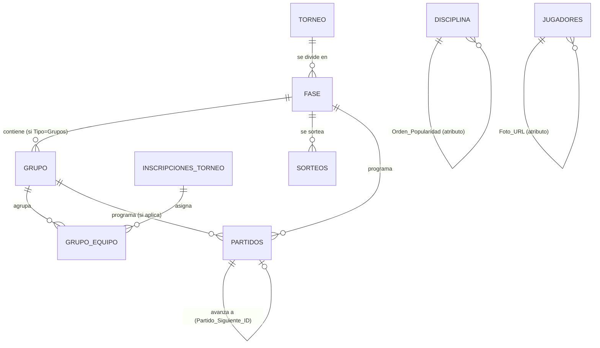

# Plan: Motor de Formatos de Competición + Gestión de Plantillas + Flujos de Navegación

Generado con `/gstack-autoplan` (revisión CEO → Design → Eng). Codex no está
disponible en esta máquina (`codex` no está en PATH) — corrió en modo
`[subagent-only]`, una sola voz revisora (Claude), mismo estado que los
cuatro planes previos de este repo (`equipos-jugadores-plan.md`,
`torneos-admin-plan.md`, `ediciones-catalogo-disciplinas-plan.md`,
`equipos-disciplina-navegacion-plan.md`). El análisis se hizo leyendo
directo el código (modelos, servicios, rutas, componentes y SQL citados
por archivo:línea abajo), no despachando un segundo subagente redundante
— mismo criterio pragmático (P3) documentado en el plan anterior.

Documento de planificación únicamente — cero código, cero cambios de
esquema aplicados. Se pidió explícitamente solo el `.md`.

**Las 2 decisiones de producto quedaron confirmadas** (ver "Decisiones
confirmadas" al final): desempate de grupos = enfrentamiento directo +
resolución manual (opción recomendada), y partido de 3er/4to lugar
**sí entra en alcance** (el usuario eligió la alternativa, no la
recomendada — el diseño de esta pieza está incorporado en el cuerpo del
documento, no solo anotado como pendiente). El plan queda **listo para
ejecutarse** tal cual está escrito.

---

## Resumen del módulo

Cuatro pedidos que llegan mezclados con una sorpresa: **dos ya están
resueltos en un 80-90% por el plan anterior** (`equipos-disciplina-navegacion-plan.md`,
implementado el 2026-08-27), uno es un fix de 10 líneas, y el cuarto —el
motor de formatos— es terreno completamente nuevo y es, con diferencia,
el trabajo real de este plan.

**1. Validaciones y Gestión de Equipos** (`/torneo-admin/torneos/{id}/equipos`)
— unicidad de dorsal, ver roster actual, agregar/quitar jugadores desde
una sola pantalla. **Parcialmente construido, con un hueco de seguridad
real**: la unicidad de dorsal SÍ está en la base de datos y SÍ tiene
mensaje claro en el flujo de registro por lote, pero el alta individual
(`POST /plantillas`) no la valida en la app — hoy cae a un 409 genérico
que no dice "el dorsal ya está ocupado". Y el roster+alta+baja están
repartidos en dos pantallas distintas, una de las cuales saca al admin
del contexto del equipo.

**2. Redirección Continua** al crear un torneo → matricular equipos
filtrados por disciplina. **El 90% ya existe.** El plan anterior ya
resolvió "Nueva Edición → redirige a `/equipos`" (en los dos lugares
donde se puede crear una edición) y ya filtra equipos por disciplina al
inscribir. Lo único que falta es que **crear un torneo la PRIMERA vez**
(grupo nuevo) también redirija — hoy se queda en el listado. Es el mismo
código ya escrito, aplicado a la otra rama del mismo formulario.

**3. Navegación por Popularidad + Grid de Plantillas.** La barra
SofaScore existe pero ordena alfabéticamente, no por popularidad, y no
hay ninguna columna en el catálogo maestro que la defina. La pantalla de
Plantillas es una tabla plana (jugador/equipo/dorsal/estado), no una
grilla de tarjetas por equipo. No hay foto de perfil en ningún lado del
esquema. El "Perfil de Jugador" existe pero es de **solo lectura** —
tiene los datos pero ningún botón para editarlos, aunque el backend
(`PATCH /jugadores/{id}`) ya acepta la edición.

**4. Motor de Formatos de Competición.** Esto es terreno nuevo de
verdad. `PARTIDOS` tiene columnas sueltas `Jornada`/`Fase`/`Grupo`
(texto libre) desde el plan de Torneos Admin, pero **nada** las
estructura: no hay tabla de fases, ni de grupos, ni de llaves, ni sorteo,
ni encadenamiento de partidos. `vw_tabla_posiciones` calcula una sola
tabla por torneo entero, ignorando `Fase`/`Grupo` por completo. `TORNEO`
no tiene ningún campo de formato. Esta es la parte que hay que diseñar
de cero.

---

## Fase 1 — CEO Review (Estrategia y Alcance)

### Premisas (verificadas leyendo el código, no asumidas)

| # | Premisa del pedido | Veredicto | Evidencia |
|---|---|---|---|
| P1 | "Unicidad de dorsal — implementar validación estricta backend y frontend" | ⚠️ **Ya existe, con un hueco.** DB: índice único parcial `uq_dorsal_por_roster_vigente` (`database/03_indexes.sql:59-61`). App: `registro_lote.py` valida y da mensaje claro ("El dorsal N ya está en uso en este equipo", línea 167). **Pero** `JugadorEquipoService.create` (el alta individual desde `POST /plantillas`) no valida en Python — depende solo del índice, y si falla cae al handler genérico (`handlers.py:17-27`) con un 409 que dice "Ya existe un registro con esos datos (restricción de unicidad)", no "el dorsal ya está ocupado". Es el mismo bug de clase que ya se cerró en `registro_lote.py`, sin cerrar en el otro camino. |
| P2 | "En la vista de agregar jugadores, ver inmediatamente la lista completa de jugadores actuales del club" | ❌ **Falso hoy.** No hay una vista así. `EquiposDelTorneo.tsx` muestra un conteo por equipo y el botón "+ Agregar jugadores" **navega afuera** a `/torneo-admin/plantillas/lote` (registro por lote, sin roster visible). `PlantillasDelTorneo.tsx` sí lista jugadores con dorsal/estado, pero de **toda la edición mezclada**, no de un equipo puntual, y vive en la pestaña "Plantillas", no en "Equipos" (la ruta que pide el requerimiento). |
| P3 | "Acciones CRUD desde la misma pantalla: listar, agregar, quitar" | ⚠️ **Las piezas existen, pero no juntas ni en la ruta pedida.** `POST /plantillas/{id}/baja` (soft-baja, ya con `fecha_fin`) y "+ Nuevo vínculo" (alta individual) ya están en `PlantillasDelTorneo.tsx` — pero esa es la pestaña Plantillas, no Equipos, y actúa sobre toda la edición, no por equipo. |
| P4 | "Al crear un torneo, redirigir a `/torneos/{id}/equipos`" | ⚠️ **Ya implementado para un camino, no para el otro.** `TorneosAdmin.submitNuevaEdicion` y `TorneoDashboard.crearEdicion` ya redirigen (`TorneosAdmin.tsx:224-228`, `TorneoDashboard.tsx:110-119`). Pero `submitCrearGrupo` — la **primera** vez que se crea un torneo (botón "Crear" del formulario "+ Nuevo torneo") — solo invalida queries y vuelve al listado (`TorneosAdmin.tsx:193-202`). Ambos flujos comparten la misma mutación (`crearTorneo`, `POST /api/v1/torneos`, que devuelve el `TORNEO` con `.id` en los dos casos) — es el mismo `onSuccess` que falta copiar. |
| P5 | "En la pantalla destino, seleccionar y matricular equipos filtrados por disciplina" | ✅ **Ya implementado.** `ModalAgregarInscripcion.tsx:284-288` filtra por `disciplina_id` del torneo y `estado: "Activo"`; el backend (`InscripcionTorneoService._crear_por_equipo`, `inscripcion_torneo.py:44-72`) rechaza con 400 si la disciplina no coincide. |
| P6 | "Barra tipo SofaScore ordenada por popularidad, no alfabético, definida en el catálogo maestro" | ❌ **Falso hoy, y es peor de lo que parece.** No solo no hay orden por popularidad — **no hay ninguna columna de orden en absoluto**. `DISCIPLINA` es `(ID, Nombre, Estado)` (`01_schema.sql:28-32`). El orden que se ve hoy es un artefacto: `TorneosAdmin.tsx:89-94` hace `.sort((a,b) => a.nombre.localeCompare(b.nombre))` sobre las disciplinas que tienen torneos — alfabético, client-side, y ni siquiera es el orden del catálogo (`GET /disciplinas` ordena por `ID`, `repositories/base.py:39`). |
| P7 | "Grid de plantillas: tarjetas por equipo, cada jugador con foto + dorsal" | ❌ **Falso hoy en dos niveles.** `PlantillasDelTorneo.tsx` es una `ResourceTable` (tabla), no una grilla de tarjetas (`PlantillasDelTorneo.tsx:235-250`). Y **no existe ningún campo de foto** en `JUGADORES` ni en ningún esquema — ni backend ni frontend. |
| P8 | "Click en jugador abre su Perfil Personal completo y permite editarlo" | ⚠️ **Mitad construido.** `PerfilJugadorAdmin.tsx` existe, muestra cédula/correo/nombre/stats/trayectoria — pero es **de solo lectura**, no tiene ningún formulario ni mutación. El backend SÍ soporta la edición (`PATCH /jugadores/{id}`, acepta `nombre`/`cedula`/`correo_electronico`/`estado`, `jugadores.py:84-88`) — está ahí, sin conectar a esta vista. Tampoco es un modal: es una página propia (`/jugadores/:jugadorId/perfil`), no algo que se abre desde el grid de Plantillas. |
| P9 | "Diseñar el motor de Liga/Liguilla, Eliminación Directa y Grupos+Playoffs" | ❌ **No existe nada.** `PARTIDOS` tiene columnas `Jornada`/`Fase VARCHAR(30)`/`Grupo VARCHAR(10)` como texto libre (`01_schema.sql:195-199`, con un comentario que ya anticipa la necesidad: "Sin estas tres columnas no hay jornadas, fase de grupos ni eliminatorias") — pero **nada las usa realmente**: `vw_tabla_posiciones` agrupa solo por `Torneo_ID` (`04_views.sql:179-207`), ignorando Fase/Grupo. No hay tabla de fases, grupos, llaves, sorteo, ni encadenamiento de partidos. `TORNEO` no tiene columna `Formato`. Es la única premisa 100% verde de construir. |

**Lectura de las premisas:** los pedidos #1, #2 y #3 no son "constrúyelo
de cero" — son "cerrá el hueco que quedó" sobre trabajo que el plan
anterior ya dejó al 80-90%. El pedido #4 es el único que exige diseño
nuevo real, y es sustancialmente más grande que los otros tres juntos.

### Qué ya existe (leverage map)

| Sub-problema | Ya cubierto por | Qué falta |
|---|---|---|
| Constraint de dorsal único | `uq_dorsal_por_roster_vigente` (índice parcial) | Nada — se reutiliza tal cual |
| Mensaje claro de dorsal duplicado | `registro_lote.py:161-167` | Replicar la misma validación (mismo mensaje) en `JugadorEquipoService.create` |
| Dar de baja a un jugador (soft-baja) | `POST /plantillas/{id}/baja` + `JugadorEquipoService.dar_de_baja` | Nada — se reutiliza, solo cambia desde dónde se llama |
| Alta individual de un jugador a un equipo | `POST /plantillas` + modal "+ Nuevo vínculo" en `PlantillasDelTorneo.tsx` | Reusar el mismo formulario/mutación dentro de un modal scoped a un equipo, no a toda la edición |
| Redirect tras crear una edición | `TorneosAdmin.submitNuevaEdicion`, `TorneoDashboard.crearEdicion` | Copiar el mismo `onSuccess` a `submitCrearGrupo` |
| Filtro de equipos por disciplina al inscribir | `ModalAgregarInscripcion` + `InscripcionTorneoService` | Nada — ya funciona para la pantalla destino del redirect |
| Edición de datos personales del jugador | `PATCH /jugadores/{id}` (`JugadorUpdate`: nombre/cedula/correo/estado) | Conectar un formulario/modal que lo llame — hoy no lo consume nadie con este propósito |
| Catálogo de Disciplina/Modalidad | `DISCIPLINA`, `MODALIDAD`, `useCatalogo()` (hook ya extraído en el plan anterior) | Columna de orden + reordenar el `.sort()` de `TorneosAdmin.tsx` |
| Vistas de agregación en vez de tablas de resumen duplicadas | `vw_tabla_posiciones`, `vw_goleadores`, `vw_resultados_partidos` | Misma técnica, extendida para agrupar por Fase/Grupo |
| Validación cruzada vía trigger (patrón ya usado 3 veces) | `fn_validar_jugador_partido`, `fn_validar_exclusividad_torneo`, `fn_validar_equipo_modalidad` | Mismo patrón para propagación de bracket y exclusividad de grupo |
| Trazabilidad append-only de una acción sensible | `TRASPASOS` (nunca se edita, se marca `Anulado`) | Mismo patrón para `SORTEOS` (un sorteo rehecho no borra el anterior) |
| Ancla "equipo-en-este-torneo" reutilizable | `INSCRIPCIONES_TORNEO` | Reusarla como ancla de `GRUPO_EQUIPO`, en vez de una FK paralela a `EQUIPOS` |

**El leverage más importante: nada de esto se construye desde cero.**
Cada pieza nueva (validación de dorsal, roster consolidado, redirect,
edición de perfil) es una extensión de código que ya existe y ya está
probado. Solo el motor de formatos es una pieza sin precedente en el
repo, y hasta ahí sigue las tres convenciones ya establecidas (trigger
para reglas cruzadas, vista para agregación, tabla append-only para
auditoría) en vez de inventar un patrón nuevo.

### Alternativas de arquitectura consideradas (Motor de Formatos)

#### ¿Cómo se representa el Formato del torneo?

| Opción | Completeness | Veredicto |
|---|---|---|
| **F1. `TORNEO.Formato` como `VARCHAR` con `CHECK` (recomendada)** | 8/10 | Mismo patrón que `Estado` en las 10+ tablas del esquema. 3 valores fijos, sin necesidad de CRUD de catálogo. |
| F2. Tabla catálogo `FORMATO_COMPETICION` | 10/10 si se anticipan más formatos seguido (ej. "Suizo", "Round Robin doble grupo") | Sobre-ingeniería para 3 valores que no cambian con frecuencia — rompería P3 (pragmático) sin necesidad real hoy. |

**Recomendación: F1** — P5 (explícito) + P3 (pragmático). Migrar a F2 después es un `ALTER` aislado si hace falta; no bloquea nada de este plan.

#### ¿Cómo se modela la fase de Eliminación — una `FASE` por ronda o una sola?

| Opción | Completeness | Veredicto |
|---|---|---|
| **G1. Una sola `FASE` (Tipo='Eliminacion') para TODO el bracket (recomendada)** | 9/10 | El nombre de ronda (Octavos/Cuartos/Semifinal/Final) se calcula al generar el sorteo y se graba en `PARTIDOS.Ronda_Nombre` (denormalizado, sin join para mostrarlo). Una fase = "el torneo está en etapa eliminatoria", que es como lo describe el pedido ("Eliminación Directa... Octavos, Cuartos, Semifinal, Final" como una sola frase, un solo concepto). |
| G2. Una `FASE` por ronda (4+ filas: Octavos, Cuartos, Semifinal, Final) | 10/10 en teoría | Multiplica filas de `FASE` sin necesidad real — el estado "En_Curso"/"Finalizada" de cada ronda ya se puede leer mirando el `Estado` de sus `PARTIDOS`, no hace falta una fila de `FASE` por ronda para saberlo. |

**Recomendación: G1** — P4 (DRY) + P5. Con G2, "Fase de Grupos + Playoffs" necesitaría 1 fila de Grupos + N filas de rondas eliminatorias — inconsistente con que el propio pedido las trata como una sola "fase de eliminación directa".

#### ¿Cómo avanza el ganador de un partido de bracket a la siguiente ronda?

| Opción | Completeness | Veredicto |
|---|---|---|
| **H1. Encadenamiento explícito `Partido_Siguiente_ID` + `Slot_Siguiente`, con trigger de propagación (recomendada)** | 10/10 | Permite armar el bracket completo (con partidos "TBD") desde el sorteo inicial, y que el ganador aparezca solo automáticamente al cerrar el partido anterior. Mismo patrón de trigger que `fn_cerrar_torneo_libera_jugadores`. |
| H2. Recalcular el bracket completo en cada consulta (sin persistir el árbol) | 4/10 | Más "sin estado", pero cada partido de ronda 2+ nace sin saber quién lo juega — hay que persistir eso en algún lado o la UI no puede mostrar "Ganador Partido 3 vs Ganador Partido 4" antes de que exista. |

**Recomendación: H1** — P1 (completeness) + P5 (el árbol es explícito, no se re-deriva con lógica escondida en el cliente).

### Alcance

**Dentro de este plan:**

- Cerrar el hueco de validación de dorsal en el alta individual (`JugadorEquipoService.create`), mismo mensaje que ya usa `registro_lote.py`.
- Modal consolidado "Gestionar plantilla" en `EquiposDelTorneoPage` (ruta `/torneo-admin/torneos/{id}/equipos`): roster visible al abrir, alta y baja sin salir de la pantalla.
- Fix del redirect en `submitCrearGrupo` (copiar el `onSuccess` que ya existe en `submitNuevaEdicion`).
- `DISCIPLINA.Orden_Popularidad` + reordenar la barra SofaScore por ese campo.
- `JUGADORES.Foto_URL` + reescritura de `PlantillasDelTorneoPage` como grid de tarjetas por equipo (foto + dorsal).
- Modal de Perfil de Jugador editable (cédula/correo/nombre), conectado a `PATCH /jugadores/{id}`, abierto desde una tarjeta del grid.
- Motor de formatos completo: `TORNEO.Formato` + parámetros, `FASE`, `GRUPO`, `GRUPO_EQUIPO`, `SORTEOS`, extensión de `PARTIDOS` (bracket chaining, `Ganador_Desempate_ID`, `Fase_ID`/`Grupo_ID` reemplazando el texto libre), triggers de propagación y de exclusividad de grupo, algoritmos de generación de fixture (round robin) y sorteo (bracket + cruce de grupos a playoffs), vistas de tabla de posiciones y goleadores escopadas por fase/grupo.
- Selector de Formato (+ parámetros: ida/vuelta, equipos por grupo, clasificados por grupo, partido por el 3er lugar) en el formulario de creación de torneo.
- Pantallas de "Generar Fixture" (Liga) y "Sorteo" (Eliminación / Grupos), y visualización de bracket.
- **Partido por el 3er/4to lugar** en formato Eliminación (y en la fase eliminatoria de Grupos+Playoffs): confirmado por el usuario — ver "Decisiones confirmadas". Se genera automáticamente junto con la Final, entre los 2 perdedores de semifinal.

**Fuera de alcance (→ `TODOS.md`):**

- Catálogo de categorías etarias/género y roster permanente de equipo (`EQUIPO_MIEMBRO`) — ya deferidos en el plan anterior, sin cambios.
- Deportes de marca/tiempo/combate (Atletismo, Natación, MMA...) para registrar resultados — el motor de formatos que este plan diseña sigue asumiendo "2 equipos + goles" (`PARTIDOS`/`EVENTOS_PARTIDO`), que es el modelo ya existente. Adaptar el registro de resultados a un tiempo o una sumisión es la extensión ya anotada en `TODOS.md` del plan de catálogo — un torneo de Ajedrez o Boxeo puede usar Liga/Eliminación/Grupos+Playoffs con este motor (son formatos, no deportes), pero cómo se carga SU resultado no cambia en este plan.
- Doble eliminación (repechaje) — el pedido dice "el perdedor sale del torneo", eliminación simple.
- Walkover/retiro de un equipo a mitad de una fase de Eliminación (EC-52) — no trivial, decisión de producto no pedida explícitamente.
- Subida real de archivo para `Foto_URL` — se agrega el campo y el frontend acepta una URL o cae a iniciales; un uploader con storage es un módulo aparte.
- Notificación al jugador cuando se edita su perfil.
- Persistir el filtro de disciplinas en la URL — ya deferido.

### Dream state

```
HOY                            ESTE PLAN                        IDEAL 12 MESES
────────────────────────       ────────────────────────         ────────────────────────
Dorsal validado solo en        Dorsal validado en TODOS          + Validación en tiempo real
el registro por lote.          los caminos de alta, mismo         mientras el admin tipea
Roster y alta/baja en          mensaje. Roster + CRUD             (antes de submit).
2 pantallas separadas.         consolidado en /equipos.

Crear torneo (1ra vez) no      Los dos caminos a "torneo         + Wizard único de creación
redirige. Nueva edición sí.    nuevo" redirigen igual.            que incluye Formato +
                                                                  matriculación en un flujo.

Barra ordenada alfabético,     DISCIPLINA.Orden_Popularidad,     + Favoritos personalizables
sin columna de orden.          barra ordenada por eso.            por usuario.

Plantillas = tabla plana,      Grid de tarjetas por equipo,      + Reordenar dorsales por
sin foto. Perfil de            foto + dorsal. Perfil editable    drag&drop desde el grid.
jugador de solo lectura.       desde una tarjeta.

Todo torneo es, de hecho,      Liga (round robin + tabla),       + Formato "Suizo", doble
Liga sin decirlo. Fase/        Eliminación (sorteo + bracket     eliminación, playoffs con
Grupo son texto suelto sin     con avance automático), Grupos    reseeding dinámico.
motor detrás.                  + Playoffs (sorteo de grupos →
                                cruce automático a bracket).
```

### Selección de modo

**SELECTIVE EXPANSION.** Los pedidos #1, #2 y #3 extienden pantallas y
endpoints ya existentes (ningún archivo se reescribe de cero, salvo
`PlantillasDelTorneoPage`, que pasa de tabla a grid). El pedido #4 agrega
tablas y vistas nuevas siguiendo los tres patrones ya establecidos en el
esquema (trigger cruzado, vista de agregación, tabla append-only) — no
introduce ningún patrón de infraestructura nuevo.

---

## Fase 2 — Design Review (UX)

### A. Roster consolidado — `/torneo-admin/torneos/{id}/equipos`

**Hoy:** el botón "+ Agregar jugadores" de una fila de equipo saca al
admin a `/torneo-admin/plantillas/lote`, una pantalla sin relación visual
con el equipo del que partió.

**Propuesto:** cada fila de `EquiposDelTorneoPage` gana un botón
"Gestionar plantilla" que abre un modal scoped a ESE equipo+torneo:

```
┌─ Gestionar plantilla — Los Tigres (Liga Relámpago Edición 2) ────────┐
│                                                                        │
│  Jugadores actuales (8)                                               │
│  ┌────────────┬────────┬─────────┬──────────┐                       │
│  │ Jugador    │ Dorsal │ Estado  │          │                       │
│  ├────────────┼────────┼─────────┼──────────┤                       │
│  │ J. Pérez   │  10    │ Activo  │ [Quitar] │                       │
│  │ M. Gómez   │   7    │ Activo  │ [Quitar] │                       │
│  └────────────┴────────┴─────────┴──────────┘                       │
│  (vacío → "Este equipo todavía no tiene jugadores en este torneo.")  │
│                                                                        │
│  + Agregar jugador                                                    │
│  ┌────────┬──────────┬─────────┬────────┐                           │
│  │ Cédula │ Nombre   │ Correo  │ Dorsal │  [Agregar]                │
│  └────────┴──────────┴─────────┴────────┘                           │
│  ⚠ El dorsal 10 ya está en uso en este equipo   ← bloquea el submit  │
│                                                                        │
│  ¿Vas a cargar varios de una vez? → Registro por lote                │
└────────────────────────────────────────────────────────────────────┘
```

**"Quitar" es un solo click, no un formulario.** Hoy `POST
/plantillas/{id}/baja` pide `fecha_fin` como campo de formulario — para
este modal, el click en "Quitar" manda `fecha_fin = hoy` directo (mismo
endpoint, default del lado del cliente) con una confirmación inline
("¿Quitar a J. Pérez de este equipo?"), no un formulario de fecha. El
caso de "quitar con efecto retroactivo" (una fecha distinta a hoy) sigue
disponible desde la pestaña Plantillas para el admin que lo necesite —
este modal optimiza el caso común.

**El link a Registro por Lote no desaparece** — sigue siendo el camino
correcto para cargar 10 jugadores nuevos de una vez con la pantalla
dividida de validación. Este modal resuelve el caso de "agregar/quitar
uno o dos", que hoy no tiene ningún atajo.

### Estados de interacción — modal de plantilla

| Estado | Comportamiento |
|---|---|
| Cargando roster | Spinner sobre la tabla, formulario de alta deshabilitado |
| Roster vacío | Mensaje explícito, sin fila fantasma |
| Dorsal duplicado (alta individual) | Mensaje inline bajo el campo Dorsal, específico ("El dorsal N ya está en uso en este equipo"), bloquea el submit — igual que ya hace el registro por lote |
| Cédula ya existe en otro equipo de este torneo | Mismo mensaje que hoy da `fn_validar_exclusividad_torneo` traducido: "Ya juega en [Equipo X] este torneo — usa Traspasos" |
| Quitar — confirmación | Modal de confirmación inline (nombre del jugador), no una navegación aparte |
| Quitar — éxito | La fila desaparece de la lista con una transición corta, toast "Jugador desvinculado" |
| Error de red | Mensaje + reintentar, el formulario no pierde lo tipeado |

### B. Redirect al crear torneo — sin mockup nuevo

Es el mismo flujo que "Nueva Edición" ya tiene, aplicado a la otra rama
del formulario. No hay UI nueva que diseñar — la pantalla destino
(`EquiposDelTorneoPage` con `ModalAgregarInscripcion` filtrado por
disciplina) ya está construida y ya se comporta bien.

### C. Barra de navegación por popularidad

Mismo componente `FiltroDisciplinasBar` — cambia únicamente el criterio
de orden. Hoy: `.sort((a,b) => a.nombre.localeCompare(b.nombre))`. Con
este plan: `.sort((a,b) => (a.orden_popularidad ?? 999) - (b.orden_popularidad ?? 999))`.
Sigue mostrando **solo disciplinas con torneos** (decisión ya tomada en
el plan anterior, D-Eng-16) — la popularidad decide el ORDEN entre las
que aparecen, no CUÁLES aparecen.

```
Antes (alfabético):   ⬤Todos  ♟Ajedrez  🏀Baloncesto  ⚽Fútbol  🎾Tenis
Ahora (popularidad):  ⬤Todos  ⚽Fútbol  🏀Baloncesto  🎾Tenis  ♟Ajedrez
```

Orden recomendado para el catálogo completo (28 disciplinas — el admin
puede reordenarlo después con un solo `UPDATE`, no es una decisión que
bloquee el resto del plan):

| Orden | Disciplina | Orden | Disciplina |
|---|---|---|---|
| 1 | Fútbol | 15 | League of Legends |
| 2 | Baloncesto | 16 | Valorant |
| 3 | Tenis | 17 | CS:GO |
| 4 | Voleibol | 18 | FIFA / EA FC |
| 5 | Ping Pong | 19 | Rocket League |
| 6 | Boxeo | 20 | Taekwondo |
| 7 | Natación | 21 | Karate |
| 8 | Atletismo | 22 | Gimnasia |
| 9 | MMA | 23 | Hándbol |
| 10 | Ajedrez | 24 | CrossFit |
| 11 | Bádminton | 25 | Squash / Racquetball |
| 12 | Judo | 26 | Fútbol Americano / Flag Football |
| 13 | Ciclismo | 27 | Pickleball |
| 14 | Rugby | 28 | Frontón / Pelota Vasca |

### D. Grid de Plantillas — `/torneo-admin/torneos/{id}/plantillas`

**Hoy:** tabla plana, una fila por jugador, columna "Equipo" como texto.

**Propuesto:**

```
Plantillas — Liga Relámpago Edición 2                    [+ Nuevo vínculo]

┌─ Los Tigres ⚽ (8 jugadores) ─────────────────────────────────────────┐
│ ┌──────────┐ ┌──────────┐ ┌──────────┐ ┌──────────┐                  │
│ │  [foto]  │ │  [foto]  │ │   J·P    │ │  [foto]  │   ← sin foto:    │
│ │  #10     │ │   #7     │ │   #4     │ │   #1     │     iniciales    │
│ │ J. Pérez │ │ M. Gómez │ │ J. Paz   │ │ Portero  │     en círculo   │
│ └──────────┘ └──────────┘ └──────────┘ └──────────┘                  │
└────────────────────────────────────────────────────────────────────────┘
┌─ Nadal/Alcaraz 🎾 (2 jugadores) ──────────────────────────────────────┐
│ ┌──────────┐ ┌──────────┐                                             │
│ │  [foto]  │ │  [foto]  │                                             │
│ │   #1     │ │   #2     │                                             │
│ │  Nadal   │ │ Alcaraz  │                                             │
│ └──────────┘ └──────────┘                                             │
└────────────────────────────────────────────────────────────────────────┘
(equipo con 0 jugadores → tarjeta de grupo igual, con
 "Sin jugadores todavía — Ir a Equipos para agregar")
```

**Click en una tarjeta → modal de Perfil de Jugador editable:**

```
┌─ Perfil de Jugador ────────────────────────────────── [Editar] [X] ──┐
│  [foto grande o iniciales]                                            │
│  J. Pérez                                                              │
│  Cédula: 001-1234567-8        Correo: jperez@mail.com                 │
│  Equipos activos: Los Tigres (Fútbol) · Nadal/Alcaraz no aplica       │
│  Trayectoria: [tabla de traspasos existente, sin cambios]              │
│  Stats: 4 goles esta disciplina                                        │
└────────────────────────────────────────────────────────────────────────┘
       │ click en [Editar]
       ▼
┌─ Editar datos personales ─────────────────────────────────────────────┐
│  Nombre:  [J. Pérez_______]                                            │
│  Cédula:  [001-1234567-8__]                                            │
│  Correo:  [jperez@mail.com]                                            │
│           [Cancelar]  [Guardar]                                        │
│  ⚠ Ya existe un jugador con esa cédula   ← si choca con otro (unique) │
└────────────────────────────────────────────────────────────────────────┘
```

**Por qué modal y no la página actual:** el pedido dice "al hacer click
en un jugador, se debe abrir su Perfil" — desde un grid de tarjetas, un
modal mantiene el contexto (seguís viendo el resto del equipo detrás);
navegar a una página nueva por cada jugador rompe el "vengo del grid,
corrijo un typo, sigo viendo el grid" que es el caso de uso descrito
("corregir errores de ingreso tipográfico"). La página existente
`/jugadores/:jugadorId/perfil` sigue existiendo para cuando se llega
desde `JugadoresAdmin.tsx` (listado global) — el modal es una vista
adicional del mismo componente de contenido, no un reemplazo.

### Estados de interacción — grid de Plantillas

| Estado | Comportamiento |
|---|---|
| Cargando | Skeleton de tarjetas de grupo |
| Torneo sin equipos | "Todavía no hay equipos matriculados en este torneo." + link a Equipos |
| Equipo sin jugadores | Tarjeta de grupo con mensaje + link a "Equipos" (no una tarjeta vacía sin salida) |
| Jugador sin foto | Círculo con iniciales, color determinístico por `Jugador_ID` (mismo jugador = mismo color siempre) |
| Editar — cédula duplicada | Mensaje inline bajo el campo, no un toast genérico |
| Editar — éxito | Toast "Datos actualizados", el modal de Perfil se actualiza sin cerrarse |

### E. UX del Motor de Formatos

**Selector de Formato al crear un torneo:**

```
Nuevo torneo
  Grupo: [Liga Relámpago______]
  Disciplina: [Fútbol ▾]   Modalidad: [Fútbol 11 ▾]
  Formato:  (●) Liga / Liguilla
            ( ) Eliminación Directa
            ( ) Fase de Grupos + Playoffs
  ┌─ si Liga ──────────────────────────┐
  │ ☐ Ida y vuelta                     │
  └─────────────────────────────────────┘
  ┌─ si Eliminación o Grupos + Playoffs ┐
  │ ☑ Jugar partido por el 3er lugar    │  ← nuevo, default marcado
  └─────────────────────────────────────┘
  ┌─ si Grupos + Playoffs ─────────────┐
  │ Equipos por grupo:      [4___]     │
  │ Clasifican por grupo:   [2___]     │
  └─────────────────────────────────────┘
  Fecha inicio / fin: [...]
  [Crear]
```

**Pantalla "Generar Fixture / Sorteo"** (aparece en la pestaña Partidos
una vez que el torneo tiene equipos matriculados, antes de que existan
partidos):

```
Partidos — Liga Relámpago Edición 2 (Liga)
  Aún no se generó el calendario.
  8 equipos matriculados.
  [Generar Fixture]  → todos contra todos, genera N jornadas

Partidos — Copa Relámpago (Eliminación)
  Aún no se hizo el sorteo.
  6 equipos matriculados (bracket de 8, 2 byes).
  [Hacer Sorteo]  → arma la llave completa, byes a los 2 primeros del sorteo

Partidos — Mundialito (Grupos + Playoffs)
  Fase de Grupos: Sorteo pendiente.
  12 equipos → 3 grupos de 4.
  [Sortear Grupos]
  (tras finalizar la fase de grupos)
  Fase Eliminatoria: pendiente de generar.
  [Generar Playoffs]  → cruza los 2 mejores de cada grupo
```

**Vista de bracket** (solo lectura, dentro de Partidos cuando
`Formato != 'Liga'`):

```
Octavos          Cuartos          Semifinal         Final
┌─────────┐
│ Tigres  │──┐
├─────────┤  ├──┐
│ Leones  │──┘  │
└─────────┘     ├──┐
┌─────────┐     │  │
│ Osos    │──┐  │  │
├─────────┤  ├──┘  ├──── 🏆
│ Águilas │──┘     │
└─────────┘        │
   ...              ...
                                    Tercer Lugar
                                   ┌──────────────┐
                                   │ Perdedor SF1  │  ← si Incluye_Tercer_Lugar
                                   │ Perdedor SF2  │     (línea aparte, fuera
                                   └──────────────┘     del árbol principal)
```
Cada casilla vacía dice "Ganador Partido N" hasta que ese partido
termina — nunca un espacio en blanco sin explicación. El cuadro de
Tercer Lugar se dibuja separado del árbol principal (no cuelga de
ninguna rama) — dice "Perdedor Semifinal N" hasta que esa semifinal
termina, mismo criterio de nunca dejar un espacio sin explicar.

### Litmus scorecard (resumen)

| Dimensión | Score | Comentario |
|---|---|---|
| Jerarquía de información | 8/10 | El grid agrupa por equipo antes que por jugador, que es como se piensa una plantilla |
| Estados especificados | 9/10 | Roster/grid/bracket con sus vacíos y errores escritos arriba |
| Especificidad | 9/10 | Mockups concretos de las 5 pantallas nuevas, no descripciones sueltas |
| Consistencia con lo existente | 9/10 | Reusa `ResourceTable`, modales existentes, el mismo endpoint de baja, el mismo `PATCH` de jugador |
| Journey emocional | 7/10 | El punto de fricción real es el bracket con "Ganador Partido N" — se explicita en vez de dejarlo en blanco, pero sigue siendo el concepto más nuevo para un admin que nunca usó esto |
| Accesibilidad | 7/10 | El grid de tarjetas necesita `role="button"`/foco de teclado en cada tarjeta clickeable — a verificar contra el CSS real en implementación |

---

## Fase 3 — Eng Review (Arquitectura, Datos, Edge Cases, Tests)

### Arquitectura

```
Frontend (Vite)                        Backend (FastAPI)                   DB (Postgres)
────────────────                        ──────────────────                  ─────────────
EquiposDelTorneoPage
  └─ ModalGestionarPlantilla ◄─NUEVO──▶ GET  /plantillas?inscripcion_torneo_id=
                                        POST /plantillas          ──valida──▶ uq_dorsal_por_roster_vigente
                                             (dorsal en Python,               (ya existe)
                                              mismo mensaje que
                                              registro_lote.py)   ◄─FIX──
                                        POST /plantillas/{id}/baja (ya existe)

TorneosAdmin.submitCrearGrupo ◄─FIX──▶ POST /torneos  (ya existe, ya
  (copia el onSuccess de                devuelve el TORNEO con .id)
   submitNuevaEdicion)

FiltroDisciplinasBar          ◄─FIX──▶ GET /disciplinas  (ordena por
  (ordena por orden_popularidad)        Orden_Popularidad en vez de ID)     DISCIPLINA.Orden_Popularidad ◄NUEVO

PlantillasDelTorneoPage       ◄─REESCRITA──▶ GET /plantillas (agrupado     JUGADORES.Foto_URL ◄NUEVO
  (grid de tarjetas)                          client-side por equipo)

  └─ ModalPerfilJugador       ◄─NUEVO──▶ GET   /jugadores/{id}/perfil (ya existe)
                                         PATCH /jugadores/{id}         (ya existe, sin conectar)

TorneosAdmin (form crear)     ◄─NUEVO──▶ POST /torneos { formato, ... }   TORNEO.Formato ◄NUEVO
PartidosDelTorneoPage
  └─ Generar Fixture          ◄─NUEVO──▶ POST /torneos/{id}/fixture      FASE, PARTIDOS (round robin)
  └─ Sorteo (bracket)         ◄─NUEVO──▶ POST /torneos/{id}/sorteo       FASE, GRUPO, GRUPO_EQUIPO,
  └─ Generar Playoffs         ◄─NUEVO──▶ POST /torneos/{id}/playoffs      SORTEOS, PARTIDOS (bracket)
  └─ Vista de bracket         ◄─NUEVO──▶ GET  /torneos/{id}/bracket

Cierre de partido (ya existe) ────────▶ UPDATE PARTIDOS SET Estado=      trigger: fn_propagar_ganador_bracket
                                         'Finalizado'                     (AFTER UPDATE, solo si
                                                                           Partido_Siguiente_ID no es NULL)
```

### Modelo de datos



#### Columnas nuevas en tablas existentes

```sql
-- Requerimiento #3 — orden de navegación
ALTER TABLE DISCIPLINA ADD COLUMN Orden_Popularidad INT;
-- NULL = no seteado, ordena al final (NULLS LAST). El seed inicial carga
-- el ranking de la sección de Design; el admin lo ajusta con un UPDATE
-- directo — no hay UI de reordenamiento en este plan (ver "fuera de
-- alcance" del catálogo inmutable, ya establecido en el plan anterior).

-- Requerimiento #3 — foto de perfil
ALTER TABLE JUGADORES ADD COLUMN Foto_URL VARCHAR(500);
-- nullable a propósito: todos los jugadores existentes quedan sin foto,
-- el frontend cae a iniciales. No hay uploader en este plan — el campo
-- acepta una URL (ver "fuera de alcance").

-- Requerimiento #4 — formato de competición
ALTER TABLE TORNEO ADD COLUMN Formato VARCHAR(20) NOT NULL DEFAULT 'Liga'
    CHECK (Formato IN ('Liga', 'Eliminacion', 'Grupos_Playoffs'));
ALTER TABLE TORNEO ADD COLUMN Ida_Vuelta BOOLEAN NOT NULL DEFAULT FALSE;
    -- solo relevante si Formato='Liga'; fn_validar_torneo_formato_parametros
    -- exige NULL/false en los que no aplican (ver trigger abajo)
ALTER TABLE TORNEO ADD COLUMN Equipos_Por_Grupo INT;      -- solo Grupos_Playoffs
ALTER TABLE TORNEO ADD COLUMN Clasificados_Por_Grupo INT; -- solo Grupos_Playoffs
ALTER TABLE TORNEO ADD COLUMN Incluye_Tercer_Lugar BOOLEAN NOT NULL DEFAULT TRUE;
-- Solo relevante si Formato IN ('Eliminacion','Grupos_Playoffs') Y el
-- bracket tiene una ronda de Semifinal (4+ equipos en esa fase — ver
-- EC-58). Default TRUE porque el usuario confirmó incluirlo; queda
-- como flag (no hardcodeado) para el torneo que no lo quiera.
```

#### Tablas nuevas

**`FASE`** — formaliza lo que hoy es `PARTIDOS.Fase` (texto suelto).
```sql
CREATE TABLE FASE (
    ID SERIAL PRIMARY KEY,
    Torneo_ID INT NOT NULL REFERENCES TORNEO(ID),
    Nombre VARCHAR(50) NOT NULL,           -- "Liga Regular", "Fase de Grupos", "Eliminatoria"
    Tipo VARCHAR(20) NOT NULL CHECK (Tipo IN ('Liga', 'Grupos', 'Eliminacion')),
    Orden INT NOT NULL,                    -- 1 = primera fase que se juega
    Estado VARCHAR(20) NOT NULL DEFAULT 'Pendiente'
        CHECK (Estado IN ('Pendiente', 'En_Curso', 'Finalizada')),
    Fecha_Registro TIMESTAMP DEFAULT CURRENT_TIMESTAMP,
    Fecha_Modificacion TIMESTAMP DEFAULT CURRENT_TIMESTAMP,
    UNIQUE (Torneo_ID, Orden)
);
-- Liga → 1 FASE (Tipo='Liga'). Eliminación → 1 FASE (Tipo='Eliminacion',
-- contiene TODO el bracket — ver Decisión de arquitectura G1). Grupos +
-- Playoffs → 2 FASES (Orden 1 'Grupos', Orden 2 'Eliminacion').
```

**`GRUPO`** — solo dentro de una `FASE` de `Tipo='Grupos'`.
```sql
CREATE TABLE GRUPO (
    ID SERIAL PRIMARY KEY,
    Fase_ID INT NOT NULL REFERENCES FASE(ID),
    Nombre VARCHAR(10) NOT NULL,           -- "A", "B", "C"...
    Fecha_Registro TIMESTAMP DEFAULT CURRENT_TIMESTAMP,
    UNIQUE (Fase_ID, Nombre)
);
```

**`GRUPO_EQUIPO`** — resultado del sorteo de grupos.
```sql
CREATE TABLE GRUPO_EQUIPO (
    ID SERIAL PRIMARY KEY,
    Grupo_ID INT NOT NULL REFERENCES GRUPO(ID),
    Inscripcion_Torneo_ID INT NOT NULL REFERENCES INSCRIPCIONES_TORNEO(ID),
    Fecha_Registro TIMESTAMP DEFAULT CURRENT_TIMESTAMP,
    UNIQUE (Grupo_ID, Inscripcion_Torneo_ID)
);
-- Ancla en INSCRIPCIONES_TORNEO, no en EQUIPOS directo — mismo criterio
-- que JUGADOR_EQUIPO: reutiliza el ancla "equipo-en-este-torneo" que ya
-- existe, no inventa una FK paralela.

CREATE OR REPLACE FUNCTION fn_validar_equipo_un_grupo_por_fase()
RETURNS TRIGGER AS $$
DECLARE
    v_conflicto INT;
BEGIN
    SELECT COUNT(*) INTO v_conflicto
    FROM GRUPO_EQUIPO ge
    JOIN GRUPO g_new ON g_new.ID = NEW.Grupo_ID
    JOIN GRUPO g_ge  ON g_ge.ID  = ge.Grupo_ID
    WHERE ge.Inscripcion_Torneo_ID = NEW.Inscripcion_Torneo_ID
      AND ge.ID <> COALESCE(NEW.ID, -1)
      AND g_ge.Fase_ID = g_new.Fase_ID;
    IF v_conflicto > 0 THEN
        RAISE EXCEPTION 'equipo_ya_asignado_a_otro_grupo_en_esta_fase';
    END IF;
    RETURN NEW;
END;
$$ LANGUAGE plpgsql;
-- Mismo patrón que fn_validar_exclusividad_torneo: no se puede expresar
-- con un UNIQUE plano porque Fase_ID no vive en esta tabla.

CREATE TRIGGER trg_grupo_equipo_un_grupo_por_fase
BEFORE INSERT OR UPDATE ON GRUPO_EQUIPO
FOR EACH ROW EXECUTE FUNCTION fn_validar_equipo_un_grupo_por_fase();
```

**`SORTEOS`** — auditoría append-only, mismo criterio que `TRASPASOS`.
```sql
CREATE TABLE SORTEOS (
    ID SERIAL PRIMARY KEY,
    Fase_ID INT NOT NULL REFERENCES FASE(ID),
    Realizado_Por INT NOT NULL REFERENCES USUARIOS(ID),
    Semilla VARCHAR(50),                   -- para poder auditar/reproducir
    Fecha_Sorteo TIMESTAMP DEFAULT CURRENT_TIMESTAMP,
    Estado VARCHAR(20) NOT NULL DEFAULT 'Completado'
        CHECK (Estado IN ('Completado', 'Rehecho'))
);
-- Rehacer un sorteo NO borra el anterior: marca el viejo 'Rehecho' e
-- inserta uno nuevo 'Completado' — igual que TRASPASOS con 'Anulado'.
```

#### `PARTIDOS` — extensión para fases, grupos y bracket

```sql
-- Fase/Grupo pasan de texto libre a FK. Backfill: todo torneo existente
-- es de hecho Formato='Liga' (default) con una sola FASE — se crea 1
-- FASE por torneo existente (Tipo='Liga', Orden=1) y se apunta cada
-- PARTIDOS.Fase_ID a ella antes de soltar las columnas de texto.
ALTER TABLE PARTIDOS ADD COLUMN Fase_ID INT REFERENCES FASE(ID);
ALTER TABLE PARTIDOS ADD COLUMN Grupo_ID INT REFERENCES GRUPO(ID);      -- NULL salvo fase de grupos
ALTER TABLE PARTIDOS ADD COLUMN Ronda_Nombre VARCHAR(30);               -- "Octavos de Final", denormalizado
ALTER TABLE PARTIDOS ADD COLUMN Partido_Siguiente_ID INT REFERENCES PARTIDOS(ID);
ALTER TABLE PARTIDOS ADD COLUMN Slot_Siguiente VARCHAR(10)
    CHECK (Slot_Siguiente IN ('Local', 'Visitante'));
-- Partido por el 3er/4to lugar (confirmado): solo las 2 SEMIFINALES lo
-- usan — apunta al partido de "Tercer Lugar", no al de la Final. Es un
-- encadenamiento paralelo e independiente de Partido_Siguiente_ID: una
-- semifinal tiene AMBOS set (ganador → Final, perdedor → Tercer Lugar);
-- el partido de Tercer Lugar y la Final no tienen ninguno de los dos
-- (son terminales, no avanzan a ningún lado).
ALTER TABLE PARTIDOS ADD COLUMN Partido_Perdedor_Siguiente_ID INT REFERENCES PARTIDOS(ID);
ALTER TABLE PARTIDOS ADD COLUMN Slot_Perdedor_Siguiente VARCHAR(10)
    CHECK (Slot_Perdedor_Siguiente IN ('Local', 'Visitante'));
ALTER TABLE PARTIDOS ADD COLUMN Ganador_Desempate_ID INT REFERENCES EQUIPOS(ID);
-- Desempate manual para partidos de Eliminación empatados en goles
-- (penales/tiempo extra/decisión arbitral) — el sistema registra QUIÉN
-- ganó, no CÓMO, mismo nivel de detalle que TRASPASOS.Motivo (texto
-- libre, no un sub-modelo del trámite).

-- Un partido de ronda 2+ se crea ANTES de saber quién lo juega
-- ("Ganador Partido 3 vs Ganador Partido 4") — nace con ambos NULL.
ALTER TABLE PARTIDOS ALTER COLUMN EQUIPOS_ID_LOCAL DROP NOT NULL;
ALTER TABLE PARTIDOS ALTER COLUMN EQUIPOS_ID_VISITANTE DROP NOT NULL;
```

**Trigger de validación (BEFORE) — exige desempate en CUALQUIER partido
de una fase Eliminación que termine empatado**, no solo los que
propagan a un siguiente partido. Esto es lo que hace que el partido de
Tercer Lugar (que no propaga a ningún lado) también exija resolver el
empate — sin este trigger separado, un 3er lugar empatado quedaría
"Finalizado" sin ganador, y no hay a dónde propagarlo para notarlo:
```sql
CREATE OR REPLACE FUNCTION fn_validar_partido_eliminacion_desempate()
RETURNS TRIGGER AS $$
DECLARE
    v_tipo_fase VARCHAR(20);
    v_goles_local INT;
    v_goles_visitante INT;
BEGIN
    IF NEW.Estado = 'Finalizado' AND OLD.Estado <> 'Finalizado' THEN
        SELECT Tipo INTO v_tipo_fase FROM FASE WHERE ID = NEW.Fase_ID;
        IF v_tipo_fase = 'Eliminacion' THEN
            SELECT Goles_Local, Goles_Visitante INTO v_goles_local, v_goles_visitante
              FROM vw_resultados_partidos WHERE Partido_ID = NEW.ID;
            IF v_goles_local = v_goles_visitante AND NEW.Ganador_Desempate_ID IS NULL THEN
                RAISE EXCEPTION 'partido_eliminacion_empatado_sin_desempate';
            END IF;
        END IF;
    END IF;
    RETURN NEW;
END;
$$ LANGUAGE plpgsql;

CREATE TRIGGER trg_partido_validar_desempate
BEFORE UPDATE ON PARTIDOS
FOR EACH ROW EXECUTE FUNCTION fn_validar_partido_eliminacion_desempate();
```

**Trigger de propagación (AFTER)** — dos ramas independientes: el
ganador avanza vía `Partido_Siguiente_ID` (Final o ronda siguiente), el
**perdedor** avanza vía `Partido_Perdedor_Siguiente_ID` (solo lo tienen
las semifilanes, hacia el partido de Tercer Lugar). Corre después del
trigger de validación de arriba, así que cuando se ejecuta ya se sabe
que si hubo empate, `Ganador_Desempate_ID` está resuelto:
```sql
CREATE OR REPLACE FUNCTION fn_propagar_ganador_bracket()
RETURNS TRIGGER AS $$
DECLARE
    v_ganador_id INT;
    v_perdedor_id INT;
    v_goles_local INT;
    v_goles_visitante INT;
BEGIN
    IF NEW.Estado = 'Finalizado' AND OLD.Estado <> 'Finalizado'
       AND (NEW.Partido_Siguiente_ID IS NOT NULL OR NEW.Partido_Perdedor_Siguiente_ID IS NOT NULL) THEN

        SELECT Goles_Local, Goles_Visitante
          INTO v_goles_local, v_goles_visitante
          FROM vw_resultados_partidos WHERE Partido_ID = NEW.ID;

        v_ganador_id := CASE
            WHEN v_goles_local > v_goles_visitante THEN NEW.EQUIPOS_ID_LOCAL
            WHEN v_goles_visitante > v_goles_local THEN NEW.EQUIPOS_ID_VISITANTE
            ELSE NEW.Ganador_Desempate_ID     -- ya validado NOT NULL por el trigger BEFORE si hubo empate
        END;
        v_perdedor_id := CASE WHEN v_ganador_id = NEW.EQUIPOS_ID_LOCAL
                               THEN NEW.EQUIPOS_ID_VISITANTE ELSE NEW.EQUIPOS_ID_LOCAL END;

        IF NEW.Partido_Siguiente_ID IS NOT NULL THEN
            UPDATE PARTIDOS
               SET EQUIPOS_ID_LOCAL     = CASE WHEN NEW.Slot_Siguiente = 'Local'
                                                THEN v_ganador_id ELSE EQUIPOS_ID_LOCAL END,
                   EQUIPOS_ID_VISITANTE = CASE WHEN NEW.Slot_Siguiente = 'Visitante'
                                                THEN v_ganador_id ELSE EQUIPOS_ID_VISITANTE END
             WHERE ID = NEW.Partido_Siguiente_ID;
        END IF;

        IF NEW.Partido_Perdedor_Siguiente_ID IS NOT NULL THEN
            UPDATE PARTIDOS
               SET EQUIPOS_ID_LOCAL     = CASE WHEN NEW.Slot_Perdedor_Siguiente = 'Local'
                                                THEN v_perdedor_id ELSE EQUIPOS_ID_LOCAL END,
                   EQUIPOS_ID_VISITANTE = CASE WHEN NEW.Slot_Perdedor_Siguiente = 'Visitante'
                                                THEN v_perdedor_id ELSE EQUIPOS_ID_VISITANTE END
             WHERE ID = NEW.Partido_Perdedor_Siguiente_ID;
        END IF;
    END IF;
    RETURN NEW;
END;
$$ LANGUAGE plpgsql;

CREATE TRIGGER trg_partido_propagar_bracket
AFTER UPDATE ON PARTIDOS
FOR EACH ROW EXECUTE FUNCTION fn_propagar_ganador_bracket();
-- No dispara para partidos de Liga/Grupos (ambas columnas de "siguiente"
-- son NULL ahí): la propagación es exclusiva de partidos de bracket.
```

#### Vistas — extensión para fase/grupo

```sql
-- vw_resultados_partidos gana Fase_ID/Grupo_ID (ya tenía Fase/Grupo como
-- texto; se agregan las FK, las columnas de texto se sueltan tras el
-- backfill).

-- vw_tabla_posiciones se re-escopa: antes agrupaba solo por Torneo_ID
-- (mezclaba TODO torneo entero); ahora agrupa por Fase_ID y, si aplica,
-- Grupo_ID. Un torneo Liga (1 sola FASE, sin GRUPO) produce exactamente
-- la misma tabla que hoy — no rompe a ningún consumidor existente que
-- filtre por Torneo_ID de un torneo Liga. Un torneo Grupos_Playoffs
-- ahora SÍ necesita que el consumidor también filtre por Grupo_ID (ver
-- EC-54) — de lo contrario mezclaría los 3 grupos en una sola tabla.
CREATE OR REPLACE VIEW vw_tabla_posiciones AS
WITH lados AS (
    SELECT p.Fase_ID, p.Grupo_ID, p.TORNEO_ID, r.Equipo_Local_ID AS Equipo_ID,
           r.Goles_Local AS GF, r.Goles_Visitante AS GC
      FROM vw_resultados_partidos r JOIN PARTIDOS p ON p.ID = r.Partido_ID
     WHERE r.Estado = 'Finalizado'
    UNION ALL
    SELECT p.Fase_ID, p.Grupo_ID, p.TORNEO_ID, r.Equipo_Visitante_ID,
           r.Goles_Visitante, r.Goles_Local
      FROM vw_resultados_partidos r JOIN PARTIDOS p ON p.ID = r.Partido_ID
     WHERE r.Estado = 'Finalizado'
)
SELECT l.Fase_ID, l.Grupo_ID, l.Torneo_ID, l.Equipo_ID, e.Nombre AS Equipo,
       COUNT(*) AS PJ,
       COUNT(*) FILTER (WHERE l.GF > l.GC) AS PG,
       COUNT(*) FILTER (WHERE l.GF = l.GC) AS PE,
       COUNT(*) FILTER (WHERE l.GF < l.GC) AS PP,
       SUM(l.GF)::INT AS GF, SUM(l.GC)::INT AS GC,
       (SUM(l.GF) - SUM(l.GC))::INT AS DG,
       (COUNT(*) FILTER (WHERE l.GF > l.GC) * 3
        + COUNT(*) FILTER (WHERE l.GF = l.GC))::INT AS PTS
FROM lados l JOIN EQUIPOS e ON e.ID = l.Equipo_ID
GROUP BY l.Fase_ID, l.Grupo_ID, l.Torneo_ID, l.Equipo_ID, e.Nombre
ORDER BY l.Fase_ID, l.Grupo_ID NULLS FIRST, PTS DESC, DG DESC, GF DESC, Equipo;
-- Partidos de una FASE Tipo='Eliminacion' no entran a esta vista en la
-- práctica (no hay "tabla de posiciones" en un bracket) — el filtro
-- natural es que el frontend solo la consulte para fases Liga/Grupos.
```

### Máquina de estados

**`FASE`:**
```
Pendiente ──(se hace el sorteo o se genera el fixture)──▶ En_Curso
                                                              │
                                          (todos sus PARTIDOS
                                           llegan a Finalizado)
                                                              ▼
                                                        Finalizada
                                                              │
                                    (si hay una FASE siguiente,
                                     Tipo='Eliminacion': se
                                     habilita "Generar Playoffs")
                                                              ▼
                                                   FASE siguiente: Pendiente
```

**`PARTIDOS` en bracket (Eliminación):**
```
[creado por el sorteo]
   │
   ├─ ambos equipos conocidos ──▶ Programado ──▶ Finalizado ──┐
   │                                                            │
   └─ 1+ equipo = "Ganador Partido N" (TBD) ──▶ Programado    │ (si tiene
       │                                        (se completa   │  Partido_Siguiente_ID)
       │ cuando el trigger de propagación                      ▼
       │ llena el slot)                          UPDATE del PARTIDO siguiente
       └──────────────────────────────────────▶  (EQUIPOS_ID_LOCAL o _VISITANTE)
```

### Algoritmos (nivel de diseño, no código de producción)

**Generar Fixture — Liga/Liguilla, método del círculo:**
```
generar_fixture_liga(inscripciones, ida_vuelta):
    equipos = inscripciones[:]
    if len(equipos) es impar: equipos.append(BYE)   # descansa 1 por jornada
    n = len(equipos)
    fijo, rotables = equipos[0], equipos[1:]
    partidos = []
    for jornada in 1..n-1:
        ronda = [fijo] + rotables
        for i in 0..n/2-1:
            local, visitante = ronda[i], ronda[n-1-i]
            if BYE no in (local, visitante):
                partidos.append((local, visitante, jornada, Fase_ID))
        rotables = [rotables[-1]] + rotables[:-1]      # rotar
    if ida_vuelta:
        partidos += [(v, l, jornada + (n-1), Fase_ID) for (l, v, jornada, _) in partidos]
    return partidos
```

**Sorteo de bracket — Eliminación:**
```
sortear_bracket(inscripciones, semilla, fase_id, incluye_tercer_lugar):
    n = len(inscripciones)
    tamano = siguiente_potencia_de_2(n)          # 8, 16, 32...
    byes = tamano - n
    barajar(inscripciones, semilla)               # random determinístico, auditable
    con_bye, sin_bye = inscripciones[:byes], inscripciones[byes:]
    ronda_1 = emparejar(sin_bye)                  # de a pares consecutivos
    crear PARTIDOS de ronda_1 (ambos equipos conocidos, Ronda_Nombre según tamano)
    crear "shells" de las rondas 2..log2(tamano) (EQUIPOS_ID_LOCAL/VISITANTE = NULL)
    encadenar cada partido de ronda i a su partido de ronda i+1
        (Partido_Siguiente_ID, Slot_Siguiente = Local si posición par, Visitante si impar)
    escribir cada equipo con bye directo en su slot de ronda 2
    if incluye_tercer_lugar AND tamano >= 4:      # hay ronda de Semifinal (ver EC-58)
        crear PARTIDO "Tercer Lugar" (Ronda_Nombre='Tercer Lugar', EQUIPOS_ID_LOCAL/VISITANTE=NULL,
                                       Partido_Siguiente_ID=NULL — es terminal)
        para cada una de las 2 semifinales:
            semifinal.Partido_Perdedor_Siguiente_ID = partido_tercer_lugar.id
            semifinal.Slot_Perdedor_Siguiente = 'Local' la primera semifinal, 'Visitante' la segunda
    insertar fila en SORTEOS (Fase_ID=fase_id, Semilla=semilla)
```

**Cruce de grupos a playoffs:**
```
generar_playoffs_desde_grupos(fase_grupos, clasificados_por_grupo):
    clasificados_por_grupo_nombre = {}
    for grupo in grupos_de(fase_grupos):
        clasificados_por_grupo_nombre[grupo.nombre] =
            top(clasificados_por_grupo, vw_tabla_posiciones WHERE Grupo_ID=grupo.id
                ORDER BY PTS DESC, DG DESC, GF DESC)
    cruce = cruzar_grupos(clasificados_por_grupo_nombre)   # 1°A-2°B, 1°B-2°A, 1°C-2°D, 1°D-2°C...
    nueva_fase = crear FASE (Tipo='Eliminacion', Orden=fase_grupos.Orden + 1)
    sortear_bracket(cruce, semilla=None, fase_id=nueva_fase.id)   # ya viene ordenado, no se re-barajar (EC-49)
```

### Edge cases

_(continúa la numeración desde EC-44, `equipos-disciplina-navegacion-plan.md`)_

**Requerimientos #1/#2 (validación y redirect)**

- **EC-45 — Dorsal duplicado en el alta individual (`POST /plantillas`).** Hoy cae al 409 genérico de `handlers.py`. Este plan exige que `JugadorEquipoService.create` valide primero en Python con `jugador_equipo_repo.dorsal_en_uso(...)` (ya existe, usado por `registro_lote.py`) y lance el mismo mensaje: "El dorsal N ya está en uso en este equipo".
- **EC-46 — Redirect al crear grupo nuevo, con `torneo_grupo_nombre` en vez de `torneo_grupo_id`.** `submitCrearGrupo` usa la misma mutación `crearTorneo` que `submitNuevaEdicion` — el `onSuccess` recibe el mismo shape de `TORNEO` (con `.id`) en ambos casos. Copiar el `navigate(...)` es directo, sin caso especial.
- **EC-47 (renumerado, ya cubierto en el plan anterior) — Quitar con `fecha_fin` retroactiva.** El modal nuevo por defecto manda `fecha_fin = hoy`; el caso de fecha distinta sigue disponible desde la pestaña Plantillas (no se elimina funcionalidad, se agrega un atajo).

**Requerimiento #4 (motor de formatos)**

- **EC-48 — Partido de fase Eliminación termina empatado en goles sin `Ganador_Desempate_ID`.** El trigger de propagación rechaza el `UPDATE` a `Estado='Finalizado'` con `partido_eliminacion_empatado_sin_desempate`; el backend lo traduce a 400 pidiendo registrar el desempate antes de cerrar el partido.
- **EC-49 — Bracket con equipos que no son potencia de 2** (ej. 6 equipos). `tamano_bracket=8`, 2 byes van a los primeros 2 del sorteo — avanzan directo a ronda 2 sin jugar ronda 1.
- **EC-50 — Cruce de grupos a playoffs no vuelve a sortear al azar.** Usa la regla de cruce fija (1°A-2°B, 1°B-2°A...) para minimizar el riesgo de enfrentar en la primera ronda a dos equipos que ya jugaron en la fase de grupos. Con un número de grupos impar (3, 5...) el cruce cae a un patrón de round-robin entre 1ros y 2dos — detalle de implementación, no bloquea el diseño.
- **EC-51 — Empate en la tabla de posiciones de un grupo al cierre de la Fase de Grupos** (mismo PTS, DG y GF). No especificado por el pedido — ver "Decisiones que requieren tu confirmación".
- **EC-52 — Rehacer un sorteo de una fase con partidos ya `Finalizado`.** Bloqueado: `DomainRuleError` — "No se puede rehacer el sorteo: ya hay resultados registrados en esta fase." Si NINGÚN partido de la fase está `Finalizado`, se permite: se borran los `PARTIDOS` de esa fase (todos en `Programado`), se marca el `SORTEOS` viejo como `Rehecho`, y se corre el algoritmo de nuevo.
- **EC-53 — Torneo Liga con número impar de equipos.** Bye rotativo del método del círculo — un equipo distinto descansa cada jornada, sin UI especial (esa jornada simplemente tiene un partido menos).
- **EC-54 — `vw_tabla_posiciones` para un torneo `Grupos_Playoffs`.** Antes de este plan, cualquier consumidor que filtrara solo por `Torneo_ID` obtenía una sola tabla. Con `Fase_ID`/`Grupo_ID` agregados a la vista, un torneo `Grupos_Playoffs` con 3 grupos produce 3 tablas separadas bajo el mismo `Torneo_ID` — **`EstadisticasDelTorneo.tsx` necesita actualizarse para pedir/mostrar por grupo**, no es un nice-to-have, es trabajo real de implementación (marcado en la tarea correspondiente).
- **EC-55 — Cambiar `TORNEO.Formato` después de que ya existen `PARTIDOS`.** Bloqueado — mismo criterio que EC-38 (bloquear cambio de disciplina de un equipo con inscripciones): `PATCH /torneos/{id}` rechaza cambiar `Formato` si `EXISTS (SELECT 1 FROM PARTIDOS WHERE Torneo_ID = ...)`.
- **EC-56 — Equipo se retira a mitad de una fase Eliminación (walkover).** Fuera de alcance — ver sección "Fuera de alcance", requiere una decisión de producto no pedida (¿avanza el rival automático? ¿el admin decide el resultado?).
- **EC-57 — Un torneo `Grupos_Playoffs` con `Equipos_Por_Grupo` que no divide parejo el total matriculado** (ej. 10 equipos, `Equipos_Por_Grupo=4` → 2 grupos de 4 + 1 de 2, o 3 grupos desparejos). El sorteo de grupos reparte lo más parejo posible (`±1` equipo entre grupos); no se bloquea un torneo con grupos de tamaño desigual, el round robin dentro de cada grupo funciona igual sin importar su tamaño.

**Partido por el 3er/4to lugar (confirmado en scope)**

- **EC-58 — Bracket sin ronda de Semifinal** (2 equipos → solo hay Final, o 4 equipos donde la "Semifinal" es en realidad la primera ronda pero el bracket total tiene solo 4 plazas — sigue habiendo 2 semifinales igual). El caso realmente sin Semifinal es `tamano_bracket < 4` (o sea, 2 equipos, 1 solo partido = la Final). Ahí `Incluye_Tercer_Lugar` no tiene con qué construirse — el sorteo lo ignora silenciosamente (no genera el partido) y el formulario de creación deshabilita el checkbox si el admin ya sabe que va a matricular 2 equipos (validación best-effort en el cliente; el backend simplemente no crea el partido si `tamano_bracket < 4`, sin error).
- **EC-59 — El partido de Tercer Lugar termina empatado en goles.** Mismo criterio que cualquier partido de una fase `Tipo='Eliminacion'` (EC-48): el trigger `fn_validar_partido_eliminacion_desempate` exige `Ganador_Desempate_ID` antes de aceptar `Estado='Finalizado'`, aunque este partido no tenga `Partido_Siguiente_ID` (es terminal, pero sigue siendo un resultado que hay que poder consultar sin ambigüedad — "quién salió 3ro" es una pregunta real).
- **EC-60 — Un equipo llega a semifinal con un walkover/bye arrastrado** (nunca jugó su cruce anterior porque tenía bye) **y pierde la semifinal.** Igual entra al partido de Tercer Lugar como cualquier perdedor de semifinal — el trigger de propagación no distingue si la semifinal se jugó desde ronda 1 o llegó con byes, solo mira quién perdió ESA semifinal.
- **EC-61 — `Incluye_Tercer_Lugar` en un torneo `Grupos_Playoffs`.** Aplica igual que en `Eliminacion` — el partido de Tercer Lugar se genera cuando se corre "Generar Playoffs" (`generar_playoffs_desde_grupos`), no cuando se sortean los grupos; usa el mismo flag de `TORNEO`.

### Diagrama de pruebas

_(continúa desde T23, `equipos-disciplina-navegacion-plan.md`)_

| # | Qué se prueba | Tipo | Archivo |
|---|---|---|---|
| T24 | `POST /plantillas` con dorsal ya en uso → 400 con mensaje claro (**EC-45**) | Backend API | `test_plantillas.py` |
| T25 | `TorneosAdmin.submitCrearGrupo` navega a `/torneos/{id}/equipos` tras crear (**EC-46**) | Frontend | `TorneosAdmin.test.tsx` |
| T26 | Modal "Gestionar plantilla": roster visible al abrir, sin fetch adicional del admin | Frontend | `EquiposDelTorneo.test.tsx` |
| T27 | Modal: "Quitar" manda `fecha_fin=hoy` sin pedir formulario | Frontend | `EquiposDelTorneo.test.tsx` |
| T28 | `GET /disciplinas` ordena por `Orden_Popularidad` (NULLS LAST) | Backend API | `test_disciplinas.py` |
| T29 | Barra SofaScore ordena los chips por popularidad, no alfabético | Frontend | `TorneosAdmin.test.tsx` |
| T30 | `PATCH /jugadores/{id}` conectado desde el modal de Perfil — edita y refresca | Frontend | `PlantillasDelTorneo.test.tsx` |
| T31 | `PATCH /jugadores/{id}` con cédula duplicada → 400 mostrado inline | Frontend | `PlantillasDelTorneo.test.tsx` |
| T32 | Grid de Plantillas agrupa tarjetas por equipo, jugador sin foto muestra iniciales | Frontend | `PlantillasDelTorneo.test.tsx` |
| T33 | `POST /torneos` con `Formato='Eliminacion'` y parámetros de Liga → 400 (parámetros no aplican) | Backend API | `test_torneos.py` |
| T34 | Generar Fixture: N equipos → N-1 (o N si impar) jornadas, cada equipo juega máximo 1 vez por jornada | Backend (service) | `test_fixture.py` |
| T35 | Generar Fixture con `Ida_Vuelta=true` duplica el calendario con local/visitante invertido | Backend (service) | `test_fixture.py` |
| T36 | Sorteo de bracket: 6 equipos → bracket de 8, 2 byes avanzan directo a ronda 2 (**EC-49**) | Backend (service) | `test_sorteo.py` |
| T37 | Trigger de propagación: cerrar un partido de bracket llena el slot del siguiente | Backend DB | `test_db_triggers_motor_formatos.py` |
| T38 | Trigger de propagación: cerrar un partido de Eliminación empatado sin desempate → excepción (**EC-48**) | Backend DB | `test_db_triggers_motor_formatos.py` |
| T39 | Trigger `fn_validar_equipo_un_grupo_por_fase`: rechaza un INSERT que pone un equipo en 2 grupos de la misma fase | Backend DB | `test_db_triggers_motor_formatos.py` |
| T40 | `vw_tabla_posiciones` de un torneo Liga (1 fase, sin grupo) da el mismo resultado que antes del plan (no-regresión) | Backend DB | `test_estadisticas.py` |
| T41 | `vw_tabla_posiciones` de un torneo Grupos_Playoffs separa correctamente por `Grupo_ID` (**EC-54**) | Backend DB | `test_estadisticas.py` |
| T42 | Cruce de grupos a playoffs: 1°A vs 2°B, 1°B vs 2°A (**EC-50**) | Backend (service) | `test_sorteo.py` |
| T43 | Rehacer sorteo con partidos ya finalizados → 400 (**EC-52**) | Backend API | `test_sorteo.py` |
| T44 | Rehacer sorteo sin partidos finalizados → borra y regenera, marca el `SORTEOS` viejo `Rehecho` | Backend API | `test_sorteo.py` |
| T45 | `PATCH /torneos/{id}` cambiando `Formato` con partidos ya creados → 400 (**EC-55**) | Backend API | `test_torneos.py` |
| T46 | Vista de bracket muestra "Ganador Partido N" en casillas sin equipo aún | Frontend | `PartidosDelTorneo.test.tsx` |
| T47 | Sorteo con `Incluye_Tercer_Lugar=true` crea el partido "Tercer Lugar" encadenado a los 2 perdedores de semifinal (**EC-58**) | Backend (service) | `test_sorteo.py` |
| T48 | Ambas semifinales finalizadas → el trigger llena `EQUIPOS_ID_LOCAL`/`_VISITANTE` del partido de Tercer Lugar con los 2 perdedores | Backend DB | `test_db_triggers_motor_formatos.py` |
| T49 | Partido de Tercer Lugar empatado sin `Ganador_Desempate_ID` → excepción, mismo criterio que la Final (**EC-59**) | Backend DB | `test_db_triggers_motor_formatos.py` |
| T50 | Sorteo con `tamano_bracket=2` (solo Final) e `Incluye_Tercer_Lugar=true` → no genera el partido, sin error (**EC-58**) | Backend (service) | `test_sorteo.py` |
| T51 | `generar_playoffs_desde_grupos` con `Incluye_Tercer_Lugar=true` genera el partido de Tercer Lugar igual que en Eliminación pura (**EC-61**) | Backend (service) | `test_sorteo.py` |

**Base actual: 140 tests backend + 113 frontend.** Este plan agrega ~28,
la mayoría nuevos (motor de formatos no tiene ningún test hoy, porque no
existe código que probar).

---

## Decision Audit Trail

| # | Fase | Decisión | Clasificación | Principio | Racional | Rechazado |
|---|---|---|---|---|---|---|
| 1 | CEO | `TORNEO.Formato` como `CHECK` enum, no tabla catálogo | Mecánica | P5 + P3 | Mismo patrón que `Estado` en 10+ tablas; 3 valores fijos no justifican una tabla | Tabla `FORMATO_COMPETICION` |
| 2 | CEO | Fase de Eliminación = 1 sola `FASE` para todo el bracket, no 1 por ronda | Taste | P4 (DRY) | El pedido la describe como un solo concepto ("Eliminación Directa... Octavos, Cuartos..."); el nombre de ronda se denormaliza en `PARTIDOS.Ronda_Nombre` | 1 `FASE` por ronda (Octavos/Cuartos/Semi/Final como 4 filas) |
| 3 | CEO | Avance de bracket vía `Partido_Siguiente_ID` + `Slot_Siguiente`, con trigger | Mecánica | P1 (completeness) | Permite armar el árbol completo desde el sorteo, con "TBD" explícito; mismo patrón que `fn_cerrar_torneo_libera_jugadores` | Recalcular el bracket en cada consulta sin persistir el árbol |
| 4 | CEO | `GRUPO_EQUIPO` ancla en `INSCRIPCIONES_TORNEO`, no en `EQUIPOS` | Mecánica | P4 (DRY) | Mismo criterio ya usado por `JUGADOR_EQUIPO` — reutiliza el ancla "equipo-en-este-torneo" | FK directa a `EQUIPOS` |
| 5 | CEO | `SORTEOS` es append-only; rehacer un sorteo inserta, no actualiza | Mecánica | P4 (DRY) | Mismo patrón que `TRASPASOS`/`Estado='Anulado'`, ya establecido en el repo | `UPDATE` in-place del sorteo |
| 6 | Design | "Quitar jugador" en el modal nuevo manda `fecha_fin=hoy` sin formulario | Taste | P5 (explícito, UX del caso común) | El caso de fecha retroactiva sigue disponible en Plantillas; no se pierde funcionalidad, se agrega un atajo | Pedir siempre la fecha, igual que hoy |
| 7 | Design | Perfil de Jugador editable es un **modal** desde el grid, no la página existente | Taste | P5 (mantener contexto) | El caso de uso descrito ("corregir un typo") pide seguir viendo el grid detrás; la página existente sigue viva para el acceso desde `JugadoresAdmin.tsx` | Reusar solo la página, navegando afuera del grid |
| 8 | Design | Columna "Plantilla" del grid = tarjetas agrupadas por equipo, foto+dorsal únicamente (sin más datos por tarjeta) | Mecánica | Fidelidad al pedido | El pedido especifica exactamente "Foto de perfil y Dorsal" como contenido de la tarjeta | Agregar nombre completo/posición a la tarjeta (no pedido, satura la tarjeta pequeña) |
| 9 | Eng | Validación de dorsal en el alta individual se agrega en el **service** (`JugadorEquipoService.create`), no solo se confía en el índice de DB | Mecánica | P4 (DRY) + fidelidad al pedido ("mostrar un error claro") | El índice de DB ya protege la integridad; falta el mensaje legible que el pedido exige explícitamente | Dejar que el 409 genérico lo cubra (no es "un error claro") |
| 10 | Eng | `vw_tabla_posiciones` se reescopa a `(Fase_ID, Grupo_ID)` en vez de crear una vista nueva en paralelo | Taste | P4 (DRY) | Evita mantener 2 vistas de tabla de posiciones; un torneo Liga (caso más común hoy) no ve ningún cambio de comportamiento | Vista nueva `vw_tabla_posiciones_por_fase`, dejando la vieja intacta |
| 11 | Eng | Cruce de grupos a playoffs usa una regla fija (1°A-2°B...), no un nuevo sorteo aleatorio | Mecánica | P1 (completeness, evita enfrentamientos repetidos en primera ronda) | Es la convención estándar de torneos con fase de grupos | Barajar los clasificados igual que en la fase de grupos |
| 12 | Eng | `Foto_URL` es un campo de texto (URL), sin uploader de archivos en este plan | Mecánica | P2 (boil-lakes, límite) | Un uploader con storage es infraestructura nueva no pedida; el campo se agrega y queda listo para conectar un uploader después | Construir el uploader ahora |
| 13 | Eng | `EQUIPOS_ID_LOCAL`/`_VISITANTE` pasan a nullable | Mecánica | P1 (completeness) | Un partido de ronda 2+ del bracket se crea antes de saber quién lo juega; sin esto no se puede armar el árbol completo desde el sorteo | Crear los partidos de rondas futuras recién cuando se conocen ambos equipos (rompe la vista de bracket completo) |
| 14 | Eng | Desempate de partidos de Eliminación (`Ganador_Desempate_ID`) es un campo simple, no un submodelo de "cómo" se resolvió | Mecánica | P5 (explícito, sin sobre-modelar) | Mismo nivel de detalle que `TRASPASOS.Motivo` (texto libre) — el sistema no necesita saber si fue penales o tiempo extra para propagar el bracket | Tabla `DESEMPATES` con tipo de resolución |
| 15 | CEO | Desempate en Fase de Grupos = enfrentamiento directo + resolución manual del admin | **Confirmado por el usuario** (opción recomendada) | P1 (completeness — permite aplicar un criterio propio cuando el sistema no alcanza a resolverlo) | El usuario eligió la opción recomendada explícitamente | Sorteo automático entre empatados |
| 16 | CEO | Partido por el 3er/4to lugar **entra en alcance** en este plan | **Confirmado por el usuario** (NO es la opción recomendada — el usuario pidió incluirlo ahora) | Fidelidad a la elección del usuario | El usuario prefirió pagar el costo (~1 día humano / ~30 min CC) de tenerlo desde ya en vez de agregarlo después | Dejarlo fuera de alcance (era lo recomendado por costo/beneficio, pero el usuario priorizó completitud) |
| 17 | Eng | Validación de desempate se separa en un trigger `BEFORE` independiente de la propagación `AFTER` | Mecánica | P1 (completeness) | Necesario para que el partido de Tercer Lugar (que no propaga a ningún lado) también exija desempate — con un solo trigger condicionado a `Partido_Siguiente_ID IS NOT NULL` ese partido quedaría sin la validación | Un solo trigger `AFTER` combinando validación y propagación (como en la v1 de este documento, antes de la confirmación) |
| 18 | Eng | El perdedor de semifinal se calcula en el mismo trigger de propagación, no en uno aparte | Mecánica | P4 (DRY) | Ya tiene el ganador calculado en la misma fila; el perdedor es el complemento, no vale la pena un tercer trigger | Trigger `fn_propagar_perdedor_bracket` separado |

---

## Decisiones confirmadas

Las 2 decisiones de producto que este plan dejaba abiertas se
resolvieron con el usuario. Ninguna queda pendiente — el plan está
listo para ejecutarse tal cual está escrito arriba.

**1. Desempate en Fase de Grupos (EC-51) → confirmada la opción
recomendada.** Enfrentamiento directo (head-to-head) primero; si
persiste el empate, resolución manual del admin (una decisión
registrada, no un sorteo silencioso). Sin cambios sobre lo ya descrito
en la Fase 3.

**2. Partido por el 3er/4to lugar → el usuario eligió incluirlo,** no la
opción recomendada (que era dejarlo fuera por costo/beneficio). Esto
**no fue solo "marcar que sí"** — cambió el diseño real del motor:

- `TORNEO.Incluye_Tercer_Lugar` (flag, default `TRUE`).
- `PARTIDOS` gana `Partido_Perdedor_Siguiente_ID`/`Slot_Perdedor_Siguiente`
  — un segundo encadenamiento, paralelo al del ganador, que solo usan
  las 2 semifinales.
- El trigger de propagación se separó en dos (validación `BEFORE` +
  propagación `AFTER`, Decisión Eng #17) porque el partido de Tercer
  Lugar no tiene `Partido_Siguiente_ID` (es terminal) pero **igual
  necesita exigir desempate** si termina empatado — con el diseño
  original (un solo trigger condicionado a "tiene siguiente") ese
  partido se hubiera colado sin la validación.
- `sortear_bracket()` gana el paso de crear el partido de Tercer Lugar
  y encadenar las 2 semifinales a él, condicionado a que exista una
  ronda de Semifinal real (`tamano_bracket >= 4`, EC-58).
- Edge cases nuevos: EC-58 a EC-61. Tests nuevos: T47 a T51.
- Costo asumido: **~1 día humano / ~30 min CC** adicional sobre el
  resto del plan, como se anticipó al presentar la decisión.

---

## Tareas de implementación (borrador, sin priorizar por sprint)

- [ ] **DB — columnas nuevas**: `DISCIPLINA.Orden_Popularidad`, `JUGADORES.Foto_URL`, `TORNEO.Formato`/`Ida_Vuelta`/`Equipos_Por_Grupo`/`Clasificados_Por_Grupo`. Migración numerada siguiendo la convención (`15_migracion_motor_formatos.sql` o similar).
- [ ] **DB — tablas nuevas**: `FASE`, `GRUPO`, `GRUPO_EQUIPO`, `SORTEOS`, con sus triggers (`fn_validar_equipo_un_grupo_por_fase`) e índices.
- [ ] **DB — extensión de `PARTIDOS`**: `Fase_ID`/`Grupo_ID`/`Ronda_Nombre`/`Partido_Siguiente_ID`/`Slot_Siguiente`/`Partido_Perdedor_Siguiente_ID`/`Slot_Perdedor_Siguiente`/`Ganador_Desempate_ID`, `EQUIPOS_ID_LOCAL`/`_VISITANTE` nullable, backfill de 1 `FASE` por torneo existente, triggers `fn_validar_partido_eliminacion_desempate` (BEFORE) y `fn_propagar_ganador_bracket` (AFTER, ganador + perdedor).
- [ ] **DB — `TORNEO.Incluye_Tercer_Lugar`** (default `TRUE`), incluido en la migración de columnas nuevas de `TORNEO`.
- [ ] **DB — vistas**: `vw_tabla_posiciones` reescopada a `(Fase_ID, Grupo_ID)`; `vw_resultados_partidos` gana `Fase_ID`/`Grupo_ID`.
- [ ] **DB — seed**: `Orden_Popularidad` de las 28 disciplinas (tabla de la sección de Design).
- [ ] **Backend — validación de dorsal (EC-45)**: `JugadorEquipoService.create` valida antes de insertar, mismo mensaje que `registro_lote.py`.
- [ ] **Backend — Fixture/Sorteo**: `POST /torneos/{id}/fixture` (Liga), `POST /torneos/{id}/sorteo` (Eliminación), `POST /torneos/{id}/playoffs` (cruce desde Grupos), `GET /torneos/{id}/bracket`.
- [ ] **Backend — `PATCH /torneos/{id}`**: bloquear cambio de `Formato` con partidos existentes (EC-55); validar coherencia de parámetros según formato (EC-33 del plan anterior es el precedente de este patrón).
- [ ] **Frontend — `ModalGestionarPlantilla`** en `EquiposDelTorneoPage`: roster + alta + baja consolidados.
- [ ] **Frontend — fix de redirect** en `submitCrearGrupo` (copiar `onSuccess` de `submitNuevaEdicion`).
- [ ] **Frontend — `FiltroDisciplinasBar`**: ordenar por `orden_popularidad` en vez de `localeCompare`.
- [ ] **Frontend — `PlantillasDelTorneoPage` reescrita**: grid de tarjetas agrupado por equipo.
- [ ] **Frontend — `ModalPerfilJugador`**: perfil + edición, conectado a `PATCH /jugadores/{id}`.
- [ ] **Frontend — selector de Formato** en el formulario de creación de torneo, con campos condicionales.
- [ ] **Frontend — pantallas de Fixture/Sorteo/Bracket** en `PartidosDelTorneoPage`.
- [ ] **Frontend — `EstadisticasDelTorneo.tsx`**: actualizar para consumir `vw_tabla_posiciones` por grupo cuando `Formato='Grupos_Playoffs'` (EC-54, trabajo real, no opcional).
- [ ] **Tests** — la tabla "Diagrama de pruebas" completa (T24-T46), priorizando T37/T38 (propagación de bracket, el corazón del motor) y T40 (no-regresión de Liga).
- [ ] **Regenerar** `frontend/src/api/schema.d.ts` tras los cambios de contrato del backend.

---

## GSTACK REVIEW REPORT

- **Modo**: SELECTIVE EXPANSION (extiende pantallas/endpoints ya
  existentes para 3 de los 4 pedidos; agrega infraestructura nueva
  siguiendo patrones ya establecidos solo para el motor de formatos).
- **Fases corridas**: CEO ✅, Design ✅ (scope UI detectado: modal de
  roster, grid de tarjetas, modal de perfil, selector de formato,
  pantallas de sorteo/bracket), Eng ✅, DX — omitida (sin superficie de
  API/CLI para terceros, módulo interno).
- **Voces**: `[subagent-only]` en las 3 fases — Codex no disponible en
  esta máquina (binario no encontrado en PATH), mismo estado que los 4
  planes previos de este repo. Verificación de hechos hecha con lectura
  directa de código (modelos, servicios, rutas, SQL) más un agente de
  exploración de solo-lectura para el reconocimiento inicial del estado
  actual — no un segundo revisor independiente.
- **Gates**: premisas presentadas en Fase 1, con **6 de 9 marcadas como
  falsas o parciales** contra el código real — la mayoría porque el plan
  anterior ya resolvió el 80-90% de los pedidos #1/#2/#3 y solo dejó
  huecos puntuales. **2 decisiones de producto genuinas** requieren tu
  confirmación (criterio de desempate en Fase de Grupos, partido de
  3er/4to lugar) — ninguna bloquea el resto del plan, ambas tienen una
  opción recomendada.
- **Decisiones registradas**: 18 (ver Decision Audit Trail). 0 taste
  decisions sin resolver, 0 user challenges (ningún desacuerdo con la
  dirección pedida por el usuario — los 4 requerimientos se toman tal
  cual se pidieron). **Las 2 decisiones de producto que quedaban
  abiertas ya se confirmaron con el usuario** (ver "Decisiones
  confirmadas") — una con la opción recomendada, la otra con la
  alternativa, que en este caso cambió el diseño del motor (partido de
  Tercer Lugar, con su propio encadenamiento de perdedores).
- **Entregables cubiertos** (pedidos explícitamente):
  1. Validaciones y gestión de equipos → premisas P1-P3 + Design sección A + EC-45/46/47 + T24-T27.
  2. Redirección continua → premisas P4-P5 + Design sección B + EC-46 + T25.
  3. Navegación por popularidad + grid de plantillas → premisas P6-P8 + Design secciones C/D + T28-T32.
  4. Motor de formatos (Liga, Eliminación, Grupos+Playoffs) → premisa P9 + Alternativas de arquitectura + Design sección E + modelo de datos completo + algoritmos + EC-48 a EC-57 + T33-T46.
- **No implementado**: cero código, cero cambios de esquema — solo este
  documento, como se pidió explícitamente ("no vas a implementar nada
  aún, solo quiero que crees el plan en un archivo md").
- **Siguiente paso sugerido**: el plan ya no tiene decisiones pendientes
  — está listo para ir directo a implementación, o a `/plan-eng-review`
  interactivo primero si se quiere una segunda pasada humana. Dado el
  tamaño del motor de formatos, probablemente valga la pena partir la
  implementación en 3 sub-planes (roster+redirect+navegación primero,
  por ser el trabajo más chico y de menor riesgo; grid de plantillas
  segundo; motor de formatos al final, incluyendo el partido de Tercer
  Lugar, por ser la pieza nueva más grande).

**STATUS: DONE — listo para ejecutarse, sin decisiones pendientes.**
