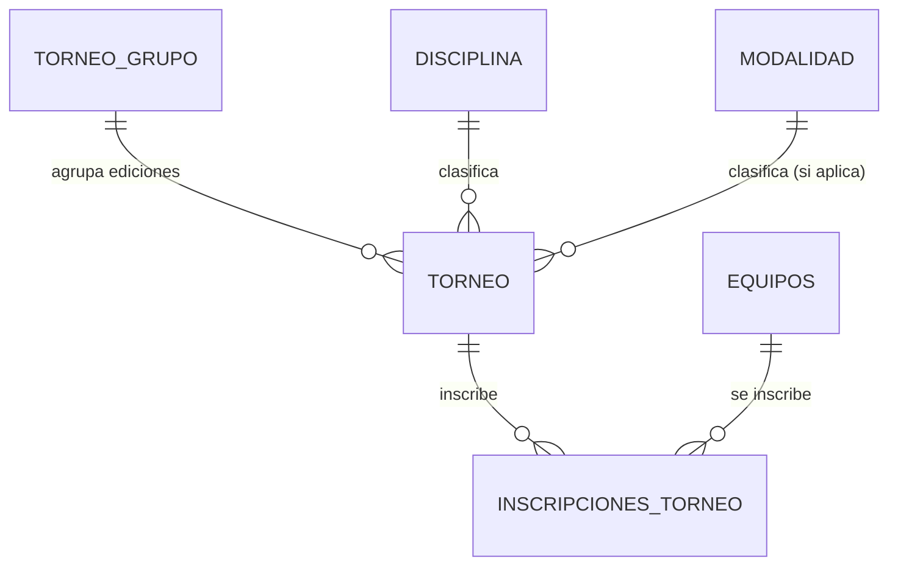

# Plan: Módulo de Administración de Torneos (UX/UI + Ediciones)

Generado con `/autoplan` (revisión CEO → Design → Eng). Codex no está
disponible en esta máquina (`codex` no está en PATH) — corrió en modo
`[subagent-only]`, una sola voz revisora (Claude), igual que
`docs/plans/equipos-jugadores-plan.md`. Marcado así en vez de fingir
dual-voice.

Estado: **Fase 1 (DB) implementada** — 2026-08-27. `01_schema.sql` a
`06_triggers.sql` quedaron actualizados a su forma final (tabla
`TORNEO_GRUPO`, `TORNEO.Torneo_Grupo_ID`/`Numero_Edicion`, constraints,
índice, trigger de `fecha_modificacion`, seed actualizado), verificado
corriendo la secuencia completa contra una base descartable. Migración
`database/09_migracion_torneo_ediciones.sql` aplicada contra `torneos_mvp`
(con backup previo en `database/backups/`, y verificada por partida doble:
corrida contra una réplica del estado pre-migración, y corrida dos veces
seguidas para confirmar idempotencia) — cada uno de los 3 torneos ya
existentes (`Copa Ecotec 2026`, `Prueba1`, `Ecogames 2026`) quedó como su
propio `TORNEO_GRUPO` de una sola edición.

Al terminar la Fase 1, backend y frontend quedaron rotos a propósito
(mismo patrón que la Fase 1 de `equipos-jugadores-plan.md`): `Torneo_Grupo_ID`
era `NOT NULL` y el service de `POST /torneos` todavía no lo llenaba —
104 tests pasaban, 5 fallaban, todos por la misma causa raíz.

**Fase 2 (Backend + Frontend) implementada** — 2026-08-27 (misma sesión).
Cierra ese gap y construye todo lo pedido en la Fase 2 del review: modelo
de datos + service de `TORNEO_GRUPO`/ediciones, endpoint agrupado,
filtros `?torneo_id=` que faltaban, campo Modalidad condicional, dashboard
scoped por torneo, modal "Agregar Equipo" con el flujo de fricción cero
completo. **120 tests backend + 94 tests frontend en verde**, `tsc -b`
limpio, `oxlint` sin warnings nuevos. Ver el checklist de "Tareas de
implementación" abajo para el detalle, y la nota de "Alcance recortado a
propósito" para lo que se dejó deliberadamente para una pasada aparte.

---

## Resumen del módulo

Rediseño de la navegación de "Torneo Admin": de una lista plana de pestañas
globales (Equipos/Plantillas/Inscripciones/Partidos mezclando TODOS los
torneos en una sola tabla) a un flujo **Torneos → Ver Torneo → panel
específico de ese torneo**, con alta de equipos sin fricción (seleccionar o
crear-e-inscribir en el mismo flujo, encadenando directo al registro por
lote ya construido), un campo Modalidad condicional que solo aparece para
disciplinas individuales, y el concepto de **Edición** de torneo (mismo
"Torneo Grupo", múltiples ediciones numeradas) con un selector desplegable
para ver estadísticas de cualquier edición sin navegar fuera de la página.

---

## Fase 1 — CEO Review (Estrategia y Alcance)

### Premisas

| # | Premisa | Veredicto |
|---|---------|-----------|
| P1 | Hoy "Torneo Admin" (`TorneoAdminLayout.tsx`) es 9 pestañas **globales y planas**: Equipos, Plantillas, Traspasos, Inscripciones y Partidos muestran TODO el sistema mezclado, sin filtrar por torneo. No existe una vista "panel de este torneo". | Confirmado leyendo `TorneoAdminLayout.tsx`, `EquiposAdmin.tsx`, `PlantillasAdmin.tsx`. Es el hallazgo central de esta revisión — el pedido de "Ver Torneo → Torneo Admin" no es cosmético, es una reestructura real de la IA (información architecture). |
| P2 | `Torneo.modalidad_id` existe en el modelo y ya es opcional a nivel de constraint, pero el **frontend no condiciona su visibilidad** — `TorneosAdmin.tsx` lo muestra siempre, con una nota explícita en el código reconociendo el gap ("el form no filtra las opciones de Modalidad por la Disciplina elegida"). | Confirmado. El pedido del usuario (ocultar/mostrar según `Disciplina.Tipo`) cierra exactamente ese gap ya documentado en el propio código. |
| P3 | El registro por lote con pantalla dividida (`RegistroLoteAdminPage`) **ya existe y funciona** (válidos arriba, inválidos abajo, revalidación server-side). No hay que reconstruirlo — hay que **engancharlo** al flujo de "crear equipo nuevo" en vez de exigir que el admin navegue a una pestaña aparte y ya sepa el `inscripcion_torneo_id`. | Confirmado. Evita reinventar (P4 DRY). |
| P4 | "Edición" no existe en el modelo de datos. Un torneo es hoy una fila suelta con `nombre` de texto libre — no hay forma de agrupar "Raúl Torneo - Edición 1" y "Raúl Torneo - Edición 2" salvo que el nombre lo diga y el admin lo recuerde a ojo. | Confirmado leyendo `models/torneo.py`. Gap real, no cosmético: sin agrupación, el selector de ediciones que pide el usuario no tiene de dónde leer "las otras ediciones de este torneo". |
| P5 | El pedido de "Agregar Equipo" habla de inscribir equipos **ya existentes en el sistema** — es decir, `EQUIPOS` sigue siendo catálogo global reusable entre torneos (un mismo club puede jugar en varias ligas), lo que hoy modela `INSCRIPCIONES_TORNEO` (equipo↔torneo, N:M). No se propone que un Equipo "pertenezca" a un solo torneo. | Aceptado — coincide con el modelo relacional ya construido en `equipos-jugadores-plan.md`; ninguna migración de datos existente se rompe. |

### Qué ya existe (leverage map)

| Sub-problema | Ya cubierto por | Qué falta |
|---|---|---|
| Pantalla dividida de registro por lote (válidos/inválidos, revalidación server-side) | `RegistroLoteAdminPage` + `POST /plantillas/lote/validar` \| `/confirmar` | Nada del motor — solo pre-rellenar `inscripcion_torneo_id` desde el contexto del torneo actual en vez de pedirlo por un selector genérico |
| Roster de un equipo en un torneo (ancla) | `INSCRIPCIONES_TORNEO` | Nada — se reutiliza tal cual |
| Catálogo global de equipos reusable entre torneos | `EQUIPOS` + `POST /api/v1/equipos` | Nada — se reutiliza tal cual desde el modal nuevo |
| Regla "Modalidad obligatoria si Disciplina es Individual" | Ya validada en DB (`fn_validar_torneo_modalidad`, `06_triggers.sql`) | Solo falta reflejar la regla en el frontend (hoy el campo se muestra siempre, la validación real vive solo en la DB) |
| Exclusividad de jugador por torneo (permite multi-torneo simultáneo en la misma disciplina) | `fn_validar_exclusividad_torneo` (trigger, Torneo_ID vía join) | Nada — es exactamente el mecanismo que hace posible el escenario "Micky en Torneo A y B de fútbol a la vez" pedido más abajo, sin cambio alguno |
| Borrado lógico / convención `Estado` | Ya establecida en las 9+ tablas | Replicar en la tabla nueva de Edición |

### Alternativas de arquitectura consideradas

**A. Modelo de datos de "Edición"**

| Alternativa | Completeness | Veredicto |
|---|---|---|
| **B1. Tabla catálogo `TORNEO_GRUPO`** (`id`, `nombre`) + `TORNEO.torneo_grupo_id` FK + `TORNEO.numero_edicion INT` **(elegida)** | 10/10 | Sigue el patrón catálogo ya usado (`DISCIPLINA`, `MODALIDAD`). Renombrar el grupo ("Raúl Torneo" → "Raúl Torneo Anual") actualiza todas las ediciones a la vez sin tocar cada fila de `TORNEO`. El nombre mostrado se **compone** en el momento (`"{grupo.nombre} - Edición {numero_edicion}"`), nunca se guarda como string concatenado — evita que un torneo viejo quede con un nombre "congelado" si el grupo se renombra después. |
| B2. Self-referencing (`TORNEO.padre_id` apuntando a la primera edición) | 6/10 | Funciona, pero mezclar "es una edición de" con "torneo real" en la misma tabla es más frágil: hay que decidir arbitrariamente cuál fila es "la raíz", y borrar la edición 1 rompe la cadena de todas las demás. Rechazada por P5 (explícito > clever). |
| B3. Parsear el nombre del torneo por convención de texto (`"X - Edición N"`) | 2/10 | Cero integridad referencial, cualquier typo rompe la agrupación, y el propio usuario pide un desplegable — necesita una consulta estructurada (`WHERE torneo_grupo_id = ?`), no un `LIKE`. Rechazada. |

**B. Dónde vive el nombre mostrado**

Se compone en el momento de renderizar (`{grupo.nombre} — Edición {n}`), tanto en frontend como en cualquier endpoint que devuelva el nombre completo para reportes — nunca se persiste el string concatenado. Esto es una decisión mecánica (P5), no de negocio.

### Alcance

**Dentro de este módulo:**
- Reestructura de navegación: `Torneos` (tarjetas + "Ver Torneo") → dashboard `Torneo Admin` específico por torneo, con sub-pestañas Equipos/Plantillas/Traspasos/Partidos/Estadísticas **filtradas a ese torneo**.
- Modal "Agregar Equipo" con dos caminos: seleccionar equipo existente e inscribirlo, o crear equipo nuevo → inscripción automática → registro por lote obligatorio encadenado (reusando `RegistroLoteAdminPage` con el contexto ya resuelto).
- Campo `Modalidad` condicional en el formulario de creación/edición de Torneo, según `Disciplina.Tipo`.
- Modelo de datos y UX de "Edición de torneo": tabla `TORNEO_GRUPO`, campo `numero_edicion`, selector desplegable de ediciones en el dashboard de estadísticas.
- Emulación de datos: 2 torneos de fútbol (misma liga, dos ediciones, activas en simultáneo) + 1 torneo de tenis, con el jugador Micky demostrando multi-torneo y perfil aislado por disciplina.

**Fuera de este módulo (→ `TODOS.md`):**
- Vista consolidada de estadísticas **agregadas cruzando todas las ediciones** de un mismo grupo (ej. "goleador histórico de la Liga Relámpago sumando todas las ediciones"). El selector de este plan solo **cambia el contexto** de qué edición se mira, no fusiona números — fusionar es una vista nueva (`vw_...` cross-edición) que merece su propio diseño (¿cómo tratar un jugador que jugó con dos equipos distintos en dos ediciones?).
- Mover/copiar equipos automáticamente de una edición a la siguiente ("clonar plantilla de la edición 1 al crear la edición 2"). El usuario no lo pidió; cada edición nace con roster vacío y se llena con el mismo flujo de "Agregar Equipo".
- Archivar o eliminar un `TORNEO_GRUPO` completo (con sus ediciones). Fuera de alcance — el borrado lógico existente (`Estado` por torneo) sigue aplicando por edición individual.
- Traspasos **entre ediciones distintas** de un mismo grupo (hoy `TRASPASOS` asume origen/destino dentro del mismo torneo — mover a un jugador de la Edición 1 a la Edición 2 sería, conceptualmente, una alta nueva en la Edición 2, no un traspaso). No se modela en este plan.

### Dream state

```
ACTUAL                          ESTE PLAN                        IDEAL 12 MESES
──────────────────────          ──────────────────────           ──────────────────────
Torneo Admin = 9 pestañas       Torneos (tarjetas) → Ver          + Comparativa cross-
planas, todo mezclado           Torneo → panel scoped              edición (goleador
entre torneos.                  (Equipos/Plantillas/Partidos/       histórico del grupo).
                                 Estadísticas de ESE torneo).
"Agregar equipo a un                                              + Clonar plantilla base
torneo" = 2 pasos manuales      Modal único: elegir o crear          de una edición a la
en pantallas distintas          + inscribir + lote obligatorio       siguiente (fichajes
(Equipos, luego                 en un solo flujo sin fricción.       que se repiten).
Inscripciones).
                                 Modalidad se muestra solo si
Modalidad siempre visible,      la Disciplina es Individual.
regla real solo en la DB.                                         + Notificación al
                                 TORNEO_GRUPO + numero_edicion,      admin cuando abre
Un torneo = una fila            selector de ediciones sin           una edición nueva de
suelta, sin agrupación.         salir de la página.                 un grupo existente.
```

---

## Fase 2 — Design Review (UX de la navegación y los flujos nuevos)

Aplica — hay pantallas nuevas, un modal con dos caminos, un campo condicional y un desplegable con estado no trivial.

### Mapa del User Journey

Desde la Pestaña Torneos hasta crear un equipo nuevo con registro por lote:

```
1. Admin entra a /torneo-admin/torneos
   → Ve TARJETAS (no tabla plana): una por TORNEO_GRUPO, mostrando el
     nombre del grupo, la disciplina, y un badge "N ediciones" si hay
     más de una. Cada tarjeta tiene:
     [+ Nueva edición]   [Ver Torneo →]
   → Si el grupo tiene una sola edición, "Ver Torneo" entra directo a
     esa edición. Si tiene varias, entra a la edición más reciente
     (Activo > la de fecha_inicio más nueva) y el selector de
     ediciones (paso 6) permite cambiar sin recargar.

2. Clic en [Ver Torneo] de la tarjeta "Liga Relámpago" (2 ediciones)
   → Redirige a /torneo-admin/torneos/:torneoId (id de la Edición 2,
     la más reciente/activa).
   → Se abre el DASHBOARD scoped: título "Liga Relámpago — Edición 2",
     con sub-pestañas: Equipos | Plantillas | Traspasos | Partidos |
     Estadísticas. Todas filtran por este torneo_id, no por el sistema
     entero (a diferencia de las pestañas globales actuales).

3. Admin está en la sub-pestaña "Equipos" (equipos inscritos en ESTA
   edición). Ve la lista de equipos ya inscritos (puede estar vacía si
   es una edición recién creada) y un botón:
   [+ Agregar Equipo]

4. Clic en [+ Agregar Equipo]
   → Se abre un MODAL con dos secciones:

     ┌─────────────────────────────────────────────┐
     │ Agregar equipo a Liga Relámpago — Edición 2  │
     │                                               │
     │ Buscar equipo existente:                     │
     │ [🔍 buscar...______________]                 │
     │  • Halcones FC          [Inscribir]           │
     │  • Deportivo Norte      [Inscribir]           │
     │  (equipos ya inscritos en ESTA edición no      │
     │   aparecen en la lista — ya no tiene sentido    │
     │   volver a inscribirlos)                        │
     │                                               │
     │  ──────────── o ────────────                  │
     │  No encuentro el equipo que busco:            │
     │  [+ Crear equipo nuevo]                        │
     └─────────────────────────────────────────────┘

   4a. Si elige un equipo existente → clic [Inscribir]:
       → POST /inscripciones {torneo_id, equipo_id}, loading en ESE
         botón puntual (no bloquea el modal entero — puede seguir
         buscando otro equipo mientras la inscripción anterior corre).
       → Éxito: el equipo desaparece de la lista de "no inscritos" del
         modal y aparece en la tabla de Equipos del dashboard, con un
         toast "Halcones FC inscrito. Sin jugadores todavía — agregá su
         plantilla cuando quieras" y un link directo "+ Agregar
         jugadores" en esa fila (no fuerza el lote en este momento,
         porque el equipo ya existía y puede que su plantilla se
         cargue en otro momento).
       → El modal permanece abierto (permite inscribir varios equipos
         seguidos sin reabrir).

   4b. Si elige [+ Crear equipo nuevo] → el modal cambia a un formulario
       inline (misma ventana, sin cerrar y reabrir otro modal):

       ┌─────────────────────────────────────────────┐
       │ Crear equipo nuevo — Liga Relámpago Ed. 2    │
       │ Nombre del equipo: [________________]         │
       │                                               │
       │ Plantilla inicial (obligatoria):              │
       │  Cédula | Nombre | Correo | Dorsal            │
       │  [___] [___] [___] [___]           [+ fila]   │
       │  [___] [___] [___] [___]                      │
       │                                               │
       │            [Cancelar]   [Validar y crear]     │
       └─────────────────────────────────────────────┘

       Nota de disciplina individual (Tenis, Pádel...): si
       `Modalidad.Tamano_Equipo === 1`, el campo "Nombre del equipo" se
       auto-completa con el nombre de la primera fila de la plantilla
       en cuanto el admin lo escribe (editable igual, por si el admin
       prefiere otro nombre) — evita pedirle que invente un nombre de
       "equipo" para un deporte de un jugador solo.

5. Clic en [Validar y crear]
   → Paso 1 (encadenado, transparente para el admin): POST /equipos
     {nombre} → obtiene equipo_id.
   → Paso 2: POST /inscripciones {torneo_id, equipo_id} → obtiene
     inscripcion_torneo_id.
   → Paso 3: se dispara la PANTALLA DIVIDIDA existente
     (RegistroLoteAdminPage), pero con `inscripcion_torneo_id` y
     `fecha_inicio` YA resueltos por el contexto — el admin no vuelve a
     elegir "Torneo — Equipo" de un desplegable genérico, esa parte del
     formulario actual desaparece para este flujo (ver "Lógica del
     componente" abajo).
   → Válidos arriba / inválidos abajo, exactamente como ya funciona hoy
     (loading, empty, error+reintentar, éxito parcial) — ver Fase 2 de
     `equipos-jugadores-plan.md`, no se reinventa nada de eso.
   → Si el admin cancela el registro por lote en este punto: el Equipo
     y la Inscripción YA quedaron creados (con roster vacío) — no se
     revierte la creación del equipo por cancelar el lote, porque el
     equipo en sí es una entidad válida sin jugadores todavía (mismo
     principio que el caso 4a). El admin puede volver después con
     "+ Agregar jugadores" desde la fila de ese equipo.
   → Confirmar → toast "Halcones FC creado con 3 jugadores" → vuelve al
     dashboard, Equipos ahora lista "Halcones FC (3)".

6. (Feature de Edición) Admin va a la sub-pestaña "Estadísticas" del
   dashboard. Arriba de la tabla de goleadores/posiciones hay un
   desplegable:
     Edición: [Edición 2 (activa) ▾]
       Edición 1 (finalizada — 2026-03-01 al 2026-05-15)
       Edición 2 (activa — 2026-04-01 al 2026-06-30)
   → Elegir "Edición 1" SOLO cambia qué torneo_id alimenta la tabla de
     abajo (fetch nuevo con el otro id) — no navega a otra URL visible
     como página distinta, no hay parpadeo de layout completo (mismo
     dashboard, mismo header "Liga Relámpago", solo cambia el subtítulo
     a "— Edición 1" y el contenido de la tabla). El querystring sí se
     actualiza (`?edicion=<torneoId>`) para que el link sea compartible
     y el botón "atrás" del navegador funcione, pero sin recargar la
     página completa (client-side).
```

### Lógica del Componente de Interfaz

**A. Campo Modalidad condicional (creación/edición de Torneo)**

```
estado: { disciplinaId: number | null, modalidadId: number | null }

on cambia disciplinaId:
    disciplina = buscar(disciplinas, disciplinaId)
    si disciplina == null:
        mostrarModalidad = false
    sino si disciplina.tipo == "Individual":
        mostrarModalidad = true
        opcionesModalidad = modalidades.filter(m => m.disciplina_id == disciplinaId)
        // si la modalidad seleccionada no pertenece a la nueva disciplina
        // (el admin cambió de disciplina después de elegir una modalidad),
        // se limpia — nunca se manda una modalidad de otra disciplina.
        si modalidadId not in opcionesModalidad.map(m => m.id):
            modalidadId = null
    sino: // tipo == "Equipo"
        mostrarModalidad = false
        modalidadId = null   // se limpia SIEMPRE, no solo se oculta —
                              // si quedara un valor viejo en el estado y
                              // el campo está oculto, el submit mandaría
                              // una modalidad "fantasma" que el trigger
                              // de la DB rechazaría con un error que el
                              // admin no puede explicarse (no ve el campo
                              // que lo está causando).

render:
    <Select Disciplina ... />
    {mostrarModalidad && <Select Modalidad opciones={opcionesModalidad} required />}
    // sin mostrarModalidad, el campo no se monta en el DOM — no solo se
    // esconde con CSS, para que un lector de pantalla no lo anuncie.
```

Esto reemplaza el comentario actual en `TorneosAdmin.tsx` que reconoce el
gap ("el form no filtra las opciones de Modalidad por la Disciplina
elegida") — la regla que hoy solo vive en `fn_validar_torneo_modalidad`
(DB) se refleja también en el frontend, sin duplicar la fuente de verdad
(la DB sigue siendo quien la hace cumplir de verdad; el frontend solo evita
que el admin choque contra un error de trigger que no puede interpretar).

**B. Selector de Edición (dashboard de Estadísticas)**

```
estado: { torneoActualId: number, edicionSeleccionadaId: number }
// torneoActualId viene de la URL (/torneo-admin/torneos/:torneoId)
// edicionSeleccionadaId inicia == torneoActualId

al montar el dashboard:
    grupo = fetch(torneo_grupo del torneoActualId)
    ediciones = fetch(torneos WHERE torneo_grupo_id == grupo.id)
                  .sort(by numero_edicion DESC)
    edicionSeleccionadaId = torneoActualId  // la que abrió el "Ver Torneo"

on admin elige otra edición en el desplegable:
    edicionSeleccionadaId = edicionElegidaId
    actualizar querystring a ?edicion={edicionElegidaId} (sin recargar)
    refetch(estadísticas, goleadores, posiciones) con torneo_id = edicionSeleccionadaId
    // el header del dashboard (nombre del grupo, sub-pestañas Equipos/
    // Plantillas/Partidos) NO cambia de torneo con este selector — el
    // selector es una lente de solo-lectura para Estadísticas. Cambiar
    // de edición "de verdad" (para agregar equipos a la Edición 1, por
    // ejemplo) es volver a la tarjeta de Torneos y usar "Ver Torneo" de
    // esa edición — evita el bug de "edité el equipo de la edición
    // equivocada porque el desplegable decía otra cosa arriba".
```

### Litmus scorecard (resumen)

| Dimensión | Score | Nota |
|---|---|---|
| Jerarquía de información (grupo → edición → recurso scoped) | 9/10 | El dashboard siempre dice de qué edición se habla en el título; el selector de Estadísticas es la única excepción documentada arriba. |
| Estados especificados (loading/empty/error del modal Agregar Equipo) | 8/10 | Ver tabla de estados abajo. |
| Especificidad (mensajes concretos, no genéricos) | 8/10 | "Sin jugadores todavía — agregá su plantilla cuando quieras" en vez de un genérico "equipo creado". |
| Alineación con patrones existentes (`ResourceTable`/`ResourceForm`/`SimpleResourceAdminPage`) | Taste decision — el modal "Agregar Equipo" y el dashboard scoped son componentes nuevos, no encajan en el scaffold genérico actual (que asume una tabla CRUD plana por recurso). Es consistente con cómo `RegistroLoteAdminPage` y `InscripcionesAdminPage` ya se desvían del scaffold cuando el flujo no es un CRUD de un solo objeto. |

### Estados de interacción — Modal Agregar Equipo

| Estado | Comportamiento |
|---|---|
| Loading (buscando equipos existentes) | Spinner inline en la lista, buscador no bloqueado. |
| Empty (no hay equipos sin inscribir que matcheen la búsqueda) | Mensaje "No hay equipos con ese nombre. ¿Es nuevo?" con el botón "+ Crear equipo nuevo" ya visible, no un callback separado. |
| Inscribiendo un equipo puntual (4a) | Loading solo en el botón de esa fila, resto de la lista interactiva. |
| Error al inscribir | Mensaje inline junto al botón de esa fila + reintentar, no cierra el modal. |
| Formulario de creación (4b) — plantilla vacía | Botón "Validar y crear" deshabilitado si todas las filas están vacías (mismo criterio que el "Confirmar Registro" ya implementado). |
| Cancelar creación de equipo a mitad de lote | Vuelve al dashboard; el equipo e inscripción ya creados quedan (ver journey paso 5) — nunca un rollback silencioso que el admin no espera. |

---

## Fase 3 — Eng Review (Arquitectura, Datos, Edge Cases, Tests)

### Arquitectura

```
Frontend (Vite)                       Backend (FastAPI)                DB (Postgres)
────────────────                       ──────────────────                ─────────────
TorneosAdminPage (tarjetas)   ───────▶ GET /torneo_grupos                TORNEO_GRUPO
  agrupa torneos por                    (con ediciones anidadas o           (nuevo)
  torneo_grupo_id en el                 GET /torneos?grupo_id=)                │
  cliente, o el backend                                                        │
  ya los devuelve agrupados                                                    ▼
  (ver D-Eng-1 abajo)                                                     TORNEO
        │                                                                 (+ torneo_grupo_id,
        ▼                                                                  + numero_edicion)
TorneoDashboardPage            ───────▶ GET /torneos/{id}
  (nuevo, scoped por :torneoId)         GET /torneos?grupo_id={gid}
        │                               (para poblar el selector
        ├─ EquiposDelTorneo    ───────▶  de ediciones)
        │    (Equipos ya                GET /inscripciones?torneo_id={id}
        │     inscritos en ESTE                 │
        │     torneo — filtro                   ▼
        │     nuevo por query param)      INSCRIPCIONES_TORNEO
        │                                        │
        ├─ ModalAgregarEquipo  ───────▶ GET /equipos?no_inscrito_en={id}
        │    (buscar existentes,           (filtro nuevo — o traer todos
        │     o crear nuevo)                y filtrar en cliente si el
        │        │                          volumen es chico, ver D-Eng-2)
        │        ├─ crear existente ──▶ POST /inscripciones
        │        └─ crear nuevo     ──▶ POST /equipos
        │                                POST /inscripciones
        │                                  │ (encadenado, mismo patrón que
        │                                  │  PlantillasAdmin.crearVinculo
        │                                  │  ya usa para resolver-o-crear
        │                                  │  un perfil antes del vínculo)
        │                                  ▼
        │                            [reusa RegistroLoteAdminPage]
        │                            POST /plantillas/lote/validar
        │                            POST /plantillas/lote/confirmar     JUGADOR_EQUIPO
        │                                                                 (trigger de
        ├─ PlantillasDelTorneo ───────▶ GET /plantillas?torneo_id={id}    exclusividad,
        ├─ TraspasosDelTorneo  ───────▶ GET /traspasos?torneo_id={id}      sin cambios)
        ├─ PartidosDelTorneo   ───────▶ GET /partidos?torneo_id={id}
        │    (los 4 endpoints arriba necesitan el filtro ?torneo_id=,
        │     hoy devuelven todo el sistema sin filtrar — ver D-Eng-3)
        │
        └─ SelectorEdicion (Estadísticas)
             on change ──────────────▶ GET /estadisticas/{otroTorneoId}
```

### Modelo de datos relacional (incremental sobre `equipos-jugadores-plan.md`)



**`TORNEO_GRUPO`** (nueva)
| Columna | Tipo | Notas |
|---|---|---|
| ID | SERIAL PK | |
| Nombre | VARCHAR(100) NOT NULL | "Liga Relámpago" — sin el sufijo de edición, eso se compone al mostrar |
| Fecha_Registro / Fecha_Modificacion | TIMESTAMP | Mismo `TimestampMixin` que el resto |

**`TORNEO`** — agrega:
```sql
ALTER TABLE TORNEO ADD COLUMN Torneo_Grupo_ID INT REFERENCES TORNEO_GRUPO(ID) NOT NULL;
ALTER TABLE TORNEO ADD COLUMN Numero_Edicion INT NOT NULL DEFAULT 1 CHECK (Numero_Edicion > 0);
ALTER TABLE TORNEO ADD CONSTRAINT unique_edicion_por_grupo UNIQUE (Torneo_Grupo_ID, Numero_Edicion);
-- Migración de datos existentes ("Copa Ecotec 2026" del seed, y cualquier
-- torneo ya creado en producción/dev): cada fila actual de TORNEO se
-- vuelve su propio TORNEO_GRUPO de una sola edición (Numero_Edicion=1),
-- nombrado igual al Torneo.Nombre actual — backfill 1:1, sin pérdida de
-- datos, sin decisión ambigua (a diferencia de la migración de
-- JUGADOR_EQUIPO en 08_migracion_equipos_jugadores.sql, acá no hay
-- candidatos múltiples que desambiguar).
```

**Creación de una nueva edición** (backend, no un simple INSERT del
frontend): `POST /torneos` con `torneo_grupo_id` existente en vez de
`nombre` de grupo nuevo → el backend calcula
`numero_edicion = MAX(numero_edicion WHERE torneo_grupo_id=?) + 1` en la
misma transacción que el INSERT (bajo `SELECT ... FOR UPDATE` sobre las
filas del grupo, o dejando que el `UNIQUE(Torneo_Grupo_ID, Numero_Edicion)`
capture la carrera y el servicio reintente una vez con el número
recalculado — mismo patrón defensivo que `unique_dorsal_por_roster` en el
plan anterior). Si el admin ingresa un nombre de grupo que no existe
todavía, se crea el `TORNEO_GRUPO` primero (numero_edicion=1).

### Decisiones de Eng (D-Eng-*)

- **D-Eng-1 — Endpoint de torneos agrupados.** Se agrega
  `GET /torneos/agrupados` (o un query param `?agrupar_por_grupo=true`
  sobre el `GET /torneos` existente) que devuelve
  `[{grupo: {...}, ediciones: [...]}]` ya ordenado, en vez de forzar al
  frontend a agrupar client-side una lista plana. Motivo: el conteo
  "N ediciones" de la tarjeta y "cuál es la más reciente/activa" son
  reglas de negocio (¿"más reciente" es por fecha o por número?), no
  deberían vivir duplicadas en cada componente de frontend que necesite
  la lista de torneos.
- **D-Eng-2 — Filtro "equipos no inscritos en este torneo".** Con el
  volumen actual del sistema (decenas de equipos, no miles), traer todos
  los equipos y filtrar en cliente contra la lista de inscripciones ya
  cargada es aceptable y más simple (P5) que un endpoint nuevo con lógica
  de exclusión en SQL. Si el catálogo de equipos crece a cientos, migrar a
  un filtro server-side (`?no_inscrito_en={torneo_id}`) es un cambio
  aislado, sin tocar el modelo de datos — anotado en "Fuera de este
  módulo" implícitamente vía este comentario, no bloquea el plan.
- **D-Eng-3 — Filtro `?torneo_id=` en Plantillas/Traspasos/Partidos.**
  Estos 3 endpoints hoy devuelven el sistema completo sin filtrar (el
  propio comentario de `PlantillasAdminPage` ya lo señala: "su GET no
  tiene skip/limit/estado"). Agregar el query param es un cambio de bajo
  riesgo (aditivo, no rompe a quien no lo pase) pero **sí** es trabajo de
  implementación real, no solo de UI — se marca como tarea explícita en
  el checklist, no una gratuidad del rediseño de navegación.
- **D-Eng-4 — Auto-nombrar el equipo en disciplinas de tamaño 1.** Es
  lógica de **frontend únicamente** (autocompletar un input, no crea nada
  en la DB hasta que el admin confirma) — no requiere cambios de backend.

### Edge cases (nuevos, específicos de este plan)

- **EC-21 — Numero_Edicion con carrera entre dos admins.** Dos admins
  crean "Edición 3" de "Liga Relámpago" al mismo tiempo. El
  `UNIQUE(Torneo_Grupo_ID, Numero_Edicion)` rechaza el segundo INSERT; el
  servicio atrapa esa violación específica y reintenta una vez con
  `MAX(...)+1` recalculado — igual que el patrón ya usado para
  `unique_dorsal_por_roster`.
- **EC-22 — Cancelar el registro por lote deja un equipo con 0 jugadores.**
  Ya decidido en el journey (Fase 2, paso 5): es un estado válido, no un
  error. La tabla de Equipos del dashboard debe poder mostrar "0
  jugadores" sin romperse (no asumir que todo equipo listado tiene roster).
- **EC-23 — Micky simultáneo en 2 ediciones de la misma disciplina.**
  Es el escenario de mock data pedido explícitamente — y **no requiere
  ningún cambio de esquema**: `fn_validar_exclusividad_torneo` ya evalúa
  por `Torneo_ID`, y la Edición 1 y la Edición 2 son `Torneo_ID` distintos
  (aunque compartan `Torneo_Grupo_ID`). Confirma que agregar `TORNEO_GRUPO`
  es puramente informativo/organizativo — no interfiere con ninguna regla
  de exclusividad existente. Se agrega como caso de prueba explícito (ver
  Diagrama de pruebas) precisamente para dejar esto verificado, no solo
  argumentado.
- **EC-24 — Modalidad "fantasma" al cambiar de disciplina en el form.**
  Cubierto por la lógica de componente (Fase 2, sección A): limpiar
  `modalidadId` al ocultar el campo, no solo ocultarlo visualmente.
- **EC-25 — Renombrar un `TORNEO_GRUPO` con ediciones ya finalizadas.**
  Permitido sin restricción — el nombre se compone al mostrar, así que un
  reporte histórico de la Edición 1 pasa a decir el nombre nuevo del
  grupo. Aceptado como comportamiento esperado (el grupo es una sola
  identidad a través del tiempo); si se necesitara "congelar" el nombre
  histórico tal como se veía en su momento, sería una decisión de producto
  distinta, no cubierta acá.

### Diagrama de pruebas

| Flujo/rama nueva | Tipo de test | Prioridad |
|---|---|---|
| Crear grupo nuevo + edición 1 (`numero_edicion` autoasignado a 1) | Integración (API) | Alta |
| Crear edición 2 de un grupo existente (`numero_edicion` = MAX+1) | Integración | Alta |
| EC-21 — dos altas de edición concurrentes contra el mismo grupo | Integración con mock de carrera (mismo patrón que EC-7 en el plan anterior) | Alta — es el más caro de escribir bien |
| Migración/backfill: cada `TORNEO` existente obtiene su propio `TORNEO_GRUPO` 1:1 | DB (script de migración, pytest contra Postgres real) | Alta — es el paso que no se puede revertir a mano fácilmente |
| GET equipos filtrando los ya inscritos en un torneo dado | Integración | Media |
| Modal Agregar Equipo → crear nuevo → encadena inscripción + lote (happy path) | E2E/integración frontend | Alta |
| Cancelar el lote a mitad de creación → equipo/inscripción persisten con 0 jugadores (EC-22) | Integración frontend | Media |
| EC-23 — Micky activo en Edición 1 y Edición 2 de la misma disciplina simultáneamente | DB (trigger de exclusividad, ya existente — test nuevo que reusa el mecanismo) | Alta — confirma que `TORNEO_GRUPO` no interfiere con la regla de negocio central del módulo anterior |
| Campo Modalidad se oculta y limpia al cambiar a disciplina de tipo Equipo (EC-24) | Unit (componente) | Media |
| Selector de Edición en Estadísticas no cambia el `torneoActualId` del dashboard (Fase 2, sección B) | Unit/integración frontend | Media |
| Filtro `?torneo_id=` en Plantillas/Traspasos/Partidos devuelve solo lo de ese torneo | Integración (API) | Alta — hoy estos 3 endpoints no filtran nada, es una laguna real |

---

## Emulación de Datos (Escenario de Prueba)

### Grupos y ediciones

| Torneo Grupo | Edición | Torneo (fila real) | Disciplina | Modalidad | Fechas | Estado |
|---|---|---|---|---|---|---|
| Liga Relámpago | 1 | **Torneo A** | Fútbol (tipo Equipo) | — (oculta) | 2026-03-01 → 2026-05-15 | Finalizado |
| Liga Relámpago | 2 | **Torneo B** | Fútbol (tipo Equipo) | — (oculta) | 2026-04-01 → 2026-06-30 | Activo |
| Copa Raíces | 1 | **Torneo C** | Tenis (tipo Individual) | Individual (Tamaño_Equipo=1) | 2026-04-10 → 2026-06-20 | Activo |

Nótese que Torneo A y Torneo B se **superponen** en el tiempo (abril) a
propósito — para que la Fase 3 (EC-23) sea un hecho verificable, no solo
un caso "después de que el otro terminó".

### Demostración de Modalidad oculta/visible

- Admin crea **Torneo A**: elige Disciplina = "Fútbol" → `Disciplina.Tipo
  = "Equipo"` → el campo Modalidad **no se monta en el DOM**. El form solo
  pide Nombre de grupo, Fechas. Submit manda `modalidad_id: null`
  implícito, sin que el admin lo haya tocado.
- Admin crea **Torneo C**: elige Disciplina = "Tenis" → `Disciplina.Tipo =
  "Individual"` → el campo Modalidad **aparece** inmediatamente, con las
  opciones filtradas a las modalidades de Tenis ("Individual", "Dobles").
  Elige "Individual" (`Tamano_Equipo=1`) → submit manda `modalidad_id`
  explícito, ahora obligatorio.
- Si el admin, a mitad de llenar el form de Torneo C, cambiara Disciplina
  de "Tenis" a "Fútbol" por error: Modalidad desaparece y su valor
  seleccionado ("Individual") se descarta — no queda un `modalidad_id`
  huérfano en el estado del formulario (EC-24).

### Micky: multi-torneo en Fútbol + perfil aislado en Tenis

| Dato | Valor |
|---|---|
| Jugador | Micky Fernández |
| Cédula | 0102030405 |
| Correo | micky.fernandez@example.com |

**En Torneo A (Liga Relámpago — Edición 1, Fútbol):**
- Perfil: `JUGADOR_PERFIL_DISCIPLINA(Jugador=Micky, Disciplina=Fútbol)` — perfil #1.
- Equipo: **Halcones FC**, dorsal 9, `JUGADOR_EQUIPO.Estado = 'Activo'`
  mientras Torneo A está en curso.
- Al finalizar Torneo A (2026-05-15, `Estado → Finalizado`): el trigger
  `fn_cerrar_torneo_libera_jugadores` cierra esa membresía
  (`Estado → 'Inactivo'`). El perfil #1 de Micky en Fútbol **no** pasa a
  "Libre" en la vista `vw_estado_perfil_disciplina`, porque en ese momento
  todavía tiene una membresía `Activo` en Torneo B (misma disciplina,
  torneo distinto) — exactamente el comportamiento de EC-10 del plan
  anterior, ahora demostrado con dos ediciones del mismo grupo en vez de
  dos grupos sueltos.

**En Torneo B (Liga Relámpago — Edición 2, Fútbol, simultáneo con A durante abril):**
- Mismo perfil #1 (Fútbol) — no se crea un perfil nuevo, es la misma
  disciplina.
- Equipo: **Tiburones FC** (equipo distinto al de Torneo A), dorsal 21,
  `JUGADOR_EQUIPO.Estado = 'Activo'`.
- El trigger de exclusividad (`fn_validar_exclusividad_torneo`) permite
  esta segunda membresía activa sin conflicto porque evalúa por
  `Torneo_ID`, y Torneo A (id distinto) ≠ Torneo B (id distinto) — pese a
  compartir `Torneo_Grupo_ID`. Si alguien intentara registrar a Micky en
  un **tercer** equipo dentro de Torneo B mientras ya está `Activo` en
  Tiburones FC en ese mismo Torneo B, ESO sí sería rechazado ("ya juega en
  Tiburones FC este torneo").

**En Torneo C (Copa Raíces — Edición 1, Tenis, Individual):**
- Perfil nuevo y aislado: `JUGADOR_PERFIL_DISCIPLINA(Jugador=Micky,
  Disciplina=Tenis)` — perfil #2, sin relación alguna con el perfil #1 de
  Fútbol (misma persona vía `Jugadores.Cedula = 0102030405`, perfiles
  distintos por `UNIQUE(Jugador_ID, Disciplina_ID)`).
- Equipo: dado que `Modalidad.Tamano_Equipo = 1`, al crear su inscripción
  el frontend auto-sugiere el nombre de equipo "Micky Fernández" (D-Eng-4)
  — el admin no tiene que inventar un nombre de "equipo" para un deporte
  individual.
- Estadísticas de Tenis de Micky (goles... en este caso, sets/partidos
  ganados vía `vw_...` análoga) son completamente independientes de sus
  estadísticas de Fútbol — mismo mecanismo que `vw_goleadores_por_disciplina`
  ya aísla por `Disciplina_ID` en el plan anterior.

### Selector de Ediciones — qué ve el admin

Al entrar a "Ver Torneo" desde la tarjeta "Liga Relámpago" (abre Edición
2, la activa), en la sub-pestaña Estadísticas:

```
Liga Relámpago — Edición 2
Edición: [Edición 2 (activa) ▾]
  Edición 1 (finalizada — 2026-03-01 al 2026-05-15)
  Edición 2 (activa — 2026-04-01 al 2026-06-30)   ← actual

Goleadores (Edición 2):
  ...Tiburones FC, Halcones FC (si están inscritos en ESTA edición)...
```

Si el admin elige "Edición 1" del desplegable: la tabla de abajo cambia a
los goleadores de Torneo A (que incluiría a Micky con Halcones FC), sin
salir de la URL `/torneo-admin/torneos/<id-edicion-2>` en apariencia — el
querystring pasa a `?edicion=<id-edicion-1>` y el título cambia a
"— Edición 1", pero el admin nunca ve una navegación de página completa.

---

## Decision Audit Trail

| # | Fase | Decisión | Clasificación | Principio | Racional |
|---|---|---|---|---|---|
| 1 | CEO | Reestructurar Torneo Admin de pestañas globales a dashboard scoped por torneo | Taste (alcance grande, pero directamente lo pedido) | P1 (completeness) | Es literalmente el pedido "Ver Torneo → panel específico" — hacerlo a medias (solo agregar el botón sin scoping real) no resolvería la carga cognitiva que el usuario describe |
| 2 | CEO | `TORNEO_GRUPO` como tabla catálogo nueva, en vez de self-referencing o parseo de texto | Mecánica | P5 (explícito) + P4 (DRY) | Sigue el patrón catálogo ya establecido (`DISCIPLINA`/`MODALIDAD`); self-referencing complica el caso "borrar la edición 1" sin ganar nada |
| 3 | CEO | Nombre mostrado se compone en runtime, nunca se persiste concatenado | Mecánica | P5 (explícito) | Evita nombres "congelados" si se renombra el grupo después |
| 4 | Design | Modal "Agregar Equipo" con dos secciones en una sola ventana (no dos modales encadenados) | Taste | P5 (explícito) | Menos saltos de contexto; el admin ve ambos caminos a la vez |
| 5 | Design | Cancelar el lote a mitad de creación NO revierte equipo/inscripción ya creados | Taste | P3 (pragmático) | Evita lógica de rollback distribuido (equipo + inscripción + lote) por un caso que no es destructivo — un equipo sin jugadores es un estado válido, no corrupto |
| 6 | Design | Selector de Edición solo afecta Estadísticas, no las demás sub-pestañas del dashboard | Taste | P5 (explícito) | Evita el bug de "edité el equipo de la edición equivocada" — cambiar de edición "de verdad" pasa siempre por la tarjeta de Torneos |
| 7 | Eng | Auto-nombrar equipo en disciplinas de `Tamano_Equipo=1` es solo frontend | Mecánica | P3 (pragmático) | No hay necesidad de tocar el backend para un autocompletado de UI |
| 8 | Eng | Filtro `?torneo_id=` en Plantillas/Traspasos/Partidos es trabajo real, no gratuito | Mecánica | P1 (completeness) | Estos endpoints hoy no filtran nada — omitirlo dejaría el dashboard scoped mostrando datos de todo el sistema, contradiciendo el punto del rediseño |
| 9 | Eng | Vista consolidada cross-edición (stats agregadas del grupo completo) → fuera de alcance | Mecánica | P2 (boil lakes, límite) | No fue pedido explícitamente; fusionar stats de jugadores que cambiaron de equipo entre ediciones es una decisión de producto propia |
| 10 | Eng | Clonar plantilla de una edición a la siguiente → fuera de alcance | Mecánica | P2 (límite) | No fue pedido; cada edición nace vacía y se llena con el mismo flujo de Agregar Equipo |

---

## Tareas de implementación (borrador, sin priorizar por sprint)

- [x] **DB** — tabla `TORNEO_GRUPO`; `TORNEO.torneo_grupo_id` + `numero_edicion` con `UNIQUE(grupo, numero)`; migración 1:1 de cada `TORNEO` existente a su propio grupo. `01_schema.sql`/`02_constraints.sql`/`03_indexes.sql`/`06_triggers.sql` (forma final) + `05_seed.sql` actualizado + `09_migracion_torneo_ediciones.sql` (base ya provisionada, aplicada contra `torneos_mvp` con backup previo).
- [x] **Backend** — `TORNEO_GRUPO` + `Torneo.numero_edicion` (Fase 1); auto-incremento vía advisory lock (EC-21, más robusto que el reintento-tras-fallar que sugería el plan — mismo mecanismo que `lock_exclusividad_torneo`); `GET /torneo-grupos` agrupado + `PATCH` para renombrar (D-Eng-1, EC-25); nombre compuesto automático si no se manda (Decision Audit Trail #3); filtro `?torneo_id=` en `/plantillas` y `/traspasos` vía join con `INSCRIPCIONES_TORNEO` (D-Eng-3 — `/partidos` ya lo tenía desde `roles-3-modulos-plan.md`, corregido ese dato del plan). 120 tests backend en verde (18 nuevos de este módulo).
- [x] **Frontend** — `TorneosAdminPage` reescrita a tarjetas agrupadas + "Ver Torneo"/"+ Nueva edición"/"+ Torneo nuevo"; `ResourceForm` extendido para soportar campos condicionales (`fields` como función de los valores actuales) — Modalidad solo aparece si la Disciplina es "Individual", limpia su valor al ocultarse (EC-24); `TorneoDashboardPage` nuevo con sub-pestañas Equipos/Plantillas/Traspasos/Partidos/Estadísticas scoped por torneo; `ModalAgregarEquipo` (buscar e inscribir existente, o crear nuevo — encadena a `RegistroLoteAdminPage` con el contexto ya resuelto, sin pedir de nuevo Torneo/Equipo); auto-nombrado del equipo en disciplinas de `tamano_equipo=1` (D-Eng-4); selector de Edición en Estadísticas, scoped solo a esa sub-pestaña (Decision Audit Trail #6). 94 tests frontend en verde (24 nuevos), `tsc -b` limpio (2 errores preexistentes en `PartidoEnVivo.tsx`, no tocado por este plan), `oxlint` sin warnings nuevos.

- [x] **Fase 3 — Consolidación** (2026-08-27, misma sesión). Eliminó por completo las pestañas GLOBALES de Equipos-en-torneos/Plantillas/Traspasos/Inscripciones/Partidos: esos 4 recursos (Plantillas, Traspasos, Inscripciones, Partidos) son inherentemente de un torneo puntual, no tenía sentido mantener una versión global sin acotar en paralelo a la scoped. Detalle:
  - `EquiposDelTorneoPage` — "Cancelar inscripción" (PATCH directo `{estado: "Cancelado"}`) reemplaza a la extinta pestaña global Inscripciones.
  - `PlantillasDelTorneoPage`, `TraspasosDelTorneoPage`, `PartidosDelTorneoPage` — pasaron de solo-lectura a CRUD completo (alta/edición/baja, mismo alcance funcional que las páginas globales que reemplazan), con los pickers de equipo/jugador ya acotados a este torneo (o a su disciplina, en Traspasos) — no vuelven a preguntar el Torneo, ya se sabe.
  - `RegistroLoteAdminPage` ganó un tercer modo intermedio (`RegistroLoteAlcanceTorneo`): sin la pestaña global de Plantillas, el botón "+ Registro por lote" necesitaba dejar elegir CUÁL equipo de este torneo sin ofrecer el sistema entero de vuelta — el selector se reduce a "Equipo" (ya filtrado por `torneo_id`).
  - Borrados: `PlantillasAdmin.tsx`, `TraspasosAdmin.tsx`, `PartidosAdmin.tsx`, `InscripcionesAdmin.tsx` y sus tests — código muerto tras la migración, no quedó una implementación duplicada sin usar.
  - `TorneoAdminLayout.tsx` — pestañas globales que quedan: Torneos, Disciplinas, Modalidades, Equipos (catálogo), Jugadores (catálogo global reusado entre torneos, no se tocó).
  - 95 tests frontend en verde (14 nuevos de esta fase: cancelar inscripción, CRUD scoped de Plantillas/Traspasos/Partidos, el modo intermedio de registro por lote, y un test de Estadísticas que de paso encontró un bug en el TEST mismo, no en el componente — dos equipos con el mismo nombre en el mock producían un "multiple elements" falso positivo, no una falla real).

**Qué queda fuera, documentado, no implementado:**
- Sin test de concurrencia real (dos conexiones separadas) para el advisory lock de EC-21 — el harness de tests de este repo comparte una sola conexión por test (ver `conftest.py`), mismo límite que ya tenía `test_ec7_race_entre_validar_y_confirmar` en el plan anterior (simulado en secuencia, no en paralelo real).
- Vista consolidada de estadísticas cruzando todas las ediciones de un grupo, clonar plantilla entre ediciones, archivar un `TORNEO_GRUPO` completo, traspasos entre ediciones distintas — ver "Fuera de este módulo" (Fase 1) y `TODOS.md`.
- [x] **Tests** — `test_ec23_jugador_activo_en_dos_ediciones_del_mismo_grupo_simultaneamente` (`test_torneo_grupos.py`): confirma con datos reales que el trigger de exclusividad no necesitó ningún cambio para el escenario central del plan, más la contraparte (un tercer equipo en la MISMA edición sí se rechaza, 400). EC-21 (carrera de numeración) sigue sin test de concurrencia real — ver la nota de alcance debajo, es un límite del harness de tests de este repo, no un pendiente resuelto a medias.
- [x] **Seed/mock data** — `database/10_demo_torneos_admin.sql` (nuevo, idempotente, mismo criterio que `09_migracion_torneo_ediciones.sql`): carga el escenario completo de "Emulación de Datos" contra `torneos_mvp` — Liga Relámpago (Edición 1 y 2, superpuestas), Copa Raíces, Micky Fernández. La Edición 1 se finaliza con un `UPDATE` real (no un estado prearmado a mano) para que `fn_cerrar_torneo_libera_jugadores` dispare de verdad. Verificado en una base descartable, corrido dos veces seguidas (idempotencia), y aplicado a `torneos_mvp` con backup previo — el perfil de Fútbol de Micky quedó `Activo` (no `Libre`) tras finalizar Halcones FC, confirmando EC-10 con datos reales.

---

## GSTACK REVIEW REPORT

- **Modo**: SELECTIVE EXPANSION (reestructura de navegación + extensión de esquema con `TORNEO_GRUPO`).
- **Fases corridas**: CEO ✅, Design ✅ (scope UI detectado: tarjetas, modal, dashboard scoped, desplegable), Eng ✅, DX — omitida (sin superficie de API/CLI para terceros, módulo interno).
- **Voces**: `[subagent-only]` en las 3 fases — Codex no disponible en esta máquina (binario no encontrado en PATH), mismo estado que `equipos-jugadores-plan.md`. Una sola voz revisora, no dual-voice real.
- **Gates**: premisas presentadas arriba (Fase 1) para lectura del usuario antes de cualquier implementación — el usuario pidió explícitamente solo el documento, no una aprobación de código.
- **Decisiones registradas**: 10 (ver Decision Audit Trail). 0 taste decisions sin resolver, 0 user challenges (el pedido del usuario coincide con lo recomendado en las 3 fases — no hubo necesidad de cuestionar la dirección planteada).
- **Entregables cubiertos** (pedidos explícitamente por el usuario):
  - Mapa del User Journey → sección "Mapa del User Journey" (Fase 2), paso a paso desde Torneos hasta el registro por lote confirmado.
  - Lógica del componente de Modalidad condicional → sección "Lógica del Componente de Interfaz", parte A (pseudocódigo de estados).
  - Emulación de datos → sección "Emulación de Datos", con 2 torneos de fútbol (misma liga, 2 ediciones superpuestas) + 1 de tenis, demostración de Modalidad oculta/visible, y el caso Micky multi-torneo + perfil aislado.
  - Feature de Edición (torneo padre + ediciones numeradas, selector desplegable sin navegar) → sección "Alternativas de arquitectura" (Fase 1), modelo de datos `TORNEO_GRUPO` (Fase 3), lógica del selector (Fase 2, parte B), y demostración completa en la Emulación de Datos.
- **No implementado en este momento**: cero código ni cambios de esquema reales — solo este documento, como se pidió.
- **Siguiente paso sugerido**: `/plan-design-review` o `/plan-eng-review` interactivo si se quiere una segunda pasada humana sobre el dashboard scoped (es el ítem de mayor alcance de este plan) antes de implementar; o directo a implementación con este documento como referencia.

**STATUS: DONE** (esto era el review del documento — la implementación siguió después, ver "Cierre del plan" abajo)

---

## Cierre del plan — 2026-08-27

Las 3 fases de implementación (DB, Backend+Frontend, Consolidación) y los 2
ítems de verificación que quedaban pendientes (test de EC-23, datos de
demostración) están completos. Resumen de estado final:

| Área | Estado | Evidencia |
|---|---|---|
| DB (`TORNEO_GRUPO`, ediciones, migración) | ✅ | Aplicada a `torneos_mvp` con backup previo |
| Backend (grupos, auto-numeración, filtros `?torneo_id=`) | ✅ | 121 tests backend en verde |
| Frontend (tarjetas, dashboard scoped, modal Agregar Equipo, Modalidad condicional, selector de Edición) | ✅ | 95 tests frontend en verde, `tsc -b`/`oxlint` limpios |
| Consolidación (pestañas globales redundantes eliminadas) | ✅ | Plantillas/Traspasos/Partidos/Inscripciones globales borradas, CRUD completo scoped por torneo |
| EC-23 (multi-edición simultánea) | ✅ | Test dedicado en `test_torneo_grupos.py` |
| Emulación de datos | ✅ | `database/10_demo_torneos_admin.sql`, aplicado a `torneos_mvp` |

**Deliberadamente fuera de alcance** (documentado en TODOS.md, no es deuda oculta):
- Test de concurrencia real (dos conexiones separadas) para el advisory lock de EC-21 — límite del harness de tests de este repo (una sola conexión por test), no del código de producción.
- Vista consolidada de estadísticas cruzando todas las ediciones de un grupo.
- Clonar plantilla de una edición a la siguiente.
- Archivar/eliminar un `TORNEO_GRUPO` completo.
- Traspasos entre ediciones distintas del mismo grupo.

**STATUS: DONE**
